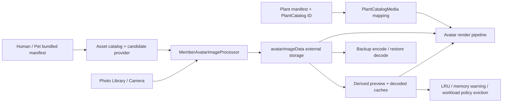

# Ohana 头像资源管理台账

> 状态：Active
>
> 资源 Owner：Avatar asset owner
>
> 复核协作者：对应 Feature owner、Release owner、Privacy and release owner
>
> 最后盘点：2026-07-10
>
> 代码基线：`4d434d5354efdfb0eb7864cadad9ccf3df3825b5`

本文用于统一管理 Ohana 的 Human、Pet、Plant 头像资源，以及用户自选头像在导入、持久化、缓存、备份和删除过程中的生命周期。它是操作台账，不复制 749 条逐文件记录；每个目录内的 `manifest.json` 仍是该资源族的逐文件清单。

## 1. 管理范围

纳入本文：

- 随 App 打包的 Human、Pet、Plant 头像。
- Plant 的目录默认图和通用兜底图。
- Human、Pet、Plant 的相册、相机和裁剪头像。
- 头像选择、映射、持久化、备份、缓存、压缩、清理和回退规则。
- 资源体积、透明度、尺寸、命名、manifest、测试与发布门禁。

不纳入本文：

- `AppIcon*.appiconset`、启动图、成就图、商店图和普通 UI 插图。
- `DesignExports/archive/` 等历史设计输出；只有进入打包资源目录的文件才属于生产头像。
- 植物相册、宠物相册等非头像媒体；它们由通用媒体与隐私规则管理。

## 2. Source of Truth 与权威顺序

| 权威顺序 | 来源 | 负责回答的问题 |
| --- | --- | --- |
| 1 | `Resources/Avatars/<Family>/` 中的实际文件及同目录 `manifest.json` | 当前安装包究竟包含哪些头像 |
| 2 | Human/Pet asset catalog 与 Plant catalog 映射代码 | 某个业务选项或 catalog ID 会加载哪个资源 |
| 3 | `docs/governance/manifests/release-resource-ownership.json` | 资源 Owner、体积预算和发布门禁 |
| 4 | `docs/governance/manifests/cache-ownership.json` | 派生缓存的 Owner、失效和恢复方式 |
| 5 | 本文 | 修改流程、验收标准、已知管理缺口和复核记录 |

冲突处理：实际文件与 manifest 不一致时不得发布；manifest 与代码映射不一致时，以修复二者一致为目标，不能用本文覆盖冲突。本文中的数量与体积是盘点快照，资源变更后必须同步更新。

## 3. 当前库存快照

### 3.1 汇总

| 资源族 | 生产目录 / manifest | 数量 | 当前格式 | 像素与透明度 | 文件内容体积 | 发布预算 |
| --- | --- | ---: | --- | --- | ---: | ---: |
| Human | `Resources/Avatars/HumanAvatarAssets/` | 15 | WebP | 全部 600×800、带 Alpha | 1,064,948 B（约 1.02 MiB） | 7 MiB |
| Pet | `Resources/Avatars/PetAvatarAssets/` | 486 | WebP | 全部 450×600、带 Alpha | 20,819,840 B（约 19.86 MiB） | 65 MiB |
| Plant | `Resources/Avatars/PlantAvatarAssets/` | 248 | indexed PNG | 全部 450×600、带 Alpha | 14,583,477 B（约 13.91 MiB） | 17 MiB |
| 合计 | `Resources/Avatars/` | **749** | WebP + PNG | 当前均为竖版透明图 | **36,468,265 B（约 34.78 MiB）** | 受 `Resources` 总预算 85 MiB 约束 |

盘点结果：三个 manifest 的 `filename` 与对应目录中的物理图像完全一致，当前均无 missing、extra 或重复 filename。

### 3.2 Human 头像

清单：[`Resources/Avatars/HumanAvatarAssets/manifest.json`](../../Resources/Avatars/HumanAvatarAssets/manifest.json)

- 3 个 gender：`male`、`female`、`nonbinary`。
- 5 个 age group：`teen`、`young_adult`、`mid_adult`、`late_adult`、`senior`。
- 每个 gender × age group 一张，共 15 张。
- 文件名契约：`human_<gender>_<age_group>.webp`。
- 代码入口：`Ohana/Shared/Media/HumanAvatarAssetCatalog.swift`。
- 候选选择：根据规范化 gender 和年龄组选图；生日缺失时当前默认 `young_adult`，不披露 gender 时不使用生成头像。
- 加载策略：优先 WebP，同时保留 PNG fallback；生产目录当前只应提交 WebP。

Human manifest 当前字段：

```json
{
  "filename": "human_male_teen.webp",
  "gender": "male",
  "genderName": "男",
  "ageGroup": "teen",
  "ageGroupName": "少年"
}
```

### 3.3 Pet 头像

清单：[`Resources/Avatars/PetAvatarAssets/manifest.json`](../../Resources/Avatars/PetAvatarAssets/manifest.json)

| Species | 数量 |
| --- | ---: |
| `dog` | 254 |
| `cat` | 220 |
| `bird` | 2 |
| `fish` | 2 |
| `hamster` | 2 |
| `other` | 2 |
| `rabbit` | 2 |
| `reptile` | 2 |

- 合计 486 张；带 breed 的条目覆盖 61 个唯一 breed slug。
- 470 张为品种/毛色组合图，16 张为 8 个 species × 2 个 gender 的标准兜底图。
- 组合文件名契约：`<species>_<breed>_<boy|girl>_<coat>.webp`。
- 标准兜底契约：`<species>_<boy|girl>_standard.webp`。
- 代码入口：`Ohana/Shared/Media/PetAvatarAssetCatalog.swift`。
- 加载策略：优先 WebP，同时保留 PNG fallback；生产目录当前只应提交 WebP。
- `standard: true` 的条目必须声明 `fallbackScope: "species"`。

Pet manifest 常用字段：

```json
{
  "filename": "cat_abyssinian_boy_blue.webp",
  "species": "cat",
  "breed": "abyssinian",
  "gender": "boy",
  "coat": "blue",
  "coatName": "蓝色",
  "eye": "black",
  "eyeName": "黑色",
  "standard": false
}
```

### 3.4 Plant 头像

清单：[`Resources/Avatars/PlantAvatarAssets/manifest.json`](../../Resources/Avatars/PlantAvatarAssets/manifest.json)

- 248 个唯一 `catalogId`、248 个唯一 filename。
- 与 `PlantCatalog` 的 248 个条目当前完全对应，无缺图、孤儿图或重复 ID。
- 文件名契约：`plant_<catalog_id_将连字符替换为下划线>.png`。
- 映射入口：`Ohana/Features/Plants/PlantCatalogModels.swift` 中的 `PlantCatalogMedia.avatarAssetName(forCatalogID:)`。
- 当前统一风格：`ohana-soft-3d-plush-plant-avatar-v1`。
- 当前生产格式：450×600、透明、8-bit indexed PNG。

Plant manifest 当前字段：

```json
{
  "catalogId": "epipremnum-aureum",
  "filename": "plant_epipremnum_aureum.png",
  "commonName": "绿萝",
  "latinName": "Epipremnum aureum",
  "width": 450,
  "height": 600,
  "style": "ohana-soft-3d-plush-plant-avatar-v1"
}
```

### 3.5 兜底与待确认资源

| 资源 | 当前用途 | 管理结论 |
| --- | --- | --- |
| `plant_catalog_foliage.imageset/plant_catalog_foliage.svg` | 未知或手动创建的非目录植物通用图 | Active；不计入 248 张目录头像 |
| `PlantMonsteraAvatar.imageset/plant_monstera_avatar.png` | 当前源码扫描未发现直接引用 | Legacy candidate；删除前必须做运行时、IB/配置和全仓引用复核 |
| Human emoji | 默认 `👤`，并按已知 gender 使用 `👩` / `👨` 等回退 | Active fallback |
| Pet emoji | 默认 `🐾`，具体 species 可有对应 emoji | Active fallback |
| Plant emoji | 默认 `🌱` | Active fallback |

## 4. 运行时数据流与优先级



### 4.1 显示优先级

| 实体 | 当前优先级 | 说明 |
| --- | --- | --- |
| Human | `avatarImageData` → gender/default emoji | 用户照片和已选随包候选最终都以持久化 Data 显示 |
| Pet | `avatarImageData` → species/default emoji | 用户照片和已选随包候选最终都以持久化 Data 显示 |
| Plant | `avatarImageData` → catalog bundle image → `plant_catalog_foliage` → `🌱` | 自定义照片覆盖目录头像；没有目录映射时使用通用兜底 |

### 4.2 替换资源的真实影响

| 变更 | 对既有实体的影响 |
| --- | --- |
| 替换 Human/Pet 随包文件但保持 filename | 影响未来候选选择；已经选择过该图的实体通常保留旧 `avatarImageData`，不会自动换图 |
| 替换 Plant catalog 文件但保持 filename / catalog ID | 没有自定义照片的既有目录植物会随新 App 版本显示新资源 |
| 修改用户自选头像 | 只影响被修改实体，并产生新的媒体签名与缓存失效 |
| 重命名或删除随包文件 | 可能触发 fallback、候选缺失或 Plant 目录缺图；不得作为无迁移的“整理”操作 |

这一区别是资源替换评审的必查项。若产品要求“所有既有 Human/Pet 也换成新版头像”，必须单独设计可回滚的数据迁移，不能只覆盖 bundle 文件。

## 5. 用户头像的持久化与隐私契约

- `Human`、`Pet`、`Plant` 均以 `@Attribute(.externalStorage) avatarImageData` 保存自选头像，并维护 attachment presence/signature 状态。
- 相册、相机和裁剪状态由 `MemberAvatarMediaCoordinator` 管理；图像处理由 `MemberAvatarImageProcessor` 统一完成。
- 透明图当前裁边并降采样到最长边不超过 900 px，以 PNG 保存；不透明图最长边不超过 1200 px，以 JPEG 0.88 保存。
- 竖版裁剪当前输出宽 900 px，高宽比 1.58。不要把随包头像的 3:4 尺寸误当成所有用户图片的强制比例。
- 新增或修改头像必须经过现有 command/service 的 `persistableAvatarData` 与 model 更新入口；View 不得直接写大块媒体 Data。
- 头像 Data 纳入备份编码与恢复解码。用户头像属于用户数据，不得写入日志、analytics 参数、随包 manifest 或永久派生缓存。
- 删除 Human/Pet/Plant 时，头像 blob、attachment 状态、派生预览和内存缓存都必须随实体生命周期失效；缓存不得成为恢复用户已删除照片的第二事实源。

关键代码入口：

- `Ohana/Features/Members/MemberAvatarMediaCoordinator.swift`
- `Ohana/Features/Members/MemberAvatarImageProcessor.swift`
- `Ohana/Features/Members/MemberAvatar2DCandidateProvider.swift`
- `Ohana/Shared/Media/AvatarPipeline.swift`
- `Ohana/Shared/Media/FocusWalletAvatarCache.swift`
- `Ohana/Shared/Media/AvatarAssetMaintenanceService.swift`
- `Ohana/Shared/Media/SwiftDataMediaBlobLoader.swift`
- `Ohana/Domain/Services/DataBackupManager+Encode.swift`
- `Ohana/Domain/Services/DataBackupManager+Decode.swift`

## 6. 缓存、维护与能耗规则

- `avatarImageData` 或 bundle resource 是事实源；`Ohana/HomeAvatarPreviewsV2` 和解码后的 `UIImage` 只是可重建缓存。
- `FocusWalletAvatarCache` 当前 LRU 容量为正常预算 24、低功耗/受限预算 8；收到内存警告时取消任务并清空解码缓存。
- 所有预加载、解码和缩略图工作必须走 `AvatarPipeline`、缓存 Owner 和 `AppWorkloadPolicy`，不得在 SwiftUI `body`、列表行或动画循环中直接解码。
- `AvatarAssetMaintenanceService` 当前只扫描持久化的 Pet/Human 大头像，阈值 700,000 B、目标最长边 900 px；Plant 写入路径仍须在保存时完成净化。
- 缓存新增或策略变化必须同步 `docs/governance/manifests/cache-ownership.json`，并提供内存警告后的重建路径。

## 7. 资源变更流程

### 7.1 新增随包头像

1. 确认资源权利、来源、可商用范围和生成工具；不要把临时生成文件直接放进生产目录。
2. 按对应资源族的格式、尺寸、透明度、风格和命名契约导出。
3. 将文件放入对应目录，并在同目录 `manifest.json` 增加唯一条目。
4. Human/Pet：确认业务选项能够通过 asset catalog 解析到 filename；新增业务维度时同步 catalog 测试。
5. Plant：先有稳定 `catalogId`，再生成确定性 filename；确认 `PlantCatalog`、manifest 和物理文件三方一一对应。
6. 检查总包与资源族预算、危险 xattr、重复 filename、尺寸和 Alpha。
7. 运行第 9 节门禁，并在真机或固定模拟器检查浅色/深色背景、圆形裁切、列表小图和详情大图。
8. 更新本文的数量、体积、盘点日期和变更记录。

### 7.2 替换头像

1. 先明确是“视觉修订”还是“身份变更”。同一 filename 只能代表同一业务身份。
2. 保持 filename 时，manifest 的分类字段不得偷偷变化；需要改变分类时应评估兼容性并更新代码和测试。
3. 对 Human/Pet 明确是否接受“只影响未来选择”；若不接受，另开持久化迁移任务。
4. 对 Plant 评估新图会立即影响所有未自定义头像的同 catalog 植物。
5. 用真实 Home、picker、详情页做前后对比，检查透明边、裁切、主体尺度和背景适配。

### 7.3 删除或重命名头像

1. 先全仓搜索 filename、catalog ID、asset name 和 manifest 条目。
2. 确认没有业务选项、测试、历史恢复数据或安装版本依赖该身份。
3. 同一变更中更新物理文件、manifest、映射代码、fallback 和测试。
4. Plant catalog ID 不得仅为文件整理而重命名；它是持久业务标识。
5. 删除后运行 manifest parity、全目录资源审计和恢复/空值测试。

### 7.4 修改用户头像流程

- 只修改 processor、command/service、备份或缓存时，不要顺带重编码 749 张随包资源。
- 保留取消、权限拒绝、解码失败、写入失败和页面退出后的安全路径。
- 新的处理策略必须验证透明图、不透明图、超大图、损坏 Data、低内存和低电量场景。

## 8. 质量与验收标准

每次资源变更必须满足：

- [ ] 资源用途、权利和 Owner 已确认。
- [ ] 文件名唯一，扩展名与真实编码一致。
- [ ] Human 为 600×800 WebP + Alpha；Pet 为 450×600 WebP + Alpha；Plant 为 450×600 indexed PNG + Alpha。
- [ ] manifest 无重复条目，且与目录文件完全一致。
- [ ] Human/Pet 业务映射可解析；Plant catalog ID、filename、代码条目完全对应。
- [ ] fallback 仍可用，缺图不会形成空白或崩溃。
- [ ] 资源族和 `Resources` 总体积均未越过治理预算。
- [ ] 没有 `.DS_Store`、AppleDouble、`__MACOSX` 或签名风险 xattr。
- [ ] 缓存、备份、删除与隐私行为未被资源改动破坏。
- [ ] 目标测试通过，并完成至少一个真实显示路径检查。
- [ ] 本文快照和变更记录已更新。

## 9. 验证命令

### 9.1 快速资源与发布门禁

```bash
scripts/audit-resource-integrity.sh
git diff --check
```

`audit-resource-integrity.sh` 当前会检查体积预算、Human/Pet manifest、危险文件与 xattr。它当前**没有完整验证 Plant manifest schema、Plant catalog 对应关系和每张图的尺寸/风格**，因此 Plant 变更还必须执行下面的手工 parity 和目标测试。

### 9.2 manifest 与物理文件一一对应

以下命令对每个目录应无输出：

```bash
for dir in \
  Resources/Avatars/HumanAvatarAssets \
  Resources/Avatars/PetAvatarAssets \
  Resources/Avatars/PlantAvatarAssets
do
  comm -3 \
    <(jq -r '.[].filename' "$dir/manifest.json" | sort) \
    <(find "$dir" -maxdepth 1 -type f ! -name manifest.json -exec basename {} \; | sort)
done
```

检查 manifest 内重复 filename；以下命令也应无输出：

```bash
for manifest in Resources/Avatars/*/manifest.json; do
  jq -r '.[].filename' "$manifest" | sort | uniq -d
done
```

### 9.3 尺寸、Alpha 与格式抽检/全检

```bash
find Resources/Avatars/HumanAvatarAssets \
  Resources/Avatars/PetAvatarAssets \
  Resources/Avatars/PlantAvatarAssets \
  -type f ! -name manifest.json -print0 \
  | xargs -0 sips -g pixelWidth -g pixelHeight -g hasAlpha

file Resources/Avatars/HumanAvatarAssets/* \
  Resources/Avatars/PetAvatarAssets/* \
  Resources/Avatars/PlantAvatarAssets/*
```

### 9.4 目标测试

```bash
scripts/test-simulator.sh \
  -only-testing:OhanaTests/HumanAvatarAssetCatalogTests

scripts/test-simulator.sh \
  -only-testing:OhanaTests/PetAvatarAssetCatalogTests

scripts/test-simulator.sh \
  -only-testing:OhanaTests/PlantLaunchTests
```

涉及用户头像持久化、备份或缓存时，再按改动范围运行：

- `OhanaTests/MemberCreationServiceTests.swift`
- `OhanaTests/MediaAttachmentUpgradeCompatibilityTests.swift`
- `OhanaTests/DataBackupCoverageTests.swift`
- `OhanaTests/MediaBlobBoundaryTests.swift`
- `OhanaTests/AvatarAssetMaintenanceServiceTests.swift`
- `OhanaTests/DecodedImageCacheMemoryWarningTests.swift`

最后运行：

```bash
scripts/dev-check-changed.sh
```

## 10. 当前管理缺口

| ID | 状态 | 缺口 | 风险 / 下一步 |
| --- | --- | --- | --- |
| AVATAR-GAP-001 | Open | `audit-resource-integrity.sh` 尚未验证 Plant manifest、248 个 catalog ID 对应和 Plant 图规格 | Plant 变更必须手工验证；后续应给脚本增加 bad/good fixture 后再作为 CI 门禁 |
| AVATAR-GAP-002 | Open | 三套 manifest 都没有逐资源 checksum、权利来源、rights owner 和更新时间；Human/Pet 也没有尺寸/风格字段 | 无法只靠 manifest 证明供应链与二进制内容；先确认最小 metadata schema，再保持向后兼容地扩展 |
| AVATAR-GAP-003 | Verify before action | `PlantMonsteraAvatar.imageset` 当前源码扫描无直接引用 | 不在本任务删除；用运行时与全仓门禁确认后再决定 Keep 或 Delete |
| AVATAR-GAP-004 | Documentation drift | Pet catalog 中仍有把 bundled avatar 称为 PNG 的注释，而生产文件已是 WebP | 代码行为未受影响；下次触碰该文件时做最小注释修正 |
| AVATAR-GAP-005 | Intentional current behavior | Human/Pet 已选随包头像只保存处理后的 Data，不保存 bundle provenance/version | 资源替换不会更新既有实体；产品若要求全量换图，必须先定义迁移与回滚，不得静默改变 |

这些条目是本台账的资源治理事项，不替代 `docs/task-follow-ups.md`。只有形成真实发布 blocker、跨任务修复或外部确认时，才按仓库规则进入 follow-up ledger。

## 11. 变更记录

| 日期 | 变更人 | 资源族 | 变更摘要 | 数量变化 | 体积变化 | 验证证据 |
| --- | --- | --- | --- | ---: | ---: | --- |
| 2026-07-10 | Codex inventory | Human / Pet / Plant | 建立统一资源台账；核对 manifest、文件数量、尺寸、Alpha、体积、预算、代码映射和生命周期 | 0 | 0 | `scripts/audit-resource-integrity.sh` 通过；手工 manifest parity 通过 |
| YYYY-MM-DD | Owner | Human / Pet / Plant | 示例：新增、替换、删除或处理策略变更 | +0 / -0 | +0 / -0 MiB | 命令、测试或截图路径 |

## 12. Definition of Done

头像资源工作只有在以下事实同时成立时才算完成：

1. 物理文件、manifest、业务映射和 fallback 一致。
2. 资源规格、权利、预算、签名卫生与 App 包装门禁合格。
3. 用户头像的持久化、备份、删除、缓存失效和隐私语义没有回归。
4. Human/Pet 的“未来选择”语义与 Plant 的“动态 catalog”语义已被产品和实现共同接受。
5. 目标测试与至少一条真实 UI 显示路径完成验证。
6. 本文的库存快照、盘点日期和变更记录已同步。
