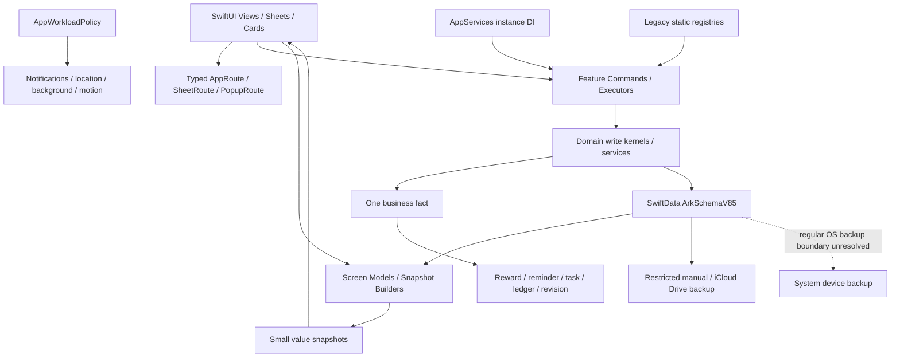
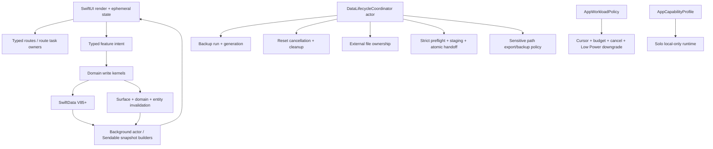

# Ohana Final Audit Report

> Phase C — Independent synthesis, release decision, and implementation planning
>
> Audit date: 2026-07-10 (Europe/Berlin)
>
> Baseline commit: `4d434d5354efdfb0eb7864cadad9ccf3df3825b5` (`fix(ci): restore release validation gates`)
>
> Mode: code read-only; report files only; no implementation, migration, dependency update, signing change, PR, commit, push, purchase, or production-account action.

Evidence labels:

- `[CODE]`: current source, configuration, test, build, lint or static result.
- `[DOC]`: current repository documentation.
- `[RUNTIME]`: observed Simulator or executed test result.
- `[PUBLIC-OFFICIAL]`: current Apple/App Store/product official public source.
- `[REVIEW-SIGNAL]`: limited public review sample, not a population fact.
- `[INFERRED]`: reasoned from incomplete evidence.
- `[UNVERIFIED]`: requires device, account, Store, payment, or runtime proof.

Finding review statuses are exactly: `CONFIRMED`, `CONFIRMED WITH CHANGES`, `DOWNGRADED`, `MERGED`, `REJECTED`, `RUNTIME VERIFICATION REQUIRED`, `PRODUCT DECISION REQUIRED`, or `MARKET VALIDATION REQUIRED`.

## 1. Audit Baseline and Scope

### 1.1 Baseline

| Item | Current fact |
|---|---|
| App / bundle | Ohana / `com.guanchen.li.Ohana` |
| App version | Marketing Version `1.0`, Build `1`; Settings still hardcodes `v4.5.0` (`DOC-004`) |
| Deployment target | iOS 26.2 for current targets |
| Swift / isolation | Swift 5 language mode; approachable concurrency; default MainActor isolation for main app configurations |
| Persistence | SwiftData `ArkSchemaV85`; primary/default/disk fallback/memory fallback store sequence; CloudKit database `.none` for Solo |
| Capability profile | Solo; HealthKit + CloudDocuments; no App Group, APNs or CloudKit sharing entitlement |
| Research date | 2026-07-10 |
| Market research | Germany primary research Storefront by explicit Phase B assumption; US supplementary only. Target launch market remains a product decision. |
| Worktree at Phase C start | Untracked `AUDIT_BRIEF.md`, `INTERNAL_AUDIT_REPORT.md`, `MARKET_BENCHMARK_REPORT.md`; no tracked source delta from the audited commit. |

### 1.2 Phase A coverage recovered

| Scope | Coverage |
|---|---|
| Production | 956 Swift files: App 27, Domain 114, Models 42, Shared 78, Features 695; whole-tree audits plus risk-prioritized semantic reading |
| Tests | 112 unit-test Swift files and 3 UI-test Swift files; full Unit and UI suites executed |
| Documentation | 79 Markdown files under `docs/`; 98 tracked Markdown files repository-wide; current rules, manifests and selected ignored/reference duplicates reviewed |
| Configuration | Xcode project, targets/schemes, Info.plist, entitlements, PrivacyInfo.xcprivacy, assets/resources and release scripts |
| Runtime | iPhone 17 Simulator launch and Home observation; no signed Release or physical-device completion |

“Whole-tree coverage” means every production file was scanned/classified by repository audits. It does not claim manual line-by-line reading of all 956 files. Human semantic review prioritized data loss, privacy, deletion, restore, startup, concurrency, lifecycle and release reachability.

### 1.3 Recovered Phase A finding inventory

- Confirmed Critical: **0**.
- Confirmed High: **5** — `SEC-001`, `SEC-002`, `SEC-003`, `DATA-001`, `TEST-001`.
- Medium: `SEC-004`, `DATA-003`, `CONC-001`, `CONC-002`, `ARCH-001`, `DATA-004`, `PERF-001`, `PERF-002`, `CONC-003`, `CONC-004`, `LOGIC-003`, `A11Y-001`, `A11Y-002`, `COMPAT-001`, `RULE-001`, `RULE-002`, `RULE-004`, `DOC-002`, `DOC-003`.
- Low: `ARCH-002`, `TEST-002`, `CONC-005`, `DOC-004`.
- Merged: `DOC-001 → SEC-001`, `DATA-002 → DATA-001`, `RULE-003 → SEC-002/003/004`.
- Rejected as independent/current defects: `LOGIC-001`, `LOGIC-002`, `TRACE-001`, “first-pet visual entry does not exist,” and “large file count proves architecture failure.”
- Runtime verification: `DATA-003` and all physical-device/Store blind spots.

### 1.4 Phase B context recovered

- Candidate pool: 18 products.
- Formal benchmark set: 11pets, DogLog, DogCat, PetDesk, FamilyWall, Planta, Finch, Apple Reminders.
- Highest-weight tasks: first pet/first value; quick care; know who did it; vet/sitter handoff; long-term reminders/recovery.
- Findings: `MARKET-001` through `MARKET-009`.
- First-party positioning: pet-first, no Ohana account for Solo, local-first, real-care facts driving gentle growth, long-term family-life memory and existing Vet PDF.
- Main market gaps: current Human-first onboarding; release trust not yet provable; no system surfaces; public identity not closed; Vet PDF under-exposed; Family is future only.
- Main Do Not Copy: ads/tracking, provider dependence, super-app sprawl, basic-care paywalls, paid Coconut/FOMO, unbounded AI diagnosis and fake Solo collaboration.

The complete Phase A and B source reports are [INTERNAL_AUDIT_REPORT.md](INTERNAL_AUDIT_REPORT.md) and [MARKET_BENCHMARK_REPORT.md](MARKET_BENCHMARK_REPORT.md).

## 2. Executive Decision

Ohana has a credible internal engineering base but is **not release-ready**. The failure mode is not architectural collapse: 1509 unit tests pass; lint/format/secret/governance audits pass; domain write boundaries, typed routes, economy chokepoints, runtime policy and V85 migrations are real strengths. The release problem is narrower and more serious: deletion, external files, OS backup and Restore are not governed by one provable data-lifecycle boundary.

### Decision summary

| Question | Decision |
|---|---|
| Continue internal development? | **Yes.** The architecture supports focused fixes; no rewrite is justified. |
| Controlled internal TestFlight? | **Conditional.** A signed Release build with synthetic/non-sensitive data and documented manual smoke testing can be used for internal engineering. This does not establish external readiness. |
| External TestFlight with real user/health data? | **No.** Blocked by `SEC-001`, `SEC-002`, `SEC-003`, `DATA-001`. |
| App Store submission? | **No.** Four data blockers, production identity/metadata, signed Archive and true-device release evidence remain open. |

The three problem clusters that must close before public release are:

1. **Sensitive data出口与隐私承诺** — `SEC-001`.
2. **删除生命周期不完整** — `SEC-002` and `SEC-003` as one user-facing deletion guarantee.
3. **Restore 不原子且容忍损坏身份** — `DATA-001`.

`TEST-001` must also be repaired before RC sign-off, but it is a release-proof problem rather than evidence that the visible first-pet entry is broken.

The first implementation PR should be **PR-001: exclude sensitive persistence roots from OS backup**. It is bounded, requires no schema migration, addresses a current Apple review/privacy rule, and creates the foundation for truthful local-first positioning.

## 3. Evidence Quality and Coverage

### 3.1 Executed evidence

| Validation | Result | Evidence quality |
|---|---|---|
| Scheme/target discovery | Success; 3 targets, 4 schemes | High |
| Debug Simulator build | Success, approximately 114.2 seconds | High for compile; not Release/signing proof |
| Simulator launch | iPhone 17/iOS 26.5; Home visible | Medium for visible shell |
| Unit tests | 1509/1509 passed | High for covered behavior |
| UI tests | 8 passed, 72 failed; 68 share first-pet identity bootstrap | High for harness failure; low for downstream route quality until fixed |
| Targeted first-pet UI rerun | Failed; recording showed the entry visually present while XCUI button query failed | High; narrows `TEST-001` correctly |
| Strict-concurrency diagnostic | Build succeeded; 132 unique warning locations, 47 actor/Sendable/ModelContext class | High for migration debt; not proof of runtime race |
| SwiftLint / SwiftFormat | 0 violations / 0 changes | High for style only |
| gitleaks | No secret found | High for scanned repository; not proof of external account security |
| Release/static governance | Previously passed on same commit | High for encoded checks; limited by what rules encode |

Phase C re-ran the most relevant static gates on the unchanged audited commit:

```text
scripts/audit-release-data-safety.sh          PASS
scripts/audit-doc-status-ledgers.sh           PASS (7 open: P0=0, P1=5, P2=2)
scripts/audit-agent-skill-governance.sh       PASS
scripts/audit-accessibility.sh --all          PASS (956 files)
```

These passes do **not** reject the High findings. They reveal a governance gap: current scripts validate encoded patterns and ledger structure, but do not model OS backup inclusion, backup/Reset interleavings, external-file ownership, atomic Restore or semantic status truth.

### 3.2 Independent Phase C source checks

- Current HEAD exactly matches the Phase A commit, so build/test evidence is not stale relative to source.
- Repository-wide search still finds no `isExcludedFromBackup`/`NSURLIsExcludedFromBackupKey` use.
- `AutomaticBackupService` still has only `isRunning`; `AppResetService` still calls an independent synchronous cleaner.
- `HumanNoteAttachmentStore` still only exposes `deletePendingAttachments`; note/Human/Reset paths do not own successful-file cleanup.
- Restore still saves multiple checkpoints and `DataBackupManager+Decode` still defaults many required IDs/dates.
- First-pet UI helper still accepts disappearance as completion; current visual card identifiers still live in `Features/TodayFocus/Views`.
- Current onboarding still has four intro pages and a mandatory Human profile before first Pet.
- Current Settings still hardcodes `v4.5.0` and an unverified review Apple ID.

Phase C corrected two incomplete Phase A file citations without changing conclusions:

- `DataBackupManager` is at `Ohana/Domain/Services/DataBackupManager.swift`, not `Ohana/Features/Settings/...`.
- `TodayFocusCard+ContentCards` is at `Ohana/Features/TodayFocus/Views/TodayFocusCard+ContentCards.swift`.

### 3.3 Current official evidence refreshed

- Apple’s current [App Review Guidelines 5.1.3](https://developer.apple.com/app-store/review/guidelines/) state that apps may not store personal health information in iCloud.
- Foundation documents that Application Support participates in regular backup and provides [`isExcludedFromBackupKey`](https://developer.apple.com/documentation/foundation/urlresourcekey/isexcludedfrombackupkey); common file operations can reset the value, so it must be reapplied/verified.
- Apple requires accurate, current App Store privacy answers and a privacy-policy URL: [App privacy details](https://developer.apple.com/app-store/app-privacy-details/), [Manage app privacy](https://developer.apple.com/help/app-store-connect/manage-app-information/manage-app-privacy).
- Apple’s current [VoiceOver guidance](https://developer.apple.com/design/human-interface-guidelines/voiceover) supports runtime testing of labels, roles and reading order; a static script alone is insufficient.

### 3.4 Unexecuted evidence

Signed Release Archive, production profile/expanded entitlements, physical-device iCloud Backup/Drive, HealthKit, notification actions, 30–60 minute locked walk, Low Power/thermal, Instruments/Energy/ETTrace/memgraph, 500-image dense scroll, VoiceOver/Voice Control/RTL/max Dynamic Type, App Store Connect metadata and real/sandbox purchase remain unexecuted.

## 4. Confirmed Critical Findings

**None.**

The earlier Critical document claim `DOC-001` was too strong because actual physical-device backup contents were unverified. The evidence does support a High control/policy gap, so `DOC-001` remains merged into `SEC-001` rather than disappearing.

## 5. Confirmed High Findings

| ID | Independent status | Severity / confidence | Impact | Urgency | Confidence | Effort | Change risk | Release class |
|---|---|---|---:|---:|---:|---|---|---|
| `SEC-001` | **CONFIRMED WITH CHANGES** — control gap and Apple-policy conflict are confirmed; actual backup transmission remains device-unverified | High / Medium | 5 | 5 | 4 | M | High | BLOCKER |
| `SEC-002` | **CONFIRMED** — static control flow establishes a reachable old-backup rewrite race | High / High | 5 | 5 | 5 | M | Medium | BLOCKER |
| `SEC-003` | **CONFIRMED** — scope is successfully saved Human Note attachments | High / High | 4 | 5 | 5 | M | High | BLOCKER |
| `DATA-001` | **CONFIRMED WITH CHANGES** — finding stands; source path corrected and strict-preflight plus atomicity are separate implementation slices | High / High | 5 | 5 | 5 | L | High | BLOCKER while Restore ships |
| `TEST-001` | **CONFIRMED WITH CHANGES** — High release-test infrastructure defect, not a confirmed missing product entry | High / High | 4 | 4 | 5 | M | Medium | SHOULD FIX BEFORE RELEASE |

### SEC-001 — Personal-health OS backup control is not provable

Current mixed SwiftData storage and Human Note attachments live under Application Support, and no exclusion control is present. The restricted `.ohanabackup` filter is a positive control but covers a different export channel. Minimum release-safe remediation is a unified path policy applied after store/file creation, migration and fallback. Excluding the whole mixed store also removes OS backup for non-health data; that is a product tradeoff, not a reason to leave the health boundary open.

### SEC-002 — Reset can be followed by a late old-generation backup

The problem is not merely “Task could run.” The backup service and Reset have separate ownership, so Reset cannot establish a completion boundary. A shared coordinator, cancellation/await and generation checks are sufficient; a general job framework is not required.

### SEC-003 — External attachment deletion is outside record deletion

Database deletion alone cannot satisfy deletion when private files are external. The repair must sequence database commit, surviving-reference check and file purge. Purging before a successful database commit would create a new data-loss bug.

### DATA-001 — Restore can commit partial state and fabricate identity/history

Preflight validation fixes silent corruption but not checkpoint atomicity. Therefore the minimal plan is two PRs: first reject malformed required fields before write; then stage/commit atomically. If an atomic boundary cannot be proven for 1.0, disabling Restore is safer than shipping a safety feature that can damage existing data.

### TEST-001 — UI gate is unable to prove downstream flows

The targeted recording disproved “entry missing.” It confirmed an accessibility-tree/query mismatch and a permissive setup helper. The fix must serve real assistive semantics and positive persistence state, not merely make XCTest green.

## 6. Medium and Low Findings

### Medium

| ID | Phase C status | Impact | Urgency | Confidence | Effort | Change risk | Release treatment |
|---|---|---:|---:|---:|---|---|---|
| `SEC-004` | PRODUCT DECISION REQUIRED | 3 | 4 | 5 | S | Medium | Decide deletion wording/retention before release |
| `DATA-003` | RUNTIME VERIFICATION REQUIRED | 5 | 4 | 3 | M | High | Test before RC; promote if split is reproduced |
| `CONC-001` | DOWNGRADED, retained | 3 | 2 | 4 | M | Medium | Before Swift 6, not Solo blocker |
| `CONC-002` | DOWNGRADED, retained | 3 | 2 | 4 | M | Medium | Before Swift 6, not Solo blocker |
| `ARCH-001` | CONFIRMED WITH CHANGES | 3 | 2 | 4 | L | Medium | Incremental DI only |
| `DATA-004` | CONFIRMED | 3 | 4 | 4 | S | Low | Clarify export before release |
| `PERF-001` | CONFIRMED WITH CHANGES | 3 | 2 | 3 | L | Medium | Correctness first; measure dense data |
| `PERF-002` | CONFIRMED WITH CHANGES | 2 | 2 | 4 | M | Medium | Scoped tokens/gating already reduce scope |
| `CONC-003` | CONFIRMED WITH CHANGES | 2 | 2 | 4 | M | Medium | Migrate when touched |
| `CONC-004` | CONFIRMED WITH CHANGES | 2 | 2 | 3 | S | Medium | Route-owned task when touched |
| `LOGIC-003` | CONFIRMED | 3 | 4 | 4 | S | Low | Should fix if expenses ship |
| `A11Y-001` | RUNTIME VERIFICATION REQUIRED | 3 | 3 | 3 | S | Medium | Core-path Reduce Motion before RC |
| `A11Y-002` | CONFIRMED | 3 | 4 | 5 | S | Low | Align marketed locales before Store |
| `COMPAT-001` | PRODUCT DECISION REQUIRED | 4 | 4 | 5 | M | Medium | Decide OS/iPad matrix before Store |
| `RULE-001` | PRODUCT DECISION REQUIRED | 3 | 4 | 5 | S | Low | Define “complete export” |
| `RULE-002` | PRODUCT DECISION REQUIRED under current code; authoritative default is pet-first | 4 | 4 | 5 | M | Medium | Resolve before onboarding acceptance |
| `RULE-004` | DOWNGRADED, retained | 2 | 2 | 4 | S | Low | Narrow AI playbook later |
| `DOC-002` | CONFIRMED | 3 | 5 | 5 | S | Low | Status must reflect blockers now |
| `DOC-003` | CONFIRMED | 3 | 4 | 5 | S | Low | Align Solo capability docs |

### Low

| ID | Phase C status | Impact | Urgency | Confidence | Effort | Change risk | Treatment |
|---|---|---:|---:|---:|---|---|---|
| `ARCH-002` | CONFIRMED only as maintenance signal | 2 | 1 | 5 | L | Medium | Split only with responsibility evidence |
| `TEST-002` | CONFIRMED WITH CHANGES | 2 | 1 | 4 | L | Low | Replace gradually after behavior tests |
| `CONC-005` | CONFIRMED | 2 | 2 | 4 | XS | Low | Next toast/feedback change |
| `DOC-004` | CONFIRMED | 3 | 5 | 5 | XS | Low | Fix production version identity before release |

## 7. Rejected, Merged and Downgraded Findings

| Original ID/claim | Phase C disposition | Reason |
|---|---|---|
| `DOC-001` | MERGED → `SEC-001` | Policy conflict is real; Critical and proven-transfer wording were not supported. |
| `DATA-002` | MERGED → `DATA-001` | Lenient decoding and partial commit share one restore trust-boundary root. |
| `RULE-003` | MERGED → `SEC-002`, `SEC-003`, `SEC-004` | “Deletion” contained three distinct causes: race, external files and intentional retention. |
| `LOGIC-001` currency conversion | REJECTED | Product explicitly defines currency change as display formatting, not retroactive FX conversion. |
| `LOGIC-002` HealthKit rejection state | REJECTED | Apps cannot reliably infer all HealthKit read-denial states; original certainty was invalid. |
| `TRACE-001` as independent finding | REJECTED / absorbed by `DOC-002` | Release docs already state static checks are not runtime proof; the remaining issue is stale status truth. |
| “First-pet entry does not exist” | REJECTED | Recording shows it; XCUI cannot query expected role/identifier. |
| “40 files >1000 lines means architecture failure” | REJECTED | Size is a signal, not proof of mixed responsibility or user harm. `ARCH-002` remains Low. |
| `SEC-004` | DOWNGRADED to Medium | Retained data is local, bounded to 45 days and contains no free text, but deletion semantics still need a decision. |
| `CONC-001`, `CONC-002` | DOWNGRADED to Medium | Strict diagnostics are valid; no current Swift 5 runtime corruption is proven. |
| `RULE-001`, `RULE-002`, `RULE-004`, `DOC-002`, `DOC-003` | DOWNGRADED/retained | Conflicts can misdirect product/release work but are not independent data-loss incidents. |
| `MARKET-002` as separate implementation | MERGED into `SEC-001/002/003`, `DATA-001` | “Prove local-first” is the market framing of the same engineering blockers. |

## 8. Conflict Matrix

| Conflict ID | Related finding | Evidence A | Evidence B | Quality | Final judgment | Remaining verification |
|---|---|---|---|---|---|---|
| `CONFLICT-001` | `SEC-001` | Policy says personal-health data does not enter iCloud | Mixed store/attachments are in Application Support with no exclusion | Code + doc + Apple official: High | Control/policy gap confirmed; not Critical because actual device payload is unobserved | Real-device OS backup/restore |
| `CONFLICT-002` | `SEC-002` | UI/Reset promises deletion completion | Old backup run is neither cancelled nor generation-checked | Static control flow: High | Reachable race confirmed | Real iCloud latency after deterministic unit tests |
| `CONFLICT-003` | `SEC-003` | Note/Human/Reset records disappear | Successful external files have no lifecycle cleanup | Code: High | Deletion incomplete | Shared-reference product contract and device file check |
| `CONFLICT-004` | `DATA-001` | Restore failure is presented as failure | Earlier checkpoints remain saved and malformed IDs/dates become plausible values | Code: High | Partial/corrupt restore confirmed as reachable | Low-storage and staging implementation proof |
| `CONFLICT-005` | `TEST-001` | Visual first-pet card is present | `app.buttons[...]` does not see it; 68 tests stop there | Runtime + code: High | Product-entry bug rejected; accessibility/test contract defect confirmed | VoiceOver semantics after fix |
| `CONFLICT-006` | `RULE-002`, `MARKET-001` | Product D17: pet-first, Human optional, <=90 sec | Current four-intro + mandatory Human flow | Doc + code/runtime: High | Current implementation conflicts with authoritative product rule | Product may explicitly revise D17; default is implement pet-first |
| `CONFLICT-007` | `DOC-002` | Active ledger says no reachable repository P1 | Phase C confirms four reachable release blockers | Current doc vs current code: High | Ledger semantically stale even though structural audit passes | Update after findings are accepted/closed |
| `CONFLICT-008` | `DOC-004`, `MARKET-006` | Xcode version is 1.0/build 1 | Settings says v4.5.0; review ID/public page unverified | Code + Apple lookup: High | Release identity conflict confirmed | App Store Connect Apple ID/metadata |
| `CONFLICT-009` | Cloud/architecture | Extensive CloudKit code exists | Solo capability profile and entitlements disable CloudKit/APNs/sharing | Code/config/test: High | No current Solo cloud-sync exposure finding; gated future code is not a release blocker | Signed entitlement inspection |
| `CONFLICT-010` | `PERF-002`, `MARKET-003` | Legacy broad `homeRevision` remains | Scoped domain/entity invalidation and covered-surface coalescing already exist | Code: High | Incremental tail, not missing architecture or P0 performance bug | Dense runtime refresh measurement |
| `CONFLICT-011` | Storefront assumption | Phase B uses DE primary due language/euro signals | Audit brief says target market is not decided | Doc/research: High | Germany is a research assumption, not launch fact | Product/marketing decision |

## 9. Product and Architecture Assessment

### 9.1 Product judgment

Ohana’s strongest coherent product is not “a bigger pet tracker.” It is a **pet-first, local-first family-life care record** where real care facts create gentle growth and long-term memory. Solo is a complete single-operator product; Family, CloudKit collaboration and Care+ AI are future layers and must not leak into the 1.0 promise.

The current feature depth is already above the minimum market table stakes: care facts, reminders, history, health, documents, expense, memory, PDF and growth exist. The product risk is focus and trust: a new user reaches Human before Pet, while a long-term user cannot yet receive a provable delete/restore/privacy guarantee.

### 9.2 Current actual architecture



### 9.3 Effective parts to preserve

- Feature/Domain/Models/Shared direction and audit-enforced boundaries.
- Typed route values and route containers rather than prebuilt destination objects.
- Command/domain write kernels and economy chokepoints; Views generally do not mutate Coconut/reward side effects.
- Snapshot/read-model direction and existing domain/entity Home invalidation tokens.
- `AppWorkloadPolicy` ownership of background, Low Power, Reduce Motion and thermal policy.
- `AppCapabilityProfile` fail-closed Solo profile; CloudKit `.none`, no APNs/App Group/sharing.
- V85 schema/migration plan and large in-memory behavior-test suite.

### 9.4 Real architecture problems

1. **Data lifecycle has multiple owners.** Backup, Reset, external attachments and Restore do not share a transaction/generation/ownership model.
2. **Instance DI and static registries coexist.** This complicates lifecycle and test isolation, but does not invalidate the entire architecture.
3. **Some actor boundaries expose SwiftData context/model semantics.** Strict diagnostics show migration debt; current runtime corruption is not proven.
4. **Broad invalidation remains beside scoped tokens.** Existing architecture already provides the migration destination.
5. **Writable fallback identity is ambiguous across launches.** Evidence requires fault injection before final severity.

### 9.5 Architecture action classification

| Classification | Action | Why |
|---|---|---|
| REQUIRED NOW | Sensitive-path backup policy; shared backup/Reset generation; attachment ownership; strict/atomic Restore | Direct privacy, deletion and data-corruption evidence |
| INCREMENTAL IMPROVEMENT | Migrate touched registries to `AppServices`; return IDs/DTOs across actor boundaries; route-own tasks; migrate measured broad revision consumers | Real maintenance/concurrency benefit with an existing safe path |
| FUTURE OPTION | App Group/Widget/App Intents; Family sync/conflict actor; split sensitive/non-sensitive stores | Valuable only after Solo safety and market validation |
| NOT JUSTIFIED | Whole-app rewrite, replace SwiftData, adopt a fashionable architecture, mass file splitting, one-shot Swift 6 conversion | No evidence that these are the root cause; change risk exceeds value now |

## 10. Business Logic and State Machine Assessment

### 10.1 Core entities and proven invariants

Core entities include Human, Pet, Plant, care/health/medication/feeding/water/walk facts, Event/Reminder, reward/Coconut ledger, Family task/shared session, document/photo/note attachment, expense, backup package/status, memorial and physical deletion state.

| Invariant | Assessment |
|---|---|
| Quick care writes one authoritative business fact | Implemented and broadly tested |
| Reward enters through `QuestManager`/economy discipline | Implemented and audited |
| Memorial limits care writes while allowing memory content | Implemented with substantial tests |
| Solo does not expose true online collaboration | Implemented and tested through capability/profile gates |
| Failed persistence must not show success/reward | Architecture and many paths support it; Today/restore/delete still need end-to-end proof |
| Delete removes database, external files, backups and late work | Not complete (`SEC-002/003/004`) |
| Restore failure leaves pre-restore state unchanged | Not complete (`DATA-001`) |

### 10.2 State machines

```text
Care:
intent -> local visual handoff -> domain command -> save one fact
       -> derived reward/reminder/task/ledger/revision -> render snapshot

Member:
active -> memorial -> restricted care writes + allowed memories
       -> optional physical deletion -> no live references

Automatic backup today:
disabled/idle -> running -> success/failure
gap: running + Reset has no shared generation/cancellation boundary

Required backup lifecycle:
idle -> exporting(generation) -> writing(generation) -> committed
  |            |                     |
  +-> cancelled/reset -> cleanup -> reset-complete

Restore today:
decode -> live inserts -> checkpoint -> more inserts -> checkpoint -> complete
gap: later failure cannot undo prior checkpoints

Required Restore:
parse -> strict preflight -> stage(cursor/budget/cancel) -> validate
      -> atomic handoff -> publish defaults/notifications/revisions once
```

### 10.3 Logic decisions

- Currency display without historical FX conversion is intentional; no fix.
- HealthKit read-denial cannot be treated as a reliably knowable state; use honest unavailable/no-data semantics.
- Expense finite/positive constraints belong at domain and Restore boundaries, not only forms.
- “Delete all,” “complete export,” anti-abuse retention and pet-first are product contracts that must map to one state machine and one public phrase.
- Family “who did what” must not ship until offline/conflict/member-revoke state is real; fake collaboration is worse than Solo honesty.

## 11. iOS Engineering Assessment

### 11.1 SwiftUI, navigation and state

- `@State`/route/read-model ownership is generally moving in the correct direction; typed routes and small snapshots are substantive strengths.
- Existing covered-surface activity gating and pending invalidation merging already implement much of the requested “pause under sheet, merge once on dismiss” behavior.
- `homeRevision` remains a broad compatibility publisher; because scoped tokens exist, this is incremental debt, not a rewrite trigger.
- The first-pet visual/accessibility tree mismatch shows that SwiftUI visual identity and assistive/test identity need one explicit contract.

### 11.2 Concurrency

- Regular Swift 5 builds pass; strict-concurrency mode surfaces 132 warning locations.
- Actor/Sendable/ModelContext warnings should be removed boundary-by-boundary, starting with one service such as Avatar maintenance, not by adding unchecked conformance or switching the entire project to Swift 6.
- Anonymous/route-independent Tasks and mutable registries should gain explicit owners when their modules are touched.
- Cancellation must remain a business outcome in backup/restore/background work; do not convert `CancellationError` into generic failure or success.

### 11.3 Persistence and external services

- SwiftData V85/migration coverage is strong.
- The current largest risks are transaction identity, external-file ownership and Restore atomicity—not schema design style.
- Solo has no general REST backend, auth refresh or API pagination surface; Networking is therefore N/A in the engineering score rather than artificially low.
- iCloud Drive file backup and OS device backup are different channels and must remain separately modeled.

### 11.4 Lifecycle, performance and energy

- Simulator launch around 1.576 seconds and static smoothness/runtime audits are positive signals.
- No evidence supports a current P0 performance rewrite.
- Dense backup/restore/reset, image lists, map snapshots, 30–60 minute locked walk and broad revisions need Release-device measurements.
- Correctness work should use background actor + cursor + budget + cancellation + Low Power downgrade; the visual first frame remains local/route-only.

### 11.5 Testing strategy

- Preserve 1509 unit tests and behavior-heavy domain coverage.
- Repair the shared UI bootstrap, then separate a small release smoke suite from the slower comprehensive suite.
- Add deterministic race/fault injection instead of relying on timing sleeps.
- Keep source-string tests only where they act as policy/audit guards; do not mistake them for runtime behavior proof.

## 12. Security, Privacy and App Store Assessment

### 12.1 Positive controls

- No repository secret found by gitleaks.
- No third-party dependency surface was identified in the current Xcode product graph.
- Privacy manifest and Required Reason static checks pass.
- Solo capabilities are minimal relative to future Family: no APNs, CloudKit sharing or App Group.
- Restricted `.ohanabackup` intentionally omits Human health and several ambiguous free-text/derived sidecars.
- Public privacy and email support entries exist in Settings.

### 12.2 Confirmed risks

- Personal-health OS backup exclusion/policy mismatch (`SEC-001`).
- Deletion can be undone by late automatic backup (`SEC-002`).
- External Human Note files survive deletion (`SEC-003`).
- Restore can partially mutate and fabricate identity/history (`DATA-001`).
- Anti-abuse retention and “delete all” need one product definition (`SEC-004`).

### 12.3 App Store assessment

The app is **not App Store Ready**. A Debug build, static privacy manifest and passing lint cannot substitute for:

1. Closing the four data blockers.
2. Producing a signed Release Archive and inspecting expanded entitlements/profile.
3. Entering accurate App Store privacy answers and public policy URL as required by Apple.
4. Resolving name/version/Apple ID/support/Storefront metadata.
5. Recording physical-device HealthKit, notifications, background location, iCloud and accessibility behavior.

No account-deletion UI is required for an Ohana account because Solo creates no app account; local Human profiles are business data, not login identities. Local data deletion must nevertheless be complete and truthful.

## 13. Accessibility Assessment

Current status is **foundation present, runtime proof incomplete**.

Positive evidence:

- Whole-repository accessibility audit passes 956 files.
- Project rules cover Dynamic Type, 44pt targets, localized labels and Reduce Motion.
- Simulator inspection exposed a sizable accessibility tree rather than an entirely inaccessible app.

Gaps:

- First-pet card role/identifier is not queryable as expected; fixing XCUI must not harm VoiceOver grouping/order.
- Reduce Motion may still allow nonessential motion through `.efficient` semantics.
- Marketed nine-language claim is not matched by InfoPlist permission localization coverage.
- No full VoiceOver, Voice Control, Switch Control, max Dynamic Type, Increase Contrast, modal focus, RTL or real-device motion session has been recorded.

Release minimum: core onboarding → first Pet → first care → failure/retry → Vet PDF → delete must be navigable with VoiceOver and maximum text, with state not conveyed by color/motion alone.

## 14. Documentation and AI Rules Assessment

### 14.1 Current authority

1. Current user request.
2. `docs/specs/product-foundation.md` for product behavior.
3. `AGENTS.md` for engineering/agent workflow.
4. `ui规范.selection.json` for machine UI tokens/components.
5. Active governance docs and status ledgers.
6. Current source/test evidence.
7. Historical/reference/archive material.

This authority model is good and should remain. The problem is semantic drift inside lower layers, not the lack of more documentation.

### 14.2 Main conflicts

- Product D17 pet-first vs current Human-first.
- Public health/iCloud promise vs missing OS backup control.
- “Complete export” vs intentionally restricted export.
- “Delete all” vs retained anti-abuse rows and orphan files/late backup.
- Active status says no reachable repository P1 while the independent audit confirms blockers.
- Permission/capability drafts mention older online/App Group/remote-notification assumptions.
- `release-hardening-plan.md` still cites V60 while current schema is V85.
- AI playbook includes automatic push/mandatory spec/future architecture material that should not be universal task rules.

### 14.3 AI Rules judgment

`AGENTS.md` already contains strong minimum-change, evidence, data, concurrency, UI, runtime and no-fabrication boundaries. Do not create another root/editor rule copy. Narrow `ai-module-test-playbook.md` into:

- mandatory task procedure tied to risk;
- optional module-spec template;
- future CloudKit/advisory appendix.

Automatic push, skill installation, future architecture and durable-memory changes must never be default side effects. Definition of Done must separate executed runtime proof from static inference.

## 15. Market and Competitor Assessment

### 15.1 Independent market judgment

The eight-product formal set is appropriate because no single app covers Ohana’s entire position:

- Direct pet-care depth: 11pets, DogLog, DogCat.
- Provider/medical maturity: PetDesk.
- Household coordination: FamilyWall.
- Care-plan clarity: Planta.
- Gentle emotional habit loop: Finch.
- Native capture/system integration: Apple Reminders.

Phase B sources were observed on 2026-07-10 and are fresh enough for Phase C. German price/rating data remains separate from US supplements. Official marketing claims are capability/scale claims, not runtime quality or market-share proof; review samples remain signals only.

### 15.2 MARKET finding review

| ID | Phase C status | Impact | Urgency | Confidence | Effort | Change risk | Judgment |
|---|---|---:|---:|---:|---|---|---|
| `MARKET-001` | CONFIRMED WITH CHANGES | 5 | 4 | 5 | M | Medium | Strong pre-release activation fix; not a data-safety blocker |
| `MARKET-002` | MERGED | 5 | 5 | 5 | L | High | Market trust framing of `SEC-001/002/003`, `DATA-001` |
| `MARKET-003` | MARKET VALIDATION REQUIRED | 4 | 3 | 4 | M | Medium | Existing Today/scoped architecture narrows the required change |
| `MARKET-004` | CONFIRMED | 4 | 3 | 5 | S | Low | Existing Vet PDF is under-exposed, high-value P1 |
| `MARKET-005` | CONFIRMED WITH CHANGES | 4 | 2 | 4 | L | High | System gap is real; start read-only after release safety |
| `MARKET-006` | CONFIRMED WITH CHANGES | 4 | 5 | 5 | S | Low | Binary identity is confirmed; Store record/ID still external |
| `MARKET-007` | MARKET VALIDATION REQUIRED | 5 | 1 | 4 | XL | High | Real problem, but Family willingness-to-pay and scope unproven |
| `MARKET-008` | CONFIRMED | 3 | 2 | 4 | S | Low | Preserve gentle fact-first rewards; no urgent defect shown |
| `MARKET-009` | MARKET VALIDATION REQUIRED | 3 | 1 | 3 | S | Low | Basic plant care fits; market value/AI expansion unproven |

### 15.3 Competitive classification after synthesis

- **Table Stakes:** pet-first fast setup; due/overdue/done truth; reliable reminders; one-fact completion; search/history; health documents/export; deletion/restore clarity; accessible/localized core path; public support/privacy identity.
- **Competitive Gaps:** Human-first activation, unproven local-first trust, no system surface, broken public version/review identity, unusable UI release gate, under-exposed Vet PDF.
- **Differentiators:** true care facts driving growth, no-account complete Solo, cross-life long-term memory, memorial, local Vet PDF, plant care as free progressive value.
- **Opportunities:** No-account Care Vault after fixes, Prepare for Vet Visit, focused cross-life Today, privacy-safe Widget, gentle recovery, later Family accountability.
- **Optional Polish:** Watch after Widget, shareable weekly cards, richer charts/themes/iPad polish.
- **Do Not Copy:** ads/tracking, provider dependence, super-app sprawl, basic-care paywalls, paid Coconut/FOMO, fake Solo collaboration, AI certainty/diagnosis.

## 16. Dual Scorecards

The scorecards are intentionally independent and are not averaged.

### 16.1 A. Internal Engineering Scorecard

| Dimension | Score | Evidence / main deduction | Confidence | Minimum change to next score |
|---|---:|---|---|---|
| Architecture | 4/5 | Feature/Domain/Models boundaries, typed routes, write kernels and read models are real; dual DI/static registries and some oversized mixed-responsibility surfaces remain. | High | Migrate touched registries/tasks to explicit instance/route owners with behavior tests; no rewrite. |
| Business Logic | 3/5 | Care/economy/memorial invariants are mature; deletion/export/restore contracts remain inconsistent. | High | Close delete/restore invariants and settle absolute product wording. |
| State Management | 3/5 | Typed route state and scoped invalidation exist; legacy broad revision and mutable registries remain. | High | Move measured consumers to domain/entity surface tokens and remove duplicated derived state. |
| Concurrency | 3/5 | Normal build passes; runtime policy/actors exist; strict diagnostic has 132 warning locations. | Medium | Remove high-risk ModelContext/model crossings and route-unowned tasks in focused slices. |
| Reliability | 2/5 | 1509 unit tests pass, but backup/Reset race, orphan files, partial Restore and unusable UI gate remain. | High | Close four blockers and restore a small green release smoke suite. |
| Data Layer | 2/5 | V85 and migration tests are strong; Restore atomicity, file ownership and fallback identity are not. | High | Strict preflight + atomic staging + attachment ownership + fallback fault evidence. |
| Networking | N/A | Solo has no general REST/backend/auth flow; CloudKit collaboration is disabled. Scoring it would penalize a non-current surface. | High | Score only when Family/network capabilities are actually enabled. |
| Performance | 3/5 | Static smoothness/runtime gates and Simulator launch are positive; dense/energy/device proof is absent. | Medium | Release-device dense media, locked walk, Energy/ETTrace/memory evidence within budgets. |
| Security | 4/5 | No secret, no third-party package graph, minimal Solo capability and privacy manifest/static gates. | High | Signed entitlement/profile inspection and ongoing dependency/secret checks. |
| Privacy | 2/5 | Restricted export is careful, but OS backup control and deletion lifecycle are High. | High | Close `SEC-001/002/003`, align policy/Store answers, verify on device. |
| Accessibility | 3/5 | Static rules/audit are strong; identity mismatch, motion semantics and runtime assistive coverage remain. | Medium | Core VoiceOver/max-text/Reduce Motion/device run and marketed permission locales. |
| Testability | 3/5 | Large unit suite and audit fixtures; UI suite exists but 72/80 fail through a shared bootstrap. | High | Positive saved marker, 10-run first-pet stability, green smoke suite, triaged residuals. |
| Documentation | 2/5 | Authority hierarchy is mature; privacy/product/status/capability documents conflict with current truth. | High | Reconcile active docs and add semantic status/capability fixtures. |
| AI Rules | 3/5 | Root AGENTS is strong and explicit; secondary playbook mixes mandatory, automatic and future actions. | High | Split/narrow playbook and encode risk-based Definition of Done. |
| App Store Readiness | 2/5 | Debug/lint/static gates pass; no signed Archive, metadata, true-device completion, and four blockers remain. | Medium | Close blockers; validate signed Release, Store metadata, privacy labels and device matrix. |

### 16.2 B. Market Product Benchmark — Ohana current observable product

| Dimension | Score | Evidence / main deduction | Confidence | Minimum change to next score |
|---|---:|---|---|---|
| Value Proposition | 4/5 | Pet care + local-first + gentle growth + long memory is clear and distinctive. | High | Express one primary promise consistently in onboarding and Store metadata. |
| App Store Presentation | N/A | No confirmed DE/US product page for the current Bundle ID. | High | Publish/inspect accurate localized page and creatives. |
| Onboarding | 2/5 | Four intro pages + mandatory Human precede Pet, conflicting with pet-first rule. | High | Defer Human and complete first pet/care/reward in <=90 seconds. |
| Time-to-First-Value | 2/5 | Differentiated reward exists but arrives after setup overhead. | High | One safe preset care fact and visible saved/reward state inside 90 seconds. |
| Core Task | 4/5 | Today Focus, quick care commands, reminders/history and rich domains exist. | Medium | Make pending/failed/retry/undo truth explicit and validate rapid use. |
| Navigation | 3/5 | Typed routes and four-tab shell are coherent; broad feature depth increases discovery load. | Medium | Make Pet/Today the dominant path and progressively reveal secondary modules. |
| Discoverability | 3/5 | Search/history and central add exist; Vet PDF and some deep value are hidden. | High | Surface “Prepare for vet visit” and high-value task entry labels. |
| Error Recovery | 2/5 | Save-failure infrastructure exists, but delete/Restore and UI recovery proof are weak. | High | Close data blockers and expose retryable failure states. |
| Native iOS Quality | 4/5 | SwiftUI, typed navigation, ShareLink, HealthKit/location/notification integration and system styles. | High | Add verified accessibility/system surfaces without privacy regression. |
| Accessibility | 2/5 | Static foundation exists; key XCUI identity and real VoiceOver evidence are incomplete. | Medium | Pass the complete core assistive path and permission localization matrix. |
| Trust and Privacy | 3/5 | No-account Solo and no tracking declaration are attractive; current lifecycle evidence prevents a higher score. | High | Close `SEC/DATA` blockers and publish exact data-flow language. |
| Monetization | N/A | Solo/Family/Care+ pricing is documented, but current StoreKit/paywall/restore-purchase implementation is absent. | High | Score only after a real, transparent Family product exists. |
| Retention | 4/5 | Real-care rewards, Oasis, reminders, memories and weekly review offer multiple non-ad retention loops. | High | Validate that rewards remain gentle and do not obscure factual completion. |
| Perceived Reliability | 3/5 | Simulator shell/build/unit signals are good; UI gate and device/restore proof are incomplete. | Medium | Green release smoke plus true-device long-session/data lifecycle evidence. |
| Differentiation | 5/5 | Real care → growth, full local Solo, cross-life memory, memorial and Vet PDF form a rare coherent combination. | High | Preserve the combination while narrowing first-use focus; do not add breadth for its own sake. |

## 17. Release Gates

The detailed executable gate contract is in [RELEASE_GATES.md](RELEASE_GATES.md).

| Classification | Items |
|---|---|
| BLOCKER | `SEC-001`, `SEC-002`, `SEC-003`, `DATA-001` |
| SHOULD FIX BEFORE RELEASE | `TEST-001`; `RULE-002/MARKET-001`; `MARKET-006/DOC-004`; `A11Y-001/002`; `LOGIC-003`; semantic portions of `DOC-002/003` |
| CAN SHIP AND FIX LATER | `CONC-001/002/003/004/005`, `ARCH-001/002`, `PERF-001/002`, `TEST-002`, provided no manual failure promotes them |
| PRODUCT DECISION | `SEC-004`, `RULE-001`, `RULE-002`, `COMPAT-001`, launch Storefront/languages |
| MARKET EXPERIMENT | `MARKET-003`, `MARKET-005`, `MARKET-007`, `MARKET-009`, Family pricing/cross-life appeal |
| MANUAL VALIDATION | OS/iCloud backup, real iCloud race, large Restore, signed Archive, HealthKit/notifications/walk, assistive path, dense performance, Store metadata |
| NOT WORTH DOING | Whole-app architecture/persistence rewrite, mass file split, enabling Family now, ads/tracking/FOMO/basic-care paywall, AI diagnosis before safety |

A controlled internal TestFlight can compensate temporarily for `TEST-001` with a recorded manual smoke. It cannot compensate for the four data blockers when testers may enter real personal information.

## 18. Target Architecture

### 18.1 Recommended target



The target is the current architecture plus one explicit data-lifecycle seam and incremental ownership cleanup. It is not a replacement architecture.

### 18.2 Migration path, protection and rollback

| Step | Classification | Concrete change | Test protection | Rollback |
|---|---|---|---|---|
| 1 | REQUIRED NOW | Sensitive backup path policy | Resource attributes, migration/fallback, device backup | Disable Human-health release surface; never re-enable unsafe backup |
| 2 | REQUIRED NOW | Backup/Reset coordinator with generation/cancel | Deterministic interleavings, timeout, new generation | Disable automatic backup, retain manual export |
| 3 | REQUIRED NOW | Attachment owner/reference cleanup | File-system tests at note/Human/Reset, save failure/shared ref | Stop purge; operation-local quarantine prevents premature loss |
| 4 | REQUIRED NOW | Strict Restore preflight | Corrupt/legacy/reference/size fixtures | Version-gate optional fields; reject unsupported backup |
| 5 | REQUIRED NOW | Staged atomic Restore | Fault after each checkpoint, low storage, cancel/relaunch | Keep Restore disabled if atomic handoff cannot be proven |
| 6 | INCREMENTAL | Positive UI saved marker and accessibility identity | 10-run target, full suite, VoiceOver | Revert element grouping, keep saved marker |
| 7 | INCREMENTAL | Fault-inject writable fallback identity | Cross-launch store tests | Fail closed/read-only rather than silent fork |
| 8 | INCREMENTAL | Touched registry/actor/task/revision slices | Strict build, behavior, route cancel, refresh probes | Revert one protocol adapter/slice |
| 9 | FUTURE OPTION | Read-only Widget then idempotent App Intents | Privacy snapshots, deep link/duplicate intent, device | Disable extension/inline intents independently |
| 10 | FUTURE OPTION | Family responsibility/conflict runtime | Dual-device offline/conflict/revoke tests | Capability gate remains closed |

### 18.3 Why now / later

- Do lifecycle work now because it is direct release harm and aligns with current product scope.
- Do concurrency/DI/revision work incrementally because evidence shows migration debt, not current system failure.
- Do system surfaces and Family later because they add entitlements, background/privacy and conflict surfaces.
- Do not replace SwiftData or redesign every module; neither action solves the current root causes faster or more safely.

## 19. Documentation Plan

### 19.1 Target source-of-truth structure

| Document/category | Action | Audience / Owner | Update trigger | Authority/relationship |
|---|---|---|---|---|
| `AGENTS.md` | Keep; narrowly modify only if needed | All contributors/agents; engineering owner | Workflow or repository-boundary change | Sole root engineering/agent rule |
| `docs/specs/product-foundation.md` | Keep + resolve D17/export/delete decisions | Product + engineering; Product Owner | Product behavior/monetization decision | Product behavior SSOT |
| `ui规范.selection.json` | Keep | UI engineering/design owner | Token/component decision | Machine UI SSOT |
| `docs/release-quality-gates.md` | Keep | Release owner | Gate/tool/evidence policy change | Generic release method, not current status |
| `docs/task-follow-ups.md` | Modify now | Engineering/release owner | New blocker/deferred/external action | Open work SSOT |
| `docs/testing-progress.md` | Modify now | Test/release owner | Validation executed or gate changes | Evidence dashboard SSOT |
| `docs/status-ledger-map.md` | Keep | Engineering owner | Ledger ownership change | Routes readers to current status |
| `docs/privacy-policy.md` | Modify urgently after implementation | Users/review; privacy/product owner | Data path, permission, export/delete change | Public promise; must match code/Store answers |
| `docs/privacy-compliance.md` + `data-cache-sync-policy.md` | Modify, do not add a parallel lifecycle doc | Engineers/reviewers; privacy/data owner | Data outlet/retention/backup architecture change | Operational privacy/data-lifecycle contract |
| `docs/governance/manifests/privacy-ownership.json` | Modify | Audits/engineers; privacy owner | Capability/data owner change | Machine privacy ownership |
| `docs/permission-rationale-draft.md` | Modify | Release/marketing; capability owner | Permission/capability change | Draft Store/user copy, not runtime truth |
| `docs/release-hardening-plan.md` | Replace with dated archive pointer | Historical readers; release owner | Superseded baseline | V60 content must not remain active |
| `docs/cloud-sync-todo.md` | Keep with dated disabled status | Future Family engineers | Capability enablement work | Future plan only, never current proof |
| `docs/ai-module-test-playbook.md` | Split/modify | AI agents/reviewers; engineering owner | Workflow/gate change | Mandatory risk workflow separated from templates/future advice |
| `docs/privacy-policy-draft 2.md`, `docs/design/ui规范 2.md` | Merge/archive/delete candidate after link/content audit | Historical only | Active truth consolidated | Must not compete with current policy/UI SSOT |
| `FINAL_AUDIT_REPORT.md` and supplements | Keep as dated audit snapshot | Release/product/engineering | New independent audit | Evidence snapshot, not living product SSOT |

### 19.2 Rule → Code → Test gaps to close

- Health-not-in-iCloud → concrete protected paths → attribute/device tests.
- Delete all → Reset/backup/files/retained rows → deterministic/file/device tests.
- Restore atomic → preflight/staging → checkpoint fault injection.
- Pet-first → onboarding state → clean-install/interruption/timing tests.
- Solo capability → profile/entitlements/routes → signed Archive inspection.
- Reduce Motion/locales → runtime policy/InfoPlist → device assistive/localization tests.

### 19.3 Automatable vs human judgment

Automate architecture boundaries, full-tree scan scope, SwiftData migration rules, data-save failure, secret/dependency checks, cache/runtime ownership, localization parity, UI/accessibility static rules, doc ledger structure and stale schema/capability fixtures.

Keep product positioning, deletion/export wording, legal interpretation, minimum OS, Storefront/language scope, visual quality, VoiceOver lived experience, energy comfort and willingness-to-pay as accountable human decisions/validation.

## 20. Prioritized Roadmap

The complete field-level plan is in [ROADMAP.md](ROADMAP.md).

| ID | Phase | Title | Findings | Release block | Primary dependency |
|---|---:|---|---|---|---|
| `ROAD-001` | 0 | Close personal-health OS backup boundary | `SEC-001` | Yes | Release-safe backup scope decision |
| `ROAD-002` | 0 | Serialize automatic backup with Reset | `SEC-002` | Yes | None |
| `ROAD-003` | 0 | Attachment lifecycle ownership | `SEC-003` | Yes | Shared-reference contract |
| `ROAD-004` | 0 | Strict Restore preflight | `DATA-001` | Yes | Required/optional field matrix |
| `ROAD-005` | 0 | Atomic, cancellable Restore | `DATA-001`, `PERF-001` | Yes while Restore exposed | ROAD-004 |
| `ROAD-008` | 0 | Production identity/metadata | `MARKET-006`, `DOC-004` | Store blocker | App Store Connect identity |
| `ROAD-018` | 0 | Signed/device release evidence | `VERIFY-*` | Yes | Blockers + test/identity/a11y |
| `ROAD-006` | 1 | Trustworthy UI smoke gate | `TEST-001` | RC proof | None |
| `ROAD-007` | 1 | Fallback store fault evidence | `DATA-003` | Conditional | Injectable store-open sequence |
| `ROAD-010` | 1 | Expense domain invariants | `LOGIC-003` | If expense ships | ROAD-004 coordination |
| `ROAD-009` | 2 | Pet-first 90-second flow | `RULE-002`, `MARKET-001` | Strongly recommended | ROAD-006 |
| `ROAD-011` | 2 | Accessibility/localization runtime closure | `A11Y-001/002` | Claims/RC | ROAD-006 + language decision |
| `ROAD-012` | 2 | Today failure/retry/undo truth | `MARKET-003`, `PERF-002` | No unless current UI lies | Data correctness |
| `ROAD-013` | 3 | Incremental DI/concurrency/revision migration | `ARCH/CONC/PERF` | No | Release blockers closed |
| `ROAD-014` | 4 | Surface Vet visit preparation | `MARKET-004` | No | Privacy/PDF validation |
| `ROAD-015` | 4 | Widget then App Intents | `MARKET-005` | No | Stable release + new entitlement review |
| `ROAD-016` | 5 | Validate Family/cross-life value | `MARKET-007/009` | No | Stable Solo |
| `ROAD-017` | 6 | Reconcile docs/rules/semantic gates | `DOC/RULE/TRACE` | Privacy/status portion yes | Product decisions and merged fixes |

## 21. PR Plan

The reversible file-level plan is in [PR_PLAN.md](PR_PLAN.md).

| PR ID | Scope | Risk | Dependency | Parallel note |
|---|---|---|---|---|
| `PR-001` | Sensitive persistence OS backup exclusion | High | None | Parallel with 002/003/004 with file coordination |
| `PR-002` | Backup generation + Reset cancellation | High | None | Shares Reset file with 003; merge first |
| `PR-003` | Human Note attachment cleanup | High | Rebase after 002 | Independent domain otherwise |
| `PR-004` | Strict versioned Restore preflight | Medium | None | Prerequisite to 005 |
| `PR-005` | Staged atomic Restore | High | PR-004 | Do not parallelize DataBackup changes |
| `PR-006` | First-pet identity + positive UI bootstrap | Medium | None | Must precede 009 |
| `PR-007` | Fallback-store fault injection/policy | Medium/High | Coordinate PR-001 container edits | Evidence first |
| `PR-008` | Bundle version + verified public links | Low | External Apple ID for final enablement | Independent |
| `PR-009` | Pet-first onboarding | High | PR-006 | Avoid Home/onboarding parallel work |
| `PR-010` | Expense invariant | Low | Coordinate PR-004 decode | Independent otherwise |
| `PR-011` | Reduce Motion + permission localization | Medium | PR-006 identity contract | Mostly independent |
| `PR-012` | Today pending/failure/retry/undo | Medium | Core data correctness | Post-blocker |
| `PR-013` | One Avatar actor/DI concurrency slice | Medium | Post-blocker | Pattern PR only |
| `PR-014` | Vet visit preparation entry | Low | Privacy/PDF validation | Post-blocker |
| `PR-015` | Read-only redacted Widget | High | Stable release, App Group | Before App Intents |
| `PR-016` | Idempotent App Intents | High | PR-015 + stable commands | Not parallel with system surface |
| `PR-017` | Active docs/rules/traceability | Low | Product decisions; status updated throughout | Docs-only final consolidation |

Every PR excludes unrelated renames/formatting and must leave the app buildable. The merge order in `PR_PLAN.md` is normative for this plan.

## 22. Autonomous Validation

### 22.1 Already completed

| Check | Status / result | Why sufficient or limited |
|---|---|---|
| Current commit/config/schema/capability re-read | Completed | Confirms Phase A evidence matches current HEAD |
| High-finding source re-read | Completed | All four data control paths and UI harness issue remain; two report paths corrected |
| Phase B current source recovery | Completed | Market report dated today; no mixed Store price/rating claims |
| Apple current policy refresh | Completed | Official App Review, backup exclusion, privacy and VoiceOver pages |
| Debug build | Completed in Phase A on same commit; passed | Not rerun because source HEAD is identical and Phase C creates docs only |
| Unit suite | Completed in Phase A; 1509/1509 | Strong for covered logic; missing new finding tests |
| UI suite | Completed; 8/80 | Failure itself is evidence; not a release pass |
| Targeted first-pet UI test | Completed; failed with visual card present | Confirms identity/harness root |
| Lint/format/gitleaks | Completed; clean | Does not address lifecycle semantics |
| Phase C release data safety audit | Completed; passed | Shows current encoded audit misses the new lifecycle classes |
| Phase C doc/agent/a11y audits | Completed; passed | Structural/static evidence only |

### 22.2 Commands for implementation follow-up

| Purpose | Command/step |
|---|---|
| Changed-file gate | `scripts/dev-check-changed.sh` |
| Fast Debug build | `scripts/build-debug-fast.sh` |
| Simulator test | `scripts/test-simulator.sh '-only-testing:OhanaTests/<FocusedSuite>'` on `iPhone 17` |
| Direct build fallback | `xcodebuild -project Ohana.xcodeproj -scheme Ohana -configuration Debug -sdk iphonesimulator -destination 'platform=iOS Simulator,name=iPhone 17' build` |
| Release data safety | `scripts/audit-release-data-safety.sh` plus new fixtures for path/generation/restore ownership |
| Runtime/UI/accessibility | `scripts/audit-runtime-guardrails.sh`, `scripts/audit-ui-v4.sh --changed`, `scripts/audit-accessibility.sh --changed` |
| Docs | `git diff --check`, `scripts/audit-doc-status-ledgers.sh`, `scripts/audit-agent-skill-governance.sh` |
| Restore/backup faults | New pausable exporter/writer and scratch-store fault tests; no sleep-based race test |
| Full RC simulator | `scripts/test-simulator.sh` only after focused suites pass and no build lock is active |

Release Build, signed Archive, App Store Connect and device-specific tests were not autonomously executed because they require signing/external state/hardware rather than more source inspection.

## 23. Human-only Validation

| ID | Why AI/local Simulator cannot reliably close it | Shortest validation | Expected result | Related finding | Blocks release? |
|---|---|---|---|---|---|
| `HVAL-001` | OS iCloud Backup contents require signed physical devices/account backup | Create synthetic Human health + attachment, backup, restore clean device | Prohibited personal-health content absent; approved restricted backup behaves as documented | `SEC-001` | Yes |
| `HVAL-002` | Real iCloud Drive latency/background account state differs from mocks | Pause/start backup, Reset during phases, lock/reopen, inspect Drive/status | No old package/success reappears; failure visible/retryable | `SEC-002` | Yes |
| `HVAL-003` | Real storage pressure/media staging cannot be modeled fully in unit tests | Restore valid/corrupt/large package under low storage and cancellation | Failure leaves prior island unchanged; success complete | `DATA-001` | Yes |
| `HVAL-004` | Production signing/profile/expanded entitlements are external | Archive Release, validate/export, inspect entitlements/manifest/version | Only Solo capability; correct bundle/profile/version | Release baseline | Yes |
| `HVAL-005` | HealthKit samples/permissions and notification actions require system services | Change permissions mid-flow; read synthetic samples; deliver/action notifications | Honest unavailable state; no duplicate/missed facts; deep link correct | Runtime blind spots | Yes for App Store |
| `HVAL-006` | Background location/energy needs real sensor/lock/thermal behavior | 30–60 minute locked walk in Release, Low Power and relaunch | Route/checkpoint recover; no unauthorized background location; acceptable energy | Performance/runtime | Yes for App Store |
| `HVAL-007` | Assistive experience is not reducible to XCUI selectors | VoiceOver/Voice Control/max text/Reduce Motion through core path | Logical order/focus, named actions, non-color state, no essential motion | `TEST-001`, `A11Y-*` | Should pass before RC |
| `HVAL-008` | Perceived smoothness and dense media need hardware and human perception | 10 rapid cares, 2-minute covered sheet, 500-image scroll, memory warning | No hang/crash; bounded memory; one dismiss refresh; light tap remains light | `PERF-*` | Conditional on failure |
| `HVAL-009` | App Store Connect data is external and editable by role | Cross-check name/subtitle/Apple ID/privacy/support/screenshots/pricing by Storefront | Metadata equals binary/current product; no DE/US mixing | `MARKET-006`, `DOC-004` | Yes for App Store |
| `HVAL-010` | Activation/positioning/payment are human-market questions | 5–8 target users perform pet-first concept and Family pricing interview | First value understood; Family value tied to duplicate-care prevention | `MARKET-001/003/007/009` | No for safety; informs scope |

## 24. Remaining Unknowns

1. Actual OS backup contents before and after exclusion on current iOS hardware.
2. Whether SwiftData’s named disk fallback creates a persistent user-visible split when primary later recovers.
3. Exact App Store Connect record, Apple ID, production profile, privacy labels, review notes and launch Storefront.
4. Final minimum iOS/iPad matrix and the availability cost of lowering 26.2.
5. Real notification/HealthKit/background-location behavior when permissions change mid-session.
6. Real-device energy/memory under locked walk, dense media, maps, Low Power and thermal pressure.
7. Residual UI failures after the shared bootstrap is repaired.
8. Product definition of complete export, delete all and bounded anti-abuse retention.
9. Whether current users understand cross-life positioning as added value rather than scope clutter.
10. Willingness to pay for Family and whether “who did what” alone is sufficient.
11. Legal/GDPR conclusions; this is an engineering/product audit, not legal advice.

## 25. Final Verdict

| Required answer | Verdict |
|---|---|
| Current engineering health | **Mixed but repairable.** Architecture/security foundations are around mature-baseline quality; reliability, data lifecycle, privacy and release evidence are below release standard. |
| Suitable for continued internal development | **Yes.** Focused fixes are justified and supported by tests/architecture. |
| TestFlight condition | **Controlled internal only, conditionally**, with signed Release, synthetic/non-sensitive data and manual smoke. **Not suitable for external TestFlight using real personal data** until blockers close. |
| App Store condition | **No.** Four data blockers plus signed/device/metadata gates remain. |
| Three must-fix problems | Sensitive OS backup/privacy boundary; complete deletion across in-flight backup and external files; strict atomic Restore. |
| Three largest engineering risks | Split ownership of data lifecycle; non-atomic Restore/lenient identity decoding; unverified fallback/device/background behavior hidden by strong static/unit signals. |
| Three clearest gaps vs mainstream apps | Slower Human-first first value; no Widget/App Intent system entry; public Store identity/reliability proof not established. |
| Three advantages to preserve | Domain fact/economy boundaries; no-account complete Solo/local-first model; deep care/health/memory feature base including Vet PDF. |
| Three promising differentiators | Real care → gentle island growth; Prepare for Vet Visit + long-term life archive; later true “who/when/done” Family accountability. |
| Three competitor capabilities not to copy | Ads/tracking; family super-app sprawl/provider dependence; paid currency/FOMO/basic-care paywalls or AI diagnosis certainty. |
| One large refactor not worth doing | Rewriting the app into TCA/Redux/Clean Architecture or replacing SwiftData. It does not target the confirmed root causes. |
| First PR | `PR-001` — sensitive persistence OS backup exclusion. |
| First PR acceptance | All primary/default/fallback stores, sidecars and Human Notes paths are protected and reverified; automated attribute/migration tests pass; restricted backup behavior is unchanged; signed real-device backup/restore proves prohibited personal-health data does not return; public policy matches. |

Final decision: **continue development, do not submit**. Close privacy/deletion/Restore first, restore a trustworthy UI smoke gate, then deliver pet-first onboarding and public identity. Only after those gates should Ohana invest in Widget/App Intents or Family. The evidence supports a surgical release-hardening program, not a rewrite.
