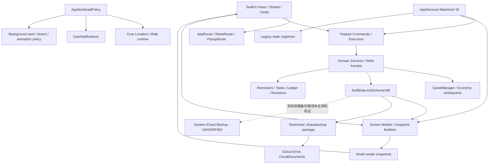

# INTERNAL_AUDIT_REPORT

审计日期：2026-07-10<br>
项目基线：`4d434d5354efdfb0eb7864cadad9ccf3df3825b5`<br>
审计模式：只读、反向验证、优先消除误报

证据标签：

- `[CODE]`：代码、配置、构建、测试或静态检查。
- `[DOC]`：项目文档。
- `[OBSERVED]`：Simulator、录屏或实际运行结果。
- `[INFERRED]`：由有限证据推导。
- `[UNVERIFIED]`：尚未通过必要环境验证。

## 1. Audit Scope and Coverage

### 1.1 覆盖范围

| 范围 | 数量 | 覆盖状态 |
|---|---:|---|
| `Ohana/App` | 27 Swift | 全树静态扫描；启动、路由、Reset、DI、运行策略深读 |
| `Ohana/Domain` | 114 Swift | 全树扫描；业务事实、删除、备份、同步、经济系统深读 |
| `Ohana/Models` | 42 Swift | 全树扫描；V85 Schema、迁移、费用、健康、状态模型深读 |
| `Ohana/Shared` | 78 Swift | 全树扫描；本地化、媒体、运行策略、共享状态深读 |
| `Ohana/Features` | 695 Swift | 全树扫描；高风险数据、照护、成员、健康、首页、设置路径深读 |
| 生产 Swift 合计 | 956 | 项目审计脚本全部覆盖 |
| `OhanaTests` | 112 Swift | 测试执行，并对相关 Finding 的既有测试重新检索 |
| `OhanaUITests` | 3 Swift | 完整套件执行；关键失败用例单独复跑 |
| `docs/` Markdown | 79 | Phase 3 逐文件检查 |
| 全仓已跟踪 Markdown | 98 | 已检查；另检查两个忽略的重复/参考文档 |
| Xcode 项目、Entitlements、Info、Privacy manifest | — | 已检查 |

这里的“全覆盖”指全树脚本扫描和文件级分类，不代表人工逐行阅读了全部 956 个生产文件。人工语义审查按数据安全、业务状态机、启动、并发、删除、备份恢复、权限和发布风险排序进行。

### 1.2 基线事实

- [CODE] 当前最新 SwiftData Schema 为 `ArkSchemaV85`。
- [CODE] Solo capability 保留 HealthKit 和 CloudDocuments；未声明 App Group、APNs、CloudKit sharing。
- [CODE] 项目 Deployment Target 为 iOS 26.2。
- [CODE] 当前以 Swift 5 language mode 编译，并启用 approachable concurrency、默认 MainActor isolation。
- [CODE] 当前工作区只有 `?? AUDIT_BRIEF.md`；没有本审计产生的 tracked diff。

### 1.3 无法检查或未执行

- 真机 iCloud Backup 内容与换机恢复。
- 正式签名 Release Archive。
- App Store Connect metadata、Privacy Nutrition Labels、正式 provisioning profiles。
- 真机 HealthKit、通知、后台定位、Low Power、thermal 行为。
- Instruments、Energy Log、ETTrace、memgraph 和长时间锁屏测试。
- 法律意见以及产品 Owner 对“完整导出”“删除全部”“首位成员”的最终定义。

没有无法读取的项目文件；主要盲区来自外部环境和真机运行条件。

## 2. Build / Test / Lint Results

### 2.1 已执行结果

| 检查 | 实际执行 | 结果 |
|---|---|---|
| Scheme/Target | `xcodebuild -list -project Ohana.xcodeproj` | 成功；3 targets、4 schemes |
| Debug Build | `xcodebuild ... -scheme Ohana -configuration Debug ... CODE_SIGNING_ALLOWED=NO build` | 成功，约 114.2 秒 |
| Simulator 启动 | iPhone 17 / iOS 26.5 | 成功；Home 可见 |
| Unit Tests | `-only-testing:OhanaTests test-without-building` | 1509/1509 通过 |
| 完整 UI Tests | `-only-testing:OhanaUITests test-without-building` | 8 通过、72 失败 |
| 严格并发诊断 | `SWIFT_STRICT_CONCURRENCY=complete` Debug Build | Build 成功；132 个去重 warning 位置 |
| SwiftLint | `swiftlint lint --strict --reporter github-actions-logging` | 1071 文件，0 violation |
| SwiftFormat | `swiftformat --lint .` | 1113 文件，0 change |
| Secret scan | `gitleaks detect --no-git --redact ...` | 未发现 secret |
| Release 静态门禁 | `scripts/release-hardening-check.sh --skip-build` | 通过 |
| 文档状态门禁 | `scripts/audit-doc-status-ledgers.sh` | Phase 4 复跑通过 |
| Agent/Skill 治理 | `scripts/audit-agent-skill-governance.sh` | Phase 4 复跑通过 |
| Tracked diff | `git diff --check` | 通过 |

Unit 结果：[xcresult](</Users/guanchenli/Library/Developer/XcodeBuildMCP/workspaces/Ohana-b6cf423d5931/result-bundles/test_sim_2026-07-10T08-40-38-740Z_pid9667_ce352cc7.xcresult>)

完整 UI 结果：[xcresult](</Users/guanchenli/Library/Developer/XcodeBuildMCP/workspaces/Ohana-b6cf423d5931/result-bundles/test_sim_2026-07-10T08-43-10-055Z_pid9667_8f619b19.xcresult>)

### 2.2 UI Test 反向验证

Phase 4 重新执行：

```bash
scripts/test-simulator.sh \
  '-only-testing:OhanaUITests/OhanaUITests/testCreateFirstPetFromTodayFocusAfterFirstHuman'
```

结果：

- [CODE] 失败，约 41.9 秒。
- [OBSERVED] 失败时录屏明确显示首页存在“添加第一只宠物”卡片。
- [CODE] XCTest 的 `app.buttons["home-add-first-pet-card"]` 未识别该入口。
- 因此，原报告中“产品入口可能不存在”的表述被拒绝；确认的是 UI 自动化门禁和 accessibility identity 不可靠。

定向结果：[xcresult](<../../../.build/DerivedData/tests/main-b6cf423d5931-tests/Logs/Test/Test-Ohana-2026.07.10_12-30-49-+0200.xcresult>)

完整 UI 套件的 72 个失败中：

- 68 个是相同的首宠入口识别失败。
- 2 个 UI query timeout。
- 2 个植物入口/卡片断言失败。

### 2.3 未执行

- Release Build / signed Archive：未执行。
- 真机 Build/Test：未执行。
- Instruments、Energy、ETTrace、memgraph：未执行。
- App Store metadata/profile 检查：无法执行。

## 3. Executive Summary

反向核验后的最终结论：

- Confirmed Critical：0
- Confirmed High：5
- 被合并：3
- 被降级：8
- 被拒绝：2
- Needs Runtime Verification：1

确认的 5 项 High 集中在：

1. 健康数据存储缺少可证明的系统备份排除，与公开隐私承诺不一致。
2. 自动备份和删除全部数据之间存在可重建旧备份的竞态。
3. Human Note 持久附件不会随笔记、成员或 Reset 清除。
4. 备份恢复包含中间提交和宽松解码，失败时可能留下部分恢复状态。
5. UI 自动化门禁系统性失效，无法作为主要流程的发布证明。

项目并非架构失控：

- 1509 项 Unit Tests 全部通过。
- SwiftLint、SwiftFormat、gitleaks 和全仓治理审计均通过。
- 已存在明确的 Domain 写入边界、经济系统 chokepoint、typed routes、runtime policy 和 V85 migration plan。
- 大部分风险可以局部修复，不支持“大规模重写”结论。

目前最影响发布可信度的是数据生命周期完整性和不可用的 UI 回归门禁，而不是代码风格或目录结构。

## 4. Product and Architecture Map

### 4.1 Product Map

[DOC][CODE] Ohana 当前是本地优先的家庭照护应用，主要围绕：

- Human、Pet、Plant 成员管理。
- 快速照护事实记录。
- 健康、喂食、饮水、用药、遛狗和任务。
- 奖励、Coconut ledger、Oasis 等反馈系统。
- 提醒、通知、历史、照片和纪念模式。
- 受限范围的 iCloud Drive 自动备份与恢复。

核心 Job-to-be-Done：

- 快速看见今天需要照护什么。
- 用尽可能少的操作完成并记录一次照护。
- 在提醒、历史、奖励和家庭成员之间保持一致。
- 在删除、纪念、恢复和权限变化后保持数据可信。

实际 onboarding 当前为 Human-first，再引导创建 Pet；这与产品基础文档的 pet-first 表述冲突，但不构成运行时 Bug。

### 4.2 Architecture Map



主要依赖方向总体正确：UI → command/read model → domain/data。<br>
主要偏差是 `AppServices` 与多个静态 registry 并存，以及 legacy `homeRevision` 仍跨 surface 广播。

## 5. Confirmed Critical Findings

没有确认的 Critical。

原 Phase 3 `DOC-001` 被标为 Critical 的依据不足以支持 Critical：

- 实际 iCloud Backup 内容没有真机证据。
- 可以确认的是代码未建立备份排除控制、公开政策作出绝对承诺。
- 因此该问题合并进入 `SEC-001`，保留为 High。

## 6. Confirmed High Findings

### SEC-001

Finding ID：SEC-001<br>
标题：健康数据存储缺少可证明的系统备份排除，与公开隐私承诺不一致<br>
类型：隐私合规控制缺口<br>
严重程度：High<br>
置信度：Medium<br>
反向验证结论：Confirm；原 `DOC-001` 合并至此<br>
证据标签：[CODE] [DOC] [INFERRED] [UNVERIFIED]<br>
涉及文件、类型、函数或页面：[SharedModelContainer.swift](<../../../Ohana/Models/SharedModelContainer.swift:1032>)、[HumanNoteAttachmentStore.swift](<../../../Ohana/Features/HumanNotes/HumanNoteAttachmentStore.swift:18>)、[privacy-policy.md](<../../../docs/privacy-policy.md:44>)<br>
当前行为：主 SwiftData store 和 Human Note 附件位于 Application Support；全仓未发现针对这些路径的 `isExcludedFromBackup`。公开隐私政策称健康数据不会进入 iCloud。<br>
预期行为：代码必须实际排除包含健康数据的存储路径，或者公开政策准确说明系统备份行为。<br>
具体问题：受限 `.ohanabackup` 已过滤健康数据，但这不能覆盖系统级设备备份路径。Apple 将 Application Support 作为通常需要备份的应用数据位置，并提供 backup exclusion；App Review 5.1.3 对个人健康信息进入 iCloud 有明确限制。[Apple 文件系统说明](https://developer.apple.com/documentation/foundation/using-the-file-system-effectively)、[App Review Guidelines](https://developer.apple.com/app-store/review/guidelines/)<br>
根因：设计治理了应用自有导出，却没有把 OS container backup 纳入同一数据出口模型。<br>
触发条件或复现步骤：在真机产生健康数据，启用设备 iCloud Backup，再检查备份或换机恢复内容。该实际传输结果目前未验证。<br>
用户影响：公开隐私承诺可能比实际技术控制更强。<br>
技术影响：存在隐私政策不一致和 App Review 风险。<br>
最小修复方案：对主 store、sidecar、fallback store 和 Human Notes 根目录建立统一 backup-exclusion helper；在创建、迁移和 fallback 后重复应用并验证。<br>
长期方案：将健康/敏感数据与允许系统备份的数据拆分到不同持久化根目录。<br>
修复后新风险：直接排除整个主数据库会同时失去非健康数据的系统备份恢复能力；产品需明确接受 local-only，或实施数据分区。<br>
不修复的风险：无法证明健康数据只存在于承诺的本地范围。<br>
实施工作量：M<br>
推荐测试：URL resource value 单测；升级与 fallback 测试；真机 iCloud Backup/restore 检查。<br>
验收标准：所有敏感路径均明确带排除标记，真机备份不包含这些文件，公开政策与实际行为一致。<br>
需要确认的内容：真机 iCloud Backup 的最终内容。

### SEC-002

Finding ID：SEC-002<br>
标题：删除全部数据期间，进行中的自动备份可以重新写回旧数据<br>
类型：竞态 Bug / 隐私删除<br>
严重程度：High<br>
置信度：High<br>
反向验证结论：Confirm；`RULE-003` 的竞态部分合并至此<br>
证据标签：[CODE]<br>
涉及文件、类型、函数或页面：[AutomaticBackupService.swift](<../../../Ohana/Domain/Services/AutomaticBackupService.swift:471>)、[AppResetService.swift](<../../../Ohana/App/AppResetService.swift:77>)<br>
当前行为：自动备份只以 `isRunning` 防止重复，没有可取消 Task 或 reset generation。Reset 通过独立 cleaner 删除托管备份，没有等待 AppServices 中正在运行的备份。<br>
预期行为：Reset 开始后，旧 generation 的任务不得写文件或更新成功状态。<br>
具体问题：如果导出已开始，Reset 可以先删除现有备份，随后旧任务完成并重新生成含删除前数据的 iCloud Drive 文件。<br>
根因：自动备份和 Reset 没有共同生命周期所有者或串行化边界。<br>
触发条件或复现步骤：让 exporter/file store 暂停在导出或写入点，同时执行删除全部数据，然后释放暂停点。<br>
用户影响：界面报告删除完成后，旧数据可能再次出现。<br>
技术影响：删除语义不可证明，晚到的 `markSuccess` 还可能覆盖 Reset 状态。<br>
最小修复方案：Reset 复用同一 backup coordinator；取消并等待 in-flight task；使用 generation token，在导出后、写入前和写入后检查 generation。<br>
长期方案：将自动备份、文件清理和 Reset 协调集中到单一 actor。<br>
修复后新风险：错误设计 generation 可能误删 Reset 后用户新启用产生的备份，或让 Reset 永久等待；必须限定 generation 所有权与超时。<br>
不修复的风险：违反用户明确的数据删除操作。<br>
实施工作量：M<br>
推荐测试：可暂停 exporter/file writer 的确定性交错测试。<br>
验收标准：所有 export/reset/write 顺序下，Reset 返回后均不存在旧 generation 文件或成功记录。<br>
需要确认的内容：无。

### SEC-003

Finding ID：SEC-003<br>
标题：Human Note 持久附件不会随笔记、成员或 Reset 删除<br>
类型：真实数据生命周期 Bug<br>
严重程度：High<br>
置信度：High<br>
反向验证结论：Confirm，范围收窄为已成功保存的附件<br>
证据标签：[CODE]<br>
涉及文件、类型、函数或页面：[HumanNoteAttachmentStore.swift](<../../../Ohana/Features/HumanNotes/HumanNoteAttachmentStore.swift:90>)、[HumanNoteCommands.swift](<../../../Ohana/Features/HumanNotes/HumanNoteCommands.swift:126>)、[PhysicalDeletionService.swift](<../../../Ohana/Domain/Services/PhysicalDeletionService.swift:491>)、[AppResetService.swift](<../../../Ohana/App/AppResetService.swift:84>)<br>
当前行为：附件只在笔记保存失败时通过 `deletePendingAttachments` 清理。成功保存后的删除笔记、删除 Human 和 Reset 路径均未清理对应文件。<br>
预期行为：业务记录被物理删除后，不再被任何存活记录引用的附件也应删除。<br>
具体问题：数据库记录消失，但包含照片或文档的文件仍留在 Application Support。<br>
根因：附件所有权没有进入 Human Note、Member deletion 和 Reset 的删除状态机。<br>
触发条件或复现步骤：创建带附件的 Human Note，记录文件 URL，然后删除笔记、删除 Human 或 Reset，并检查文件。<br>
用户影响：用户认为已经删除的私人附件仍保留在设备上。<br>
技术影响：孤儿文件、存储增长和隐私删除不完整。<br>
最小修复方案：删除前解析引用；数据库保存成功后删除已无引用文件；Member 删除清除该 Human 的附件目录；Reset 清除整个 Human Notes 根目录。<br>
长期方案：为外部文件建立明确的 owner ID、引用计数和 orphan maintenance。<br>
修复后新风险：若附件可被多个记录共享，直接删除会造成活跃记录丢文件；必须先做存活引用检查，并在数据库提交成功后删文件。<br>
不修复的风险：删除承诺持续不完整。<br>
实施工作量：M<br>
推荐测试：带附件的单笔删除、Human 删除、Reset、共享引用和数据库保存失败测试。<br>
验收标准：删除后无孤儿文件；保存失败或共享引用情况下不会误删。<br>
需要确认的内容：产品是否允许同一附件被多个笔记引用。

### DATA-001

Finding ID：DATA-001<br>
标题：备份恢复不是原子的，宽松解码会把损坏输入转换为合法但错误的数据<br>
类型：持久化完整性 Bug<br>
严重程度：High<br>
置信度：High<br>
反向验证结论：Confirm；原 `DATA-002` 合并至此<br>
证据标签：[CODE]<br>
涉及文件、类型、函数或页面：[DataBackupManager.swift](<../../../Ohana/Domain/Services/DataBackupManager.swift:507>)<br>
当前行为：

- 恢复过程至少在约 563、687、872 行存在中间 `save()`。
- 后续阶段仍可能 throw。
- rollback 只能撤销当前未保存变更，不能恢复已提交 checkpoint。
- 多处损坏 UUID 被替换为新 UUID，必要日期被替换为当前时间。

预期行为：损坏备份在写入前被拒绝；恢复要么完整成功，要么保留恢复前状态。<br>
具体问题：后期失败会留下部分成员、事件或关系；宽松 fallback 会掩盖数据损坏并破坏关联和历史时间。<br>
根因：验证、转换和持久化交织；解码器把 required identity/date 当作可恢复展示字段。<br>
触发条件或复现步骤：构造非法 UUID、非法日期，或在第一个/第二个 checkpoint 后让媒体或关系恢复抛错。<br>
用户影响：用户看到“恢复失败”，但数据库实际上已经被部分改变。<br>
技术影响：关系断裂、重复实体、错误历史时间以及难以再次恢复。<br>
最小修复方案：在第一次写入前严格验证所有 required ID、日期和关系引用；后续阶段必须在临时 store 中完成，或提供完整补偿机制。<br>
长期方案：版本化 restore transaction/staging store，并在成功后一次性切换。<br>
修复后新风险：staging 会增加临时磁盘占用；一次性构建全部对象可能增加内存峰值，需配合 cursor 和预算。<br>
不修复的风险：备份这一安全机制本身可能制造数据损坏。<br>
实施工作量：L<br>
推荐测试：非法 ID/date、关系缺失、三个 checkpoint 后故障注入、磁盘不足、重复恢复。<br>
验收标准：任何失败都不改变恢复前数据库；损坏 required 字段产生明确错误而非随机替代。<br>
需要确认的内容：允许被默认修复的字段白名单。

### TEST-001

Finding ID：TEST-001<br>
标题：UI 回归门禁系统性失效，不能证明主要用户流程<br>
类型：测试基础设施缺陷<br>
严重程度：High<br>
置信度：High<br>
反向验证结论：Confirm，但明确不是已确认的产品入口 Bug<br>
证据标签：[CODE] [OBSERVED]<br>
涉及文件、类型、函数或页面：[OhanaUITests.swift](<../../../OhanaUITests/OhanaUITests.swift:2810>)、[OhanaUITests.swift](<../../../OhanaUITests/OhanaUITests.swift:5113>)、[TodayFocusCard+ContentCards.swift](<../../../Ohana/Features/TodayFocus/Views/TodayFocusCard+ContentCards.swift:501>)<br>
当前行为：80 项 UI Tests 中 72 项失败；68 项卡在相同的首宠入口查询。创建 helper 在名称、标题和主要按钮都消失时可以认为创建完成，却没有要求明确的 post-save marker。<br>
预期行为：测试准备阶段只能在确认业务状态已持久化后成功；关键入口必须通过稳定 accessibility identity 查询。<br>
具体问题：录屏显示“添加第一只宠物”卡片实际可见，但 XCTest 的 button 查询看不到它。这说明测试与 SwiftUI accessibility hierarchy 不一致，而不是入口不存在。<br>
根因：accessibility element 合并/identity 与查询类型不匹配，加上 setup helper 接受模糊成功条件。<br>
触发条件或复现步骤：执行 `testCreateFirstPetFromTodayFocusAfterFirstHuman`。<br>
用户影响：当前没有直接证明产品流程损坏，但发布回归无法覆盖大部分主要路径。<br>
技术影响：72 个失败掩盖真实回归，完整 UI 套件不能作为 release gate。<br>
最小修复方案：

1. 让首宠入口以单一稳定 XCUI button identity 暴露；
2. 创建 helper 必须等待明确的保存后状态；
3. 修复 setup 后再单独处理剩余植物断言和 timeout。

长期方案：建立小型 smoke suite 与较慢完整 UI suite，避免所有用例依赖同一个脆弱 bootstrap。<br>
修复后新风险：为了测试而强行合并 accessibility children 可能破坏 VoiceOver 阅读顺序；修复必须同时验证真实辅助功能。<br>
不修复的风险：UI 回归只能依赖人工发现。<br>
实施工作量：M<br>
推荐测试： accessibility tree snapshot、首次 Human、首次 Pet、重启后状态、失败保存、完整 UI suite。<br>
验收标准：首宠定向测试连续 10 次通过；setup 必须证明保存后状态；完整套件不存在共同 bootstrap 失败。<br>
需要确认的内容：首宠卡期望暴露为一个整体按钮，还是多个独立操作。

## 7. Medium and Low Findings

### Medium

| ID | 保留结论 | 证据与最小动作 |
|---|---|---|
| SEC-004 | Reset 保留 `EconomyBudgetUsageEvent` 与“删除全部”语义不一致 | [CODE] 数据为本地、45 天有界、无自由文本，因此由 High 降级。需产品明确“反滥用数据”是否属于删除范围。 |
| DATA-003 | writable disk fallback 可能形成主库/备用库分叉 | [CODE][UNVERIFIED] 静态路径存在，但未做 store-open fault injection。先验证 primary→fallback→primary 序列。 |
| CONC-001 | Avatar ModelActor 将 `ModelContext` 传到 MainActor service | [CODE] Swift 6 严格诊断成立；当前 Swift 5 下未证明运行时损坏，降为迁移风险。 |
| CONC-002 | Medication callback 捕获 SwiftData models/context | [CODE] 同上；需改为 Sendable ID/DTO，但不是已证实竞态事故。 |
| ARCH-001 | `AppServices` 与静态 registries 形成双重依赖图 | [CODE] 可测试性和生命周期所有权不清，但现有边界审计通过。新增服务时优先实例 DI。 |
| DATA-004 | Restricted backup 的排除范围未完整向用户说明 | [CODE][DOC] UI 强调健康排除，但任务、部分自由文本和 sidecar 范围不够明确。 |
| PERF-001 | 大型 backup/restore/reset 缺少统一 cursor、预算和取消 | [CODE][UNVERIFIED] 属于规模风险；未有 Instruments 或密集数据运行证明。 |
| PERF-002 | legacy `homeRevision` 仍造成宽范围失效 | [CODE] scoped Home token 已存在，因此不是整体设计缺失；应逐 surface 迁移并测量。 |
| CONC-003 | Notification scheduler 使用全局可变 registry | [CODE] 当前防护降低风险，但生命周期和测试隔离仍不够显式。 |
| CONC-004 | QuickFeed bootstrap 启动匿名 Task，缺少 route cancellation | [CODE][INFERRED] 页面离开后可能继续工作；需将 Task 归 route/screen owner。 |
| LOGIC-003 | Domain/restore 可写入非正数或非有限 expense | [CODE] UI 输入限制不是 domain invariant；在命令和恢复边界拒绝非法值。 |
| A11Y-001 | Reduce Motion 被映射成 `.efficient`，部分调用者只检查 `allowsMotion` | [CODE] full 与 efficient 语义被折叠；需 runtime 测试确认具体动画。 |
| A11Y-002 | App 注册九种语言，但 InfoPlist localization 不完整 | [CODE] 系统权限文案和主应用语言覆盖不一致。 |
| COMPAT-001 | iOS 26.2 最低版本和 iPad 支持矩阵未形成明确产品决策 | [CODE][DOC] 不是代码 Bug，但影响可发布设备范围。 |
| RULE-001 | “完整导出”与 restricted backup 实现冲突 | [DOC][CODE] 代码更隐私安全；需要重定义“完整”而不是放宽敏感数据导出。 |
| RULE-002 | pet-first 文档与 Human-first 实现/测试冲突 | [DOC][CODE] 属于产品规则冲突，不是 High 运行风险。 |
| RULE-004 | AI playbook 中自动 push、强制 spec、未来架构段落可能扩大任务范围 | [DOC] 根 `AGENTS.md` 已明确当前用户请求优先，因此降级。 |
| DOC-002 | 状态文档仍称 P1=0，并包含过时 release 基线 | [DOC] 是状态漂移，不单独构成产品 High。 |
| DOC-003 | permission rationale、privacy ownership 中仍有旧 capability 描述 | [DOC][CODE] 实际 entitlement 较安全；问题是文档漂移。 |

### Low

| ID | 保留结论 |
|---|---|
| ARCH-002 | 40 个生产 Swift 文件超过 1000 行；属于维护成本，不应按体积直接判定架构 Bug。 |
| TEST-002 | 约 32 个测试文件含 source-string 断言；可作 guardrail，但不能替代行为测试。 |
| CONC-005 | 取消旧 toast Task 后，晚到 cleanup 可能清除新 toast；影响范围有限。 |
| DOC-004 | Settings 硬编码 `v4.5.0`，而项目 Marketing Version 为 `1.0`。原 Phase 2 与 Phase 3 都使用过 `DOC-001`，最终报告将此低风险项重新编号为 `DOC-004`，避免 ID 冲突。 |

## 8. Business Logic and State Machine Review

### 8.1 核心实体

- Human、Pet、Plant。
- Care event、Health log、Medication、Feeding、Water、Walk。
- Reminder、Family Task、Reward、Coconut ledger。
- Human Note 与外部附件。
- Expense、Document、Photo、Moment。
- Backup snapshot、automatic backup status。
- Memorial、physical deletion、reset state。

### 8.2 已确认实现较成熟的不变量

| 不变量 | 状态 |
|---|---|
| View 不直接修改 Coconut balance | [CODE] 已由 economy boundary 和审计保护 |
| Quick care 进入 command/domain service | [CODE] 总体成立 |
| Reward 经 QuestManager 和 audited chokepoint | [CODE][TEST] 成立 |
| Memorial/physical deletion 有集中式 service | [CODE][TEST] 大部分成立 |
| 高频读使用 read model/snapshot 而非全部放在 View | [CODE] 已有明确架构方向 |
| Solo 不启用 CloudKit sharing/APNs | [CODE][TEST] 成立 |

### 8.3 关键状态机

```text
照护：
user intent
→ 本地视觉反馈
→ domain command
→ 写入一个 business fact
→ rewards/reminders/tasks/ledger/revision side effects
→ read model refresh

成员：
active
→ memorial
→ restricted write/read behavior
→ optional physical deletion
→ deleted

自动备份：
disabled / idle
→ running
→ success or failure

缺口：
running + reset 没有共同 generation/cancellation 状态

恢复：
decode
→ create base entities
→ save checkpoint
→ relationships/media
→ further checkpoints
→ complete

缺口：
任一后期失败可能留下前期已提交状态
```

### 8.4 业务规则结论

- 照护事实和经济奖励边界总体可信。
- 删除、外部附件、自动备份和恢复尚未形成一个端到端数据生命周期状态机。
- “完整导出”和“删除全部”在产品文档中的绝对措辞超过当前实现。
- 费用币种行为是明确的“仅改变显示格式、不换算”产品设计，因此原 `LOGIC-001` 被拒绝。
- HealthKit 不能可靠告诉应用读取权限是否被用户拒绝；因此原“拒绝后显示 connected 必然错误”的 Finding 被拒绝。

## 9. iOS Engineering Review

### Architecture and DI

- 优点：Feature/Domain/Model/Shared 边界清楚，typed routes 和 domain write kernels 已存在。
- 扣分：`AppServices` 与多个 static registry 并存；部分大型 View 同时承担 UI、协调、聚合和异步工作。
- 结论：不是 God Object 主导的失控架构，但仍处于迁移到单一生命周期所有权的中间阶段。

### SwiftUI and State

- 局部 visual state、route state 和 read-model state 大体分离。
- scoped invalidation token 已实现。
- legacy `homeRevision` 仍会让多个 surface 对无关变化失效。
- 首宠入口视觉存在但 XCUI identity 不可见，表明 accessibility tree 与视觉树不一致。

### Concurrency

- [CODE] 常规构建成功。
- [CODE] `SWIFT_STRICT_CONCURRENCY=complete` 暴露 132 个 warning 位置，其中 47 个属于 actor/Sendable/ModelContext 问题。
- 当前 Swift 5 mode 下不能把这些 warning 直接写成已发生的 race。
- 它们是明确的 Swift 6 升级阻塞和未来正确性风险，应按边界逐步消除，而不是一次性全仓重写。

### Persistence and Sync

- V85 schema、migration plan 和大量 in-memory persistence tests 是明显优点。
- 当前最大缺口在 restore atomicity、fallback store 身份和外部附件 ownership。
- 当前 Solo 没有常规 REST backend；Auth refresh、HTTP retry、API pagination 等不属于当前主要攻击面。
- iCloud Drive 文件备份仍需要超时、取消、generation 和错误恢复语义。

### Lifecycle, Performance and Energy

- 启动约 1.576 秒的 UI 测量是正向信号，但仅来自 Simulator。
- 静态 runtime、smoothness、route-first-frame 审计均通过。
- 这些结果不能替代 500 图滚动、后台遛狗、两分钟 sheet 覆盖、Low Power 或长时间锁屏测试。
- backup/restore/reset 的全量循环和 legacy revision 是最值得做真机 profiling 的区域。

## 10. Security, Privacy and App Store Review

### 已确认的正向控制

- [CODE] gitleaks 未发现 secret。
- [CODE] Solo entitlement 不包含 APNs、CloudKit sharing 或 App Group。
- [CODE] 应用自有 `.ohanabackup` 明确排除多类健康数据。
- [CODE] Privacy manifest、Required Reason 和 release-data-safety 静态门禁通过。
- [CODE] 未发现需要立即升级为 High 的 WebView、clipboard、deep-link 或硬编码 API key 问题。

### 主要风险

- `SEC-001`：健康数据 OS backup 控制不可证明。
- `SEC-002`：Reset 与自动备份竞态。
- `SEC-003`：附件删除不完整。
- `SEC-004`：反滥用事件保留与“删除全部”措辞不一致。
- App Store Connect 的实际隐私标签、截图、支持 URL、审核备注和 profile 未验证。

### App Store 判断

当前不能称为 App Store Ready，原因不是编译失败，而是：

- 公开隐私政策和实际存储控制尚未完全闭环。
- 数据删除不可证明。
- signed Archive 和正式 metadata 未检查。
- UI release gate 不可用。

## 11. Accessibility Review

正向证据：

- [CODE] 全仓 accessibility 静态门禁通过。
- [OBSERVED] 启动页面可见 82 个 accessibility elements 和 13 个交互目标。
- [CODE] 项目已有 Dynamic Type、44pt target、localized label 和 Reduce Motion 规则。

保留问题：

- `TEST-001` 表明视觉入口不一定以预期 accessibility role/identifier 暴露。
- `A11Y-001` 表明 Reduce Motion 与 efficient motion 的语义不完全一致。
- `A11Y-002` 表明系统权限文案的语言覆盖少于 App 注册语言。
- 未执行真实 VoiceOver 阅读顺序、Voice Control、Switch Control、RTL、最大 Dynamic Type、Increase Contrast 和 modal focus 验收。

静态脚本通过不能证明完整 Accessibility；当前等级应理解为“基础设施存在、运行验证不足”。

## 12. Test Coverage Review

### 优点

- 1509 项 Unit Tests 全部通过。
- Domain、economy、member lifecycle、migration、runtime policy 等有大量行为测试。
- 审计脚本有 fixture self-tests，降低扫描范围被悄悄缩小的风险。
- UI 套件真实存在，不是空壳。

### 主要缺口

| 缺口 | 推荐测试 |
|---|---|
| 自动备份/Reset 竞态 | 可暂停 exporter 和 file writer 的交错测试 |
| Human Note 附件删除 | note、member、reset、shared reference 测试 |
| Restore atomicity | 每个 checkpoint 后 fault injection |
| 损坏 UUID/date | 严格拒绝测试 |
| Store fallback 分叉 | primary→fallback→primary fault-injection |
| OS backup exclusion | URL resource 测试及真机 backup/restore |
| UI bootstrap | 明确 post-save marker |
| Accessibility identity | XCUI role/identifier snapshot |
| Reduce Motion | full/efficient/minimal 三档行为测试 |

当前 UI Tests 不是“产品 72 条流程全部坏了”，而是一个共同 bootstrap/identity 问题使 68 项无法到达被测流程。修复共同依赖后，才能重新评估真实 UI 缺陷数量。

## 13. Documentation and Rules Review

### 13.1 权威与冲突矩阵

| 文件/类别 | 权威 | 结论 | 主要问题 |
|---|---|---|---|
| [AGENTS.md](<../../../AGENTS.md>) | 工程与 Agent 最高 | Modify | 权威顺序清楚；push/playbook 边界可进一步限定 |
| [product-foundation.md](<../../../docs/specs/product-foundation.md>) | 产品最高 | Modify | D17 pet-first、G6 完整导出/删除与实现冲突 |
| [privacy-policy.md](<../../../docs/privacy-policy.md>) | 对外公开 | Modify urgently | “健康数据不会进入 iCloud”缺少完整技术证明 |
| [release-quality-gates.md](<../../../docs/release-quality-gates.md>) | 工程发布门禁 | Keep | 已明确静态审计不等于运行证明 |
| `ui规范.selection.json` | UI machine source of truth | Keep | 未发现需要升级为 High 的代码冲突 |
| `testing-progress.md` / `task-follow-ups.md` | 当前状态账本 | Modify | P1=0 与本次确认 Finding 不一致 |
| `release-hardening-plan.md` | 历史计划 | Archive/Replace | 仍引用 V60 和过时 backup 范围 |
| `permission-rationale-draft.md` | 发布文案草稿 | Modify | 仍描述 remote notification capability |
| `privacy-data-ownership.json` | 隐私治理 manifest | Modify | 仍提 App Group，而当前 Solo 无此 entitlement |
| `cloud-sync-todo.md` | 延后事项 | Keep with dated status | 不应被当作当前能力证明 |
| `ai-module-test-playbook.md` | AI 工作流 | Split/Modify | 混入自动 push、未来同步和强制文档创建 |
| `.codex/skills/ui-ux-pro-max` | Advisory | Keep | `AGENTS.md` 已明确仓库规则优先 |

其余已检查 Markdown 没有发现需要升级为 High 的独立冲突；历史文档应保持 archive/reference 标记，避免被 AI 当作当前规范。

### 13.2 AI Rules 结论

正向部分：

- 当前用户请求位于最高优先级。
- 明确禁止编造 API、文件和未执行验证。
- 要求最小改动、保护用户工作、按风险验证。
- UI、数据、并发、隐私边界较完整。

需要收紧的部分：

- 自动 push 只能在用户请求或明确 workflow 下执行。
- “必须创建 spec”应改为风险触发，而不是所有模块统一要求。
- 未来 CloudKit 架构、安装技能、保存长期规则不能成为默认任务动作。
- AI 应先区分 current policy、future plan 和 historical reference。
- Definition of Done 应包含“运行结果与静态推断分开”。

## 14. Rule → Code → Test Traceability

| 规则 ID | 规则 | 来源 | 代码 | 测试 | UI/流程 | 状态 | 建议 |
|---|---|---|---|---|---|---|---|
| R-BIZ-001 | Quick care 只写一个 business fact | AGENTS | Domain write kernels | Care/domain tests | Quick Care | Implemented and tested | 保持 chokepoint |
| R-ECON-001 | Reward 只能经 QuestManager | AGENTS | Economy discipline | Economy boundary tests | Rewards/Oasis | Implemented and tested | 保持审计 fixture |
| R-MEM-001 | Memorial 限制后续业务写入 | Product/AGENTS | MemberLifecycleGate | Lifecycle tests | Memorial | Implemented and tested | 补外部附件删除 |
| R-SOLO-001 | Solo 禁用 CloudKit sharing/APNs | Capability docs | AppCapabilityProfile、entitlements | Capability tests/audits | Settings/online features | Implemented and tested | 修正文档 drift |
| R-PRIV-001 | 健康数据不进入 iCloud | Privacy policy | Restricted export 有过滤；OS backup 无显式排除 | 无真机 backup test | Health/backup | Partially implemented | 建立 backup exclusion |
| R-DEL-001 | 删除全部数据 | Product/privacy | AppReset、PhysicalDeletion | 有 Reset/删除测试，缺附件和 race | Settings Reset | Partially implemented | 纳入文件和 in-flight work |
| R-BACKUP-001 | 自动备份可安全启停和清除 | Backup spec | AutomaticBackupService | 有普通路径测试，缺交错 | Settings Backup | Partially implemented | generation/cancellation |
| R-RESTORE-001 | 恢复失败不损坏现有数据 | 隐含数据安全规则 | DataBackupManager | 缺 checkpoint fault injection | Restore | Partially implemented | strict preflight + staging |
| R-EXPORT-001 | 用户可导出完整数据 | Product G6 | Restricted export | 范围测试存在 | Export | Conflicting | 重定义“完整” |
| R-ONB-001 | Pet-first，Human 可跳过 | Product D17 | 当前 Human-first | UI/unit 明确 Human-first | Onboarding | Conflicting | 产品 Owner 选定唯一规则 |
| R-RUNTIME-001 | 所有重复工作受 AppWorkloadPolicy 控制 | AGENTS/governance | AppWorkloadPolicy | Policy/audit tests | Motion/background | Partially implemented | 修正 Reduce Motion 调用者 |
| R-AI-001 | 用户请求优先、最小改动、验证后修改 | AGENTS/playbook | 不适用 | Governance audit | Agent workflow | Conflicting | 拆分强制规则与未来建议 |

## 15. Rejected or Downgraded Findings

| 原 Finding | 最终判定 | 原因 |
|---|---|---|
| SEC-001 | Confirm | 确认的是备份控制和公开承诺缺口；实际真机传输仍未验证 |
| SEC-002 | Confirm | 静态控制流足以建立可达竞态 |
| SEC-003 | Confirm | 保存失败已有清理；已保存附件删除缺失仍成立 |
| SEC-004 | Downgrade → Medium | 数据本地、45 天有界、无自由文本；仍需明确删除语义 |
| DATA-001 | Confirm | 多次保存后仍存在 throw 路径 |
| DATA-002 | Merge → DATA-001 | 宽松 ID/date 解码与非原子恢复属于同一 trust-boundary 根因 |
| DATA-003 | Needs Runtime Verification | store fork 路径存在，但没有 fault-injection 证明真实切换结果 |
| CONC-001 | Downgrade → Medium | 严格诊断成立；当前 Swift 5 下无运行时损坏证据 |
| CONC-002 | Downgrade → Medium | 同上 |
| LOGIC-001 | Reject | 产品明确规定 currency 只改变显示、不进行历史换算 |
| TEST-001 | Confirm, refined | 确认测试门禁失效；拒绝“首宠入口不存在”结论 |
| DOC-001 | Merge → SEC-001 | Critical 不成立；公开政策冲突保留为 High |
| RULE-001 | Downgrade → Medium | 文档冲突真实，但代码选择更隐私安全 |
| RULE-002 | Downgrade → Medium | 产品规则冲突，不是安全或数据损坏 High |
| RULE-003 | Merge → SEC-002/003/004 | 删除问题应按竞态、附件、保留数据三个根因处理 |
| RULE-004 | Downgrade → Medium | 根 AGENTS 已声明用户请求优先，原报告夸大必然误操作 |
| DOC-002 | Downgrade → Medium | 状态文档过时，不单独制造运行事故 |
| TRACE-001 | Reject as independent finding | release-quality-gates 已明确静态审计不等于运行证明；只保留状态过度乐观问题 |
| DOC-003 | Downgrade → Medium | capability 文档漂移，实际 entitlement 没有扩大权限 |

额外拒绝：

- `LOGIC-002`：HealthKit 读取授权的拒绝状态不能由应用可靠获知；不能据此判定产品逻辑 Bug。
- “40 个千行文件等于架构失败”：拒绝。体积只能作为维护信号，必须结合职责和修改扩散判断。

## 16. Remaining Blind Spots

1. 真机 iCloud Backup 是否包含主 store、sidecar 和 Human Notes。
2. 真机 iCloud Drive 中 automatic backup/reset 的真实交错。
3. SwiftData primary store 失败后切换 writable fallback，再恢复 primary 的数据一致性。
4. Signed Release Archive、正式 entitlement 展开结果和 profile。
5. App Store Connect privacy labels、支持 URL、审核备注。
6. HealthKit、通知权限中途变化及后台恢复。
7. 30–60 分钟锁屏遛狗、Low Power、thermal 和定位能耗。
8. 500 图长列表、地图快照、缓存压力和 memory warning。
9. ETTrace、Instruments、Energy Log、memgraph。
10. VoiceOver、Voice Control、RTL、最大 Dynamic Type 和 modal focus。
11. 修复 UI bootstrap 后剩余 UI Tests 的真实失败数量。
12. 产品 Owner 对 pet-first、完整导出、反滥用数据保留和最低 OS 的最终决定。
13. 法律合规结论；本报告是工程审计，不是法律意见。

## 17. Internal Engineering Scorecard

| 领域 | 分数 | 置信度 | 证据 | 主要扣分原因 |
|---|---:|---|---|---|
| Architecture | 4/5 | High | [CODE] 清晰 Feature/Domain/Models 分层、全仓边界审计通过 | 双 DI 图、legacy revision、部分大型 View |
| Business Logic | 3/5 | High | [CODE][TEST] economy、care、member lifecycle 测试成熟 | 删除/恢复不变量不完整，产品规则冲突 |
| Reliability | 2/5 | High | [CODE] 1509 Unit 全过 | 非原子恢复、backup/reset race、UI gate 失效 |
| State Management | 3/5 | High | [CODE] typed routes、read models、scoped invalidation | legacy `homeRevision` 和部分全局 registry |
| Concurrency | 3/5 | Medium | [CODE] actors、runtime policy、普通 Build 成功 | strict concurrency 132 warning 位置，Swift 5 掩盖升级风险 |
| Data Layer | 2/5 | High | [CODE][TEST] V85、migration、持久化测试丰富 | restore atomicity、附件 ownership、fallback 身份 |
| Performance | 3/5 | Medium | [CODE][OBSERVED] 静态 smoothness 审计、Simulator launch 测量 | 无真机 profiling；批处理、revision、长会话未验证 |
| Security and Privacy | 2/5 | High | [CODE] gitleaks、restricted backup、最小 capability | 健康备份控制和删除闭环存在 High |
| Accessibility | 3/5 | Medium | [CODE] 静态审计和项目规则完善 | XCUI identity、Reduce Motion、真机辅助功能未验证 |
| Testability | 3/5 | High | [CODE] 1509 Unit、fixture audits | 80 项 UI 中 72 失败，共同 bootstrap 脆弱 |
| Documentation and Rules | 2/5 | High | [DOC] 权威层级和治理文档较完整 | 产品、隐私、状态、capability 文档存在实质冲突 |
| App Store Readiness | 2/5 | Medium | [CODE] Debug、lint、审计均通过 | 未 Archive/真机/metadata，隐私 High 和 UI gate 未关闭 |

最终判断：Ohana 的工程基础明显高于“不可维护”水平，但当前还不能把静态门禁和 Unit Test 数量等同于发布就绪。最关键的修复应保持局部：关闭敏感数据出口、使删除具备统一生命周期、让恢复失败保持原状态，并恢复可信的 UI 自动化门禁；现有证据不支持大规模架构重写。
