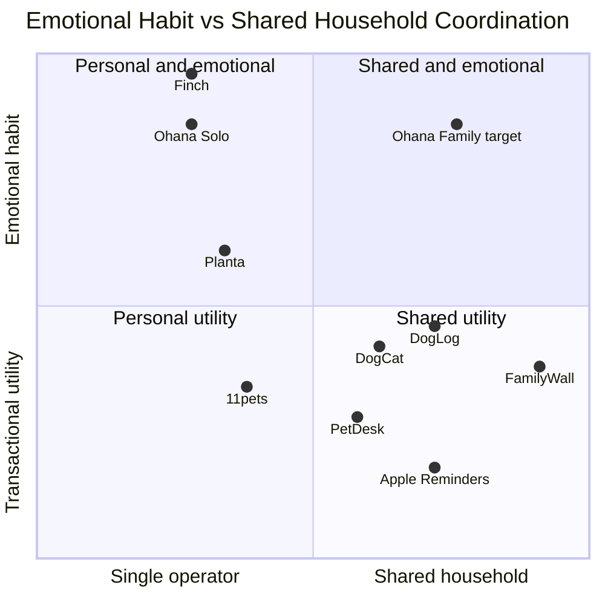

# Ohana Market Benchmark Report

> Phase B：自主市场研究与主流 App 竞品对标
>
> 研究基准日：2026-07-10（Europe/Berlin）
>
> 报告状态：Complete for public evidence；登录、付费、真机和未发布 Store 页面相关项目保留为 N/A / UNVERIFIED
> 研究原则：不把宣传文案等同于实测能力；不推断竞品内部技术；不把评分数或少量评论等同于市场份额。

证据标签：

- `[FIRST-PARTY-CODE]`：Ohana 源码、配置、测试或 Assets 直接证据。
- `[FIRST-PARTY-RUNTIME]`：Build、Simulator 或测试运行中实际观察。
- `[FIRST-PARTY-DOC]`：项目内产品、架构或审计文档。
- `[CODE-INFERRED]`：由源码结构推断，未完成对应运行验证。
- `[PUBLIC-OFFICIAL]`：Apple、产品官网或官方帮助中心当前公开页面。
- `[REVIEW-SIGNAL]`：公开评论中的有限样本信号，不代表全体用户。
- `[UNVERIFIED]`：公开证据不足或需要登录、付费、真机才能确认。

置信度记号：`H = High`、`M = Medium`、`L = Low`。评分记号如 `4/H` 表示 4 分、高置信度；`N/A` 表示证据不足，不等同于 0 分。

## 1. Research Scope

### 1.1 研究范围与市场假设

| 项目 | 结论 |
|---|---|
| 研究日期 | 2026-07-10 |
| 主要 Storefront | 德国 App Store。`[CODE-INFERRED]` 项目具备德语、欧元定价提案和德国 Locale，但产品文档未明确宣布唯一首发市场，因此这是研究假设。 |
| 补充 Storefront | 美国 App Store，仅用于德国区缺少页面、评论或官方价格说明时补充；报告不跨区合并评分、价格或评论量。 |
| 第一方信息 | 当前源码、Xcode 配置、测试、Simulator、[产品基线](../../../docs/specs/product-foundation.md:1)、[Phase A 内部审计](INTERNAL_AUDIT_REPORT.md:1)。 |
| 公开网络范围 | Apple App Store/iTunes Lookup、竞品官网、官方帮助和价格页、公开版本历史、公开截图、公开评论、Apple 官方支持页面。 |
| 网络边界 | 未登录竞品账号、未创建账户、未购买、未输入支付信息、未绕过地区或付费限制。 |

### 1.2 第一方运行与验证

| 验证项 | 实际结果 | 证据等级 |
|---|---|---|
| Scheme/Target 识别 | `xcodebuild -list -project Ohana.xcodeproj` 成功；Phase A 记录 3 targets、4 schemes。 | `[FIRST-PARTY-RUNTIME]` |
| Debug Build | iPhone 17 Simulator Debug Build 成功，Phase A 记录约 114.2 秒。 | `[FIRST-PARTY-RUNTIME]` |
| Simulator 启动 | `xcrun simctl launch booted com.guanchen.li.Ohana` 成功；观察到本地数据启动页和 Home。约 7 秒截图仅代表人工取样时点，不是启动性能测量。 | `[FIRST-PARTY-RUNTIME]` |
| Home 观察 | 深色背景、荧光主操作色、Human 卡、首宠提示、Home/Calendar/Oasis/Plants 底栏及中央新增入口可见。 | `[FIRST-PARTY-RUNTIME]` |
| Unit Tests | 1509/1509 通过。 | `[FIRST-PARTY-RUNTIME]` |
| UI Tests | 80 项中 8 通过、72 失败；其中 68 项共同卡在首宠 accessibility identity / harness，不能解释为 68 条产品流程均坏。 | `[FIRST-PARTY-RUNTIME]` |
| 标准化启动信号 | Phase A Simulator UI 测量约 1.576 秒，是正向信号，但不代表真机或 Release。 | `[FIRST-PARTY-RUNTIME]` |

详细命令与结果见 [INTERNAL_AUDIT_REPORT.md](INTERNAL_AUDIT_REPORT.md:54)。本轮未执行真实购买、生产账号、真机 Release、竞品登录后流程或竞品性能分析。

### 1.3 Ohana App Store 定位结果

- `[FIRST-PARTY-CODE]` 主 App Bundle ID 为 `com.guanchen.li.Ohana`，工程 `MARKETING_VERSION = 1.0`。
- `[PUBLIC-OFFICIAL]` Apple iTunes Lookup 在德国和美国以该 Bundle ID 查询均返回 `resultCount: 0`（观察日 2026-07-10）。因此本报告按“尚无可确认的公开页面”处理，而不是断言全球未发布。
- `[FIRST-PARTY-CODE]` Settings 中存在 `id6742117937` 的评价链接，但公开 Lookup 未能确认该 ID；同时 About 页面硬编码 `v4.5.0`，与工程 Marketing Version 1.0 不一致。该状态会直接影响发布身份与信任表达。
- 同名/近名公开产品包括 Project Ohana、Parental Controls by Ohana 和 Ohana Island；本研究未将它们误认为本项目。

### 1.4 无法验证的范围

- 竞品首次启动、完整 onboarding、权限请求时机、离线恢复、删除账户、恢复购买等需要安装/登录/付费的体验。
- 竞品 Dynamic Type、VoiceOver、Dark Mode、实际性能和崩溃率；公开页面不够时全部使用 N/A。
- Ohana 真机 Release、锁屏遛狗、自动备份、删除失败恢复、StoreKit 交易与公开 Store 页面转化。
- 用户是否愿意把宠物、人类和植物放在一个长期家庭岛屿中，以及对 Family 价格的真实支付意愿。

## 2. First-party Product Model

### 2.1 产品身份、定位与用户

| 项目 | 第一方产品模型 | 证据 |
|---|---|---|
| App 名称 | Ohana | `[FIRST-PARTY-CODE]` Xcode 工程与 App 显示 |
| 一句话定位 | 以宠物照护为核心，把家庭成员、植物、照护事实、记忆与成长反馈放进一个本地优先的“家庭生活照护岛”。 | `[FIRST-PARTY-DOC]` [product-foundation.md](../../../docs/specs/product-foundation.md:11) |
| 首发核心用户 | 一位主理人：希望可靠记录一只或多只宠物的日常照护、健康、提醒、资料与长期记忆。 | `[FIRST-PARTY-DOC]` Solo 规则 |
| 后续用户 | 伴侣、家庭成员、寄养人等多照护者；属于未来 Ohana Family，不应在 Solo 中伪装为已上线协作。 | `[FIRST-PARTY-DOC]` D5/D9 |
| 核心 JTBD | “让我立刻知道今天该为谁做什么、刚才是否已经做过，并把健康资料和长期记忆可靠留下来。” | `[CODE-INFERRED]` 由 Today Focus、照护命令、日历、健康、资料和记忆模块综合提取 |
| 下载动机 | 减少漏喂、漏药和重复照护；集中健康与文档；得到温和的成长反馈；未来支持家庭共同照护。 | `[FIRST-PARTY-DOC][CODE-INFERRED]` |

### 2.2 功能与产品边界

核心功能：

- 宠物档案；喂食、饮水、用药、清洁、遛狗等快速照护事实；提醒、日历、历史、搜索/筛选。
- 健康、体重、症状、药物、保险和文档记录；A4 兽医健康摘要 PDF 与系统分享。
- 本地 SwiftData 持久化、手动导出/导入、自动 iCloud Drive 文件备份。
- Coconut 奖励、连胜、Oasis 成长、记忆归档与周报，把真实照护转为情感反馈。

次要或成长解锁功能：

- 多 Human 档案、人类轻健康记录、相册、花费、纪念模式。
- Lv.4 后的植物档案、浇水、施肥、修剪、换盆、照片、提醒、历史与导出；基础能力属于 Solo 免费层。
- 植物 AI 识别/诊断、天气联动、智能计划属于未来 Care+，不应在首发承诺为现有能力。

明确不属于首发 Solo 的能力：

- CloudKit 多设备同步、CKShare、APNs 真协作、FamilyTasks、共享提醒、成员认领、云端版本历史。
- AI 兽医诊断、重度游戏、社交网络、财务产品和监控产品。

证据：[产品免费/付费边界](../../../docs/specs/product-foundation.md:80)、[AppCapabilityProfile.swift](../../../Ohana/Domain/Services/AppCapabilityProfile.swift:11)。

### 2.3 核心页面、导航与信息架构

| 层级 | 当前模型 | 证据 |
|---|---|---|
| App Shell | typed route coordinator + sheet/popup route；非简单全局布尔导航。 | `[FIRST-PARTY-CODE]` `AppRouteCoordinator` |
| 底部主导航 | Home、Calendar、Oasis、Plants；中央 `+` 为创建/记录入口。 | `[FIRST-PARTY-CODE]` [VerticalSolidHomeModels.swift](../../../Ohana/Features/Home/VerticalSolidHomeModels.swift:12)、`[FIRST-PARTY-RUNTIME]` |
| Home | 活跃 Human、Coconut、Today Focus、生命卡片、首宠空状态、成长入口。 | `[FIRST-PARTY-CODE][FIRST-PARTY-RUNTIME]` |
| 详情域 | Pet/Human/Plant 档案、照护、健康、运动、文档、历史、相册、花费、记忆。 | `[FIRST-PARTY-CODE]` Features 目录与 route containers |
| Settings | 语言、通知、外观、隐私、本地保护、备份/恢复、支持、关于。 | `[FIRST-PARTY-CODE]` |

信息架构的优点是功能深度和生命对象聚合；风险是四类生命/成长/照护/文档共同进入 Home 后，首次用户未必能迅速识别“今天最重要的一笔照护”。

### 2.4 首次使用与核心路径

产品规则要求的理想路径：

`建岛 → 创建第一只宠物 → 完成第一笔照护 → 获得第一把 Coconut → 看到 Oasis 发芽`，主理人档案可跳过，目标 90 秒内完成。见 [D17](../../../docs/specs/product-foundation.md:65)。

当前实现/观察路径：

`4 页 Intro → 必填 Human Profile → Home 首宠提示 → 创建 Pet → 快速照护 → 奖励/成长`。

- `[FIRST-PARTY-CODE]` `introPageCount = 4`，流程状态为 `intro/profile`，保存 Primary Human 后进入 Home：[OnboardingView.swift](../../../Ohana/Features/Onboarding/Views/OnboardingView.swift:98)。
- `[FIRST-PARTY-RUNTIME]` Home 可见 Human 卡和首宠入口。
- 判断：这是当前最明确的 Product–Implementation mismatch。它不是代码风格问题，而是直接延迟宠物照护的 First Value。

### 2.5 状态、数据流、账户、权限与输出

| 方面 | 当前能力 | 证据与限制 |
|---|---|---|
| Empty | 首宠空状态、无记录/无任务等界面有专用模型或 UI。 | `[FIRST-PARTY-CODE]` `VerticalSolidHomeFirstPetEmptyState` |
| Loading | 启动页显示“正在打开本地数据”；多个 read model 有 ready/loading 状态。 | `[FIRST-PARTY-RUNTIME][FIRST-PARTY-CODE]` |
| Error / Retry | 各域存在错误提示和恢复路径，但 Phase A 已确认删除失败状态、备份/恢复原子性等高风险仍需修复。 | `[FIRST-PARTY-DOC]` Phase A findings |
| Offline | Solo 核心数据本地持久化；不依赖 App 自建账号。iCloud Drive 自动备份需 Apple 系统账户和可用容器。 | `[FIRST-PARTY-CODE]` |
| Permission denied | 设置与功能内存在系统设置入口/降级逻辑；完整真机路径未验证。 | `[CODE-INFERRED][UNVERIFIED]` |
| 数据输入 | 表单、快速照护、照片/相机、HealthKit 主动连接、遛狗位置、导入文件。 | `[FIRST-PARTY-CODE]` |
| 数据处理 | Domain command/service 写入业务事实，再同步奖励、提醒、任务、ledger 和 read-model revision。 | `[FIRST-PARTY-CODE]` |
| 持久化 | SwiftData 本地模型；Solo profile 禁止正常运行时 CloudKit dirty writes。 | `[FIRST-PARTY-CODE]` [AppCapabilityProfile.swift](../../../Ohana/Domain/Services/AppCapabilityProfile.swift:27) |
| 输出 | App 内历史/图表/周报、PDF、系统 ShareLink、文件备份/导入。 | `[FIRST-PARTY-CODE]` [PetVetSummaryPDFView.swift](../../../Ohana/Features/Documents/Views/PetVetSummaryPDFView.swift:289) |
| App 账户 | 首发无 Ohana 登录；Human 是本地业务档案，不等于用户账号。 | `[FIRST-PARTY-CODE][FIRST-PARTY-DOC]` |
| 系统账户 | iCloud Drive 备份依赖 Apple iCloud；它不等于 Ohana Family 的 CloudKit 实时同步。 | `[FIRST-PARTY-CODE]` [Ohana.entitlements](../../../Ohana/Ohana.entitlements:7) |
| 权限 | Camera、Photo Library、Face ID、HealthKit read、When In Use/Always Location；后台模式为 fetch/location。 | `[FIRST-PARTY-CODE]` [Info.plist](../../../Ohana/Info.plist:52) |

### 2.6 商业模式、系统集成、隐私与本地化

- `[FIRST-PARTY-DOC]` Solo 永久免费；Family 提案为 €3.99/月、€29.99/年、€79.99–99.99 lifetime，并计划 14 天试用。该价格是内部产品决策/提案，不是已上线 Store 价格。
- `[FIRST-PARTY-CODE]` 当前代码未发现 `StoreKit` 购买实现，因此订阅、Paywall、恢复购买和取消流程记为 N/A。
- `[FIRST-PARTY-CODE]` 当前未发现 App Intents、WidgetKit Extension 或 App Group；快捷照护尚未进入 Widget、Shortcuts、Siri/Spotlight 等系统表面。
- `[FIRST-PARTY-CODE]` `PrivacyInfo.xcprivacy` 声明不跟踪、无收集数据类型；公开隐私政策与 email support 已在 Settings 提供。但 Phase A 的健康数据备份出口、删除失败呈现和数据安全路径必须在公开营销“local/private”前闭环。
- `[FIRST-PARTY-CODE]` 注册语言为中文、英语、德语、西班牙语、葡萄牙语、法语、日语、韩语、意大利语；Info bundle 仅列 en/de/zh-Hans；无 RTL 语言。见 [LocalizationSettings.swift](../../../Ohana/Shared/LocalizationSettings.swift:15)。
- 当前最有条件成立的差异化：无 Ohana 账号的 Solo、本地优先、宠物照护事实驱动的成长反馈、跨宠物/人类/植物的长期家庭记忆、以及现成但尚未突出展示的 Vet PDF。

## 3. Competitor Candidate Pool

候选池先按“宠物照护直接替代 → 家庭协作替代 → 相邻习惯/植物 → 系统工具”展开。开发者名称以 Apple 当前页为准；未能稳定取得者明确标记未核实。

| 候选产品 | 开发者 | 类型 / 目标 JTBD | 与 Ohana 重叠 | 结论 | Storefront / 公开证据 | 置信度 |
|---|---|---|---|---|---|---|
| 11pets: Pet Care | 11PETS LTD | 直接；宠物健康、提醒、资料 | 宠物档案、医疗、任务、文档、分享 | 选入：直接且功能成熟，低价与数据迁移评论有参考价值 | DE [App Store](https://apps.apple.com/de/app/11pets-pet-care/id1232470530)、[功能](https://www.11pets.com/en/feature)、[价格](https://www.11pets.com/en/price) | H |
| DogLog | RSLL VENTURES INC | 直接；多人记录狗的日常 | 快速照护、谁做了什么、提醒、统计 | 选入：最接近未来 Family 的照护协作 | DE [App Store](https://apps.apple.com/de/app/doglog-track-your-dogs-life/id1229529595) | H |
| Pet Care Tracker Dog Cat Log | Cloudlogic, Unipessoal Lda | 直接；多物种日常与健康追踪 | 日志、药物、日历、文档、共享 | 选入：功能广、语言多，广告/隐私形成反例 | US [App Store](https://apps.apple.com/us/app/pet-care-tracker-dog-cat-log/id1551003273) | H |
| PetDesk | PetDesk, LLC | 候选品类领导者；宠物主与兽医机构连接 | 预约、提醒、记录、续药、信任 | 选入：巨大评分样本和 provider workflow，但不是本地照护同类 | US [App Store](https://apps.apple.com/us/app/petdesk/id631377773)、[产品](https://petdesk.com/products) | H |
| VitusVet | VitusVet.com | 成熟参考；宠物医疗记录和 provider | 医疗记录、提醒、兽医协同 | 排除正式集：与 PetDesk 重合，PetDesk 当前公开规模与资料更强 | US [App Store](https://apps.apple.com/us/app/vitusvet-pet-medical-records/id955252538) | M |
| Pawprint / GreatPetCare | Pawprint（公开页） | 直接/医疗资料 | 健康档案与分享 | 排除：公开定位重叠，但当前证据完整度低于 11pets/PetDesk | DE [App Store](https://apps.apple.com/de/app/pawprint-pet-health-tracker/id934948619) | M |
| Petable | Petable（开发者未稳定核实） | 直接；宠物健康与习惯 | 健康、提醒、日常 | 排除：候选发现有效，当前更新/证据强度不足 | DE [App Store](https://apps.apple.com/de/app/petable/id798660145) | L |
| Pet&Care | 开发者未核实 | 直接；狗猫照护 | 日志、提醒 | 排除：功能重叠，但公开成熟度证据不足 | US [App Store](https://apps.apple.com/us/app/pet-care-dog-and-cat-tracker/id6740836763) | L |
| PawTrack | 开发者未核实 | 新兴直接竞品；照护日志 | 快速照护、宠物记录 | 排除：当前产品历史和评论信号太少 | DE [App Store](https://apps.apple.com/de/app/pawtrack-pet-care-log/id6756696421) | L |
| PawReminder | 开发者未核实 | 新兴直接竞品；提醒 | 宠物提醒 | 排除：范围窄、成熟度证据少 | US [App Store](https://apps.apple.com/us/app/pawreminder-pet-care-tracker/id6758776370) | L |
| PetCare: Pet Health Tracker | 开发者未核实 | 新兴直接竞品；健康 | 健康与日志 | 排除：发布历史短，无法形成可靠基线 | US [App Store](https://apps.apple.com/us/app/petcare-pet-health-tracker/id6761523756) | L |
| FamilyWall | Family & Co | 邻近/成熟家庭组织；全家日程与任务 | 多成员、日历、任务、文档、通知 | 选入：未来 Family 的成熟协作参照 | DE [App Store](https://apps.apple.com/de/app/familywall-familienplaner/id496889629)、[Premium](https://www.familywall.com/premium.html?lang=en) | H |
| Cozi Family Organizer | Cozi Group, Inc. | 邻近；家庭日历/清单 | 家庭协调、提醒 | 排除正式集：与 FamilyWall 重合，德国当前证据较弱 | DE [App Store](https://apps.apple.com/de/app/cozi-family-organizer/id407108860) | M |
| TimeTree | TimeTree, Inc. | 替代方案；共享日历 | 共享计划、通知、评论 | 排除：协作强但宠物照护/健康重叠较弱 | DE [App Store](https://apps.apple.com/de/app/timetree-gemeinsamer-kalender/id952578473) | H |
| Planta | Planta AB | 邻近品类领导者候选；植物养护 | 植物提醒、识别、诊断、Care Share | 选入：对应 Ohana 植物模块，也展示单一价值承诺 | DE [App Store](https://apps.apple.com/de/app/planta-pflanzen-gartenpflege/id1410126781) | H |
| PictureThis | Glority Global Group Ltd. | 邻近；植物识别/诊断 | 未来 Care+ 植物智能 | 排除：更偏识别工具，Planta 与日常养护重叠更高 | DE [App Store](https://apps.apple.com/de/app/picturethis-blumen-und-b%C3%A4ume/id1252497129) | H |
| Finch | Finch Care Public Benefit Corporation | 邻近品类领导者候选；情感化自我照护 | 温和目标、虚拟宠物、奖励、留存 | 选入：Ohana “真实照护 → 成长反馈”的最佳情感参照 | DE [App Store](https://apps.apple.com/de/app/finch-self-care-pet/id1528595748)、[新手指南](https://help.finchcare.com/hc/en-us/articles/42149821015693-New-User-Guide) | H |
| Apple Reminders | Apple | 系统替代；快速捕获与提醒 | 提醒、共享列表、Siri、Widget、系统入口 | 选入：零学习/系统集成的基准，而非宠物功能竞品 | DE [Apple 支持](https://support.apple.com/de-de/guide/iphone/iphc7880ecd6/26/ios/26) | H |

候选池共 18 个，正式集 8 个。候选池不用于宣称市场份额，只用于确保没有遗漏最直接的替代路径。

## 4. Final Competitor Set

### 4.1 正式竞品与当前公开基线

| 产品 | 角色 | 当前公开版本 / 更新 | Store 评分信号 | 当前公开价格 | 选择理由 | 证据质量 |
|---|---|---|---|---|---|---|
| 11pets | 直接竞品 | V.6.003.018；2026-07-07 | DE 2.23/5，43 评分 | 免费；DE IAP 显示 €1.99/€19.99，计费周期在已采集页面不清楚 | 健康、提醒、文档、兽医分享完整；迁移/可用性负评有价值 | H |
| DogLog | 直接竞品 | 3.36；2026-06-02 | DE 4.65/5，17 评分 | €4.49/月；€43.99/年 | Pack、照护日志、操作人和通知最接近 Family 协作 | H |
| DogCat | 直接竞品 | 13.4；2026-07-08 | US 4.83/5，932 评分 | $4.49/月；$39.99/年；免费层有广告 | 多物种、健康、文档、共享信号；功能广但广告/跟踪形成取舍 | H |
| PetDesk | 候选品类领导者 | 10.0；2026-07-09 | US 4.86/5，488,087 评分 | 免费；当前页未显示 IAP | provider 预约、续药、记录与品牌信任基准；评分量仅作成熟度信号 | H |
| FamilyWall | 成熟邻近产品 | 12.2；2026-07-01 | DE 4.73/5，20,657 评分 | DE €4.99/月；€39.99/年。官网 US 年价不同，不混用 | 家庭共享日历、任务、文档、通知、Widget 的完整协作参照 | H |
| Planta | 邻近品类领导者候选 | 3.117.2；2026-07-04 | DE 4.56/5，6,938 评分 | DE 当前订阅卡 €47.99/年并带试用；IAP 历史报价较多 | 植物 care plan、诊断、光照、Care Share；价值主张极清晰 | H |
| Finch | 邻近品类领导者候选 | 3.73.187；2026-07-09 | DE 4.93/5，12,295 评分；US 大样本仅作补充 | DE IAP €5.99–79.99，周期不全；官方 US 为 $9.99/月、$69.99/年 | 温和目标、即时奖励、免费核心和数据恢复机制参照 | H |
| Apple Reminders | 原生系统参照 | iOS 26 系统 App；无独立 Store 版本 | N/A | 免费、系统内置 | 两步创建、Siri/Control Center/Action Button、共享列表与 Widget 基准 | H |

所有版本、评分量和发布时间来自 Apple iTunes Lookup/App Store，观察日均为 2026-07-10。评分会随 Storefront 与时间变化，不应复用为未来发布材料。

### 4.2 公开能力与信任证据卡

- **11pets**：官方公开健康、药物、体重、活动、任务、文档和向兽医分享；价格页显示免费/高级层在宠物数、存储、Family、caregiver sharing 上分层。官方自报 500k+ 下载、15 个国家，只视为营销声明。DE 仅英语；隐私标签包含 tracking identifiers 以及多类 linked/unlinked data；未声明 Accessibility。
- **DogLog**：App Store 公开 Pack、food/water/walk/medicine/custom activity、记录后通知、照片/消息、统计和导出；官方自报 100k+ downloads，不视为市场份额。DE 仅英语；隐私标签显示 linked email；未声明 Accessibility。
- **DogCat**：App Store 公开健康、疫苗、饮食、体重、症状、药物、日历、活动、文档、相册和 21+ 物种；37 个语言代码，含德语、阿拉伯语、希伯来语和中文。共享家庭日历主要来自评论信号，不能提升为完整官方能力证明。隐私标签包括 tracking usage、linked contact/photos/user content/product interaction，并有广告。
- **PetDesk**：官方公开预约、to-do/reminders、provider、loyalty、medication refill；官网称服务 thousands of practices，仅作为规模声明。隐私标签包含 linked contact/user content/identifiers/usage/diagnostics 和未关联 precise location；未声明 Accessibility。
- **FamilyWall**：公开共享日历、任务、购物清单离线、消息、相册、联系人；Premium 增加文档、预算、餐食、课表、位置、外部日历同步；当前页面显示 Widget 和邮件 AI event import。11 种语言，含德语，无 RTL；隐私标签含 tracking identifier 与多类 linked/unlinked data。
- **Planta**：公开自适应照护提醒、识别、诊断、光照计、日记和 Care Share 实时完成状态；官方/App Store 自报 10m users/40m plants，仅作为营销声明。12 种语言，含德语，无 RTL；隐私标签包含 tracking purchases/IDs/usage 及多类 linked data。
- **Finch**：官方新手指南说明自动起始 goals、完成目标为 birb 充能、Widget 和温和 streak repair；官方称核心 self-care 永久免费，Plus 主要扩展个性化和内容。FAQ 说明本地数据、Finch account/cloud backup、手动备份及损坏风险，并公开试用/恢复购买帮助。DE 仅英语；隐私标签显示 linked identifiers、unlinked purchases/contact/user content/usage/diagnostics。
- **Apple Reminders**：Apple 支持公开两步 app 内创建路径（New Reminder → 描述），并支持 Siri、Control Center、Action Button、共享列表、tags/smart lists；完整共享能力依赖升级后的 iCloud Reminders。

正式证据入口：[11pets 功能](https://www.11pets.com/en/feature)、[11pets 价格](https://www.11pets.com/en/price)、[PetDesk 产品](https://petdesk.com/products)、[PetDesk App 帮助](https://petdesk.zendesk.com/hc/en-us/articles/360052077794-Benefits-to-Using-the-PetDesk-Mobile-App)、[FamilyWall Premium](https://www.familywall.com/premium.html?lang=en)、[Finch Plus 价格](https://help.finchcare.com/hc/en-us/articles/38755205001869-Finch-Plus-Pricing)、[Finch Plus 能力](https://help.finchcare.com/hc/en-us/articles/37780200600589-Benefits-of-Finch-Plus)、[Finch FAQ](https://help.finchcare.com/hc/en-us/articles/41672084300557-FAQs)、[Apple 创建提醒](https://support.apple.com/de-de/guide/iphone/iph88463e18/ios)。

## 5. Positioning Map

### 5.1 可比较定位

| 产品 | 主要目标用户 | 产品复杂度 | 协作模式 | 可观察隐私模式 | 价格模式 | 核心差异 |
|---|---|---:|---|---|---|---|
| Ohana Solo | 单一家庭照护主理人 | 高：跨宠物/人类/植物/成长 | 首发单操作者；Family 尚未上线 | 无 Ohana 登录、本地 SwiftData、可选 iCloud Drive 文件备份；不跟踪声明 | Solo 免费；Family 仅文档提案 | 真实照护驱动家庭岛成长与长期生命记忆 |
| 11pets | 宠物主与照护者 | 中高：健康/照护深度 | Premium Family/caregiver sharing | Store 标签显示 tracking identifier 与多类数据 | Freemium + IAP | 医疗、照护、文档的一体化工具 |
| DogLog | 狗主人、伴侣/家庭 | 中 | Pack 共享、记录操作者 | Store 标签相对窄，linked email | 订阅 | “谁刚做过什么”的日常协作时间线 |
| DogCat | 多物种宠物家庭 | 高：功能广 | 共享能力有评论信号 | 广告、tracking usage 和多类 linked data | 免费广告 + 订阅 | 多物种、广功能、多语言 |
| PetDesk | 使用合作兽医机构的宠物主 | 中 | 宠物主—provider | 多类 linked data；无家庭协作隐私结论 | 消费者免费 | 预约、续药、忠诚度和 provider 网络 |
| FamilyWall | 多成员家庭 | 很高：家庭 super-app | 强共享 | 多类 tracking/linked data；位置能力 | Freemium + Premium | 一个空间覆盖家庭日历、任务、清单和文档 |
| Planta | 植物养护者 | 中 | Care Share | 多类 tracking/linked data | 年订阅为主 | 从植物识别到个性化照护计划 |
| Finch | 希望建立自我照护习惯的个人 | 中 | 主要个人；社交非本报告核心 | 本地数据 + 可选账户备份；仍有多类隐私标签 | 免费核心 + Plus | 温和、无羞耻的即时情感奖励 |
| Apple Reminders | 所有 iPhone 用户 | 低到中 | iCloud 共享列表 | Apple 系统/iCloud 模式；未按第三方 Store 标签比较 | 免费内置 | 最短捕获路径和最深系统入口 |

### 5.2 情感价值 × 协作范围

下图是研究者基于公开定位的概念图，不是量化得分，也不代表市场份额。

Ohana 的空位不是“功能最多”，而是“比工具更有情感意义、比游戏更尊重真实照护、比家庭 super-app 更聚焦生命照护”。未来 Family 若兑现真实协作，它会进入目前较少产品占据的右上象限。

## 6. Core Task Benchmark

本报告把下列五项视为最高权重任务：首次建立宠物并获得价值、快速记录日常照护、确认其他照护者是否已完成、向兽医/寄养人交接健康资料、长期提醒与数据恢复。公开页面无法确认的步骤不补写。

### Task 1：建立第一只宠物并获得第一份明确价值

| 产品 | 起点 / 可确认步骤 | 门槛 | 反馈与 First Value | 判断 |
|---|---|---|---|---|
| Ohana | 当前为 4 页 Intro → Human Profile → Home → 首宠 → 第一笔照护；精确 tap 数 N/A | 无 Ohana 注册；核心建宠暂不需敏感权限 | 首次照护后 Coconut/Oasis 成长 | 价值闭环有差异化，但 Human-first 违背 90 秒 pet-first 规则 |
| 11pets | 建立宠物/健康档案；完整 onboarding 步骤 N/A | 官方价格页指向账户/产品层；精确门槛 N/A | 得到集中健康/任务记录 | LOGIN-GATED 细节未验证 |
| DogLog | 创建/加入 Pack 并建立狗；步骤 N/A | 账户/Pack 细节 N/A | 可开始共享活动日志 | 共享价值清楚，首次路径未公开完整 |
| DogCat | 创建动物档案；步骤 N/A | 注册门槛 N/A | 多种照护/健康模块可用 | 功能价值广，首次认知负担无法公开确认 |
| PetDesk | 下载后连接 provider/宠物资料；步骤 N/A | provider availability 是业务门槛 | 预约、记录、续药入口 | 对有合作机构用户价值高，对纯日常照护不完整 |
| FamilyWall | 建家庭空间/邀请；步骤 N/A | 账户与成员设置 | 共享日历/任务/清单 | 首次设置更重，但协作回报明确 |
| Planta | 官方表达为识别/添加植物 → 得到个性化计划；精确步骤 N/A | 相机/照片可能在用户主动识别时需要；注册 N/A | 立即得到“如何养活这株植物”的计划 | TTFV 主张非常清晰 |
| Finch | 官方新手指南：获得自动 starter goals → 完成目标 → 为 birb 充能 | 可选 Finch Account；核心本地可开始 | 第一笔行为立即转化为情感反馈 | 情感 TTFV 标杆 |
| Apple Reminders | App 内 `New Reminder` → 输入描述，官方为两步 | 无第三方注册；iCloud 仅共享/全功能需要 | 立即出现可完成提醒 | 最低门槛、最短捕获基准 |

### Task 2：快速记录一笔日常照护

| 产品 | 入口 / 操作 | 系统反馈 | Undo / Retry / Offline | 判断 |
|---|---|---|---|---|
| Ohana | Home Today Focus 或中央 `+` → 快速照护 command | 卡片状态、ledger、提醒同步、Coconut/成长反馈 | Solo 本地可用；失败/删除恢复仍有 Phase A 高风险 | 快速路径有能力基础，必须让“事实已保存”先于奖励且可撤销 |
| 11pets | 任务/照护入口，精确步骤 N/A | 日历/任务和健康记录更新 | 官方宣传 offline；Undo/Retry N/A | 达行业基本水平，界面密度和迁移评论削弱信任 |
| DogLog | 选择狗/活动并 log；可见 activity feed | Pack 成员收到已记录信号 | recurring 灵活性和选错宠物是评论风险；Undo N/A | “刚刚谁做了什么”表达强 |
| DogCat | 活动/日历记录；精确步骤 N/A | 状态/日历更新 | 评论提到 Complete/Skip 与颜色状态困惑；Undo N/A | 功能完整但状态表达要谨慎借鉴 |
| PetDesk | 日常喂水不是核心；to-do/reminder 可完成 | provider/reminder 更新 | N/A | 不作为快速日常照护标杆 |
| FamilyWall | 通用 task/list item 完成 | 所有成员看到共享状态 | Shopping lists 官方称可离线；Undo N/A | 协作通用，但缺少宠物语义 |
| Planta | 今日 care plan 中完成浇水等任务 | 计划与 Care Share 实时完成状态 | Offline/Undo N/A | 单一“今天做什么”非常清楚 |
| Finch | 点击完成 goal | 能量、动画、成长；streak repair 减少惩罚 | 官方有温和恢复；离线数据本地 | 反馈清楚且不羞辱用户 |
| Apple Reminders | 在列表中勾选完成 | 原生完成状态和系统同步 | Undo/离线细节未在目标证据中确认 | 完成成本极低，是手势和系统反馈基准 |

### Task 3：知道另一位照护者是否已经做过

| 产品 | 可观察机制 | 证据边界 | 判断 |
|---|---|---|---|
| Ohana Solo | 单操作者；不显示伪 FamilyTasks | `[FIRST-PARTY-CODE]` | 诚实但不解决多人问题；首发不应假装已协作 |
| Ohana Family | 设计目标含共享、操作者、审计、冲突处理 | `[FIRST-PARTY-DOC]` 尚未出货 | UNVERIFIED，不纳入当前能力评分 |
| 11pets | Premium Family/caregiver sharing | 官方功能/价格页 | 有协作表面，但活动审计细节 N/A |
| DogLog | Pack feed、活动记录和成员通知 | App Store 官方描述 | 当前最直接的家庭照护参照 |
| DogCat | 评论描述家庭共同记录药物和“谁做了什么” | `[REVIEW-SIGNAL]`，非官方完整 contract | 有真实需求信号，能力边界需登录验证 |
| PetDesk | pet owner 与 provider 连接 | 官方产品页 | 不等同家庭成员间照护责任 |
| FamilyWall | 共享日历、任务、消息、清单 | 官方 | 强协作，但缺少宠物照护不变量 |
| Planta | Care Share 显示 care task 实时完成 | 官方/App Store | 很适合借鉴“状态可见”，不必复制植物功能 |
| Finch | 不属于核心多人照护 | N/A | N/A |
| Apple Reminders | iCloud shared lists 协作 | Apple 官方 | 低成本替代，但缺少宠物、剂量、操作者审计语义 |

### Task 4：向兽医、寄养人或训练师交接健康资料

| 产品 | 输出方式 | 内容 / 门槛 | 判断 |
|---|---|---|---|
| Ohana | A4 Vet Summary PDF + ShareLink | 体重、健康、药物、症状、保险、文档等；本地生成 | 已实现的强差异化，但当前入口和 Store 叙事不够突出 |
| 11pets | 官方明确可向 vet 分享资料 | 健康、药物、记录、文档 | 直接 Table Stake 参照 |
| DogLog | 公开 export 能力 | 活动/统计范围，完整医疗 handoff N/A | 可迁移性好，医疗深度不如 11pets/PetDesk |
| DogCat | 文档、健康、日历与分享评论信号 | 正式导出细节 N/A | 能力广，证据中等 |
| PetDesk | provider 原生连接、预约、records/refill | 受合作机构数据与权限边界影响 | 机构连接最强，但用户可控导出仍需验证 |
| FamilyWall | Premium documents | 通用文件，不是健康摘要 | 只能作为家庭资料库参照 |
| Planta | 不适用 | N/A | N/A |
| Finch | 不适用 | N/A | N/A |
| Apple Reminders | 不适用 | N/A | N/A |

### Task 5：长期提醒、重开恢复与数据安全

| 产品 | 提醒/留存 | 恢复/迁移 | 风险信号 |
|---|---|---|---|
| Ohana | 本地通知、日历、周报、成长/记忆 | 手动导出/导入、自动 iCloud Drive 文件备份 | Phase A 已确认数据出口、非原子恢复、删除失败状态等需先闭环 |
| 11pets | 日历、任务、提醒、offline 宣传 | 文档/分享；迁移能力存在 | 少量 DE 评论出现迁移后打不开、数据缺失、UI 变差信号 |
| DogLog | 提醒、统计、导出 | 导出公开 | 评论出现 recurring 不够灵活、选错 pet、缺 Watch 信号 |
| DogCat | 提醒、历史、文档、多语言 | 导出细节 N/A | 评论出现状态 UI 困惑和广告干扰 |
| PetDesk | provider reminders/to-do | 数据由 provider 关系影响 | 评论出现 stale reminders、provider data limitations 信号 |
| FamilyWall | 共享通知、离线 shopping lists、calendar sync | Premium documents / calendar integration | 评论出现通知故障和更新后 crash 信号 |
| Planta | 个性化、季节/环境 care schedule | 导出/恢复 N/A | 价格/试用透明度是评论风险 |
| Finch | goals、streak repair、温和奖励 | 本地数据、可选 Finch account/cloud backup、手动 backup | 官方明确数据损坏可能不可恢复；评论有 crash/event/data signal |
| Apple Reminders | 系统通知、Siri、Widget、共享列表 | iCloud reminders；独立导出/版本恢复 N/A | 系统集成强，宠物级历史和健康资料弱 |

## 7. Market Product Benchmark Matrix

### 7.1 评分口径与权重

- **最高权重**：定位、Onboarding、注册门槛、TTFV、核心任务效率、状态/恢复、隐私、删除/导出、通知可靠性、稳定性、信任、差异化。它们直接决定“今天有没有可靠照护”和用户是否敢把多年资料交给产品。
- **中等权重**：IA、Navigation、搜索、视觉、原生感、本地化、Paywall 透明度、系统集成。
- **辅助或当前不适用**：批量操作不一定适合敏感照护；Ohana 当前未上线 StoreKit，因此订阅/恢复购买为 N/A；竞品 Accessibility/性能若无公开实测证据均为 N/A。
- 不计算总平均分。功能深度不能抵消数据丢失、首次价值延迟或不可靠提醒。

矩阵所有公开竞品证据继承第 4 节的 App Store/官方来源，观察日 2026-07-10；Ohana 证据继承第 2 节和 Phase A。`N/A` 不参与优劣判断。

### 7.2 价值、首次体验与信息架构（1–10）

| # | 维度 | Ohana | 11pets | DogLog | DogCat | PetDesk | FamilyWall | Planta | Finch | Reminders |
|---:|---|---:|---:|---:|---:|---:|---:|---:|---:|---:|
| 1 | 定位和价值主张 | 4/H | 3/H | 4/H | 3/H | 4/H | 4/H | 5/H | 5/H | 4/H |
| 2 | App Store 页面表达 | N/A | 3/M | 3/M | 4/M | 4/M | 4/M | 5/M | 5/M | N/A |
| 3 | Onboarding | 2/H | N/A | N/A | N/A | N/A | N/A | N/A | 4/H | 5/H |
| 4 | 注册和首次启动门槛 | 5/H | 2/M | N/A | N/A | N/A | 2/M | N/A | 4/H | 5/H |
| 5 | 权限请求时机 | 4/M | N/A | N/A | N/A | N/A | N/A | N/A | N/A | N/A |
| 6 | Time-to-First-Value | 2/H | N/A | N/A | N/A | N/A | N/A | 4/M | 5/H | 5/H |
| 7 | 核心任务完成效率 | 4/M | 3/M | 4/M | 4/M | 4/M | 4/M | 4/M | 5/H | 5/H |
| 8 | 信息架构 | 3/M | 3/M | 3/M | 3/M | 4/M | 3/M | 4/M | 4/M | 4/H |
| 9 | Navigation | 3/M | 3/M | 2/M | 3/M | 4/M | 4/M | 4/M | 4/M | 4/H |
| 10 | Search / Filter / Discoverability | 3/H | 3/M | 4/H | 3/M | 3/M | 4/H | 3/M | 3/M | 5/H |

判分摘要：Ohana 的定位清楚、无注册是优势，但 Human-first 使 onboarding/TTFV 明确扣分；Planta 与 Finch 的公开页面都围绕一个第一价值组织；Reminders 的两步创建和系统入口是效率上限。11pets/DogLog 的公开截图较工具化或老旧，DogCat/FamilyWall 功能多而 IA 负担更高。没有完整公开 onboarding 的产品不打分。

### 7.3 状态、原生体验、可访问性与数据权利（11–22）

| # | 维度 | Ohana | 11pets | DogLog | DogCat | PetDesk | FamilyWall | Planta | Finch | Reminders |
|---:|---|---:|---:|---:|---:|---:|---:|---:|---:|---:|
| 11 | Loading / Empty / Error / Offline | 3/M | 3/M | N/A | 3/M | N/A | 4/H | N/A | 3/M | 4/M |
| 12 | Undo / Retry / Recovery | 2/H | N/A | N/A | N/A | 2/M | 3/M | N/A | 3/H | N/A |
| 13 | 自动保存和批量操作 | 3/M | N/A | N/A | N/A | N/A | N/A | N/A | N/A | N/A |
| 14 | 视觉层级 | 4/M | 2/M | 2/M | 4/M | 4/M | 4/M | 5/H | 5/M | 5/H |
| 15 | iOS 原生感 | 4/H | 2/M | 3/M | 3/M | 3/M | 3/M | 4/M | 4/M | 5/H |
| 16 | Dark Mode | 4/H | N/A | N/A | N/A | N/A | N/A | N/A | N/A | 5/H |
| 17 | Dynamic Type | 3/M | N/A | N/A | N/A | N/A | N/A | N/A | N/A | N/A |
| 18 | VoiceOver | 2/M | N/A | N/A | N/A | N/A | N/A | N/A | N/A | N/A |
| 19 | Localization / RTL | 3/H | 1/H | 1/H | 5/H | N/A | 4/H | 4/H | 1/H | 5/H |
| 20 | 隐私与权限解释 | 3/H | 2/H | 3/H | 1/H | 2/H | 2/H | 1/H | 3/H | 4/M |
| 21 | 账号和数据删除 | 2/H | N/A | 4/H | N/A | N/A | N/A | N/A | 3/M | N/A |
| 22 | 导出和数据可迁移性 | 3/H | 4/H | 4/H | 4/M | 3/M | 3/M | 2/M | 4/H | N/A |

判分摘要：Ohana 有专用 Empty/Loading、本地模式、深色界面、九语言资源、PDF 与备份，但 Phase A 数据安全 findings 和 UI accessibility gate 失效压低恢复、删除和 VoiceOver。DogCat 在语言覆盖上最强且含 RTL，但广告/跟踪压低隐私。DogLog 的公开 account deletion 版本记录和 export 提升数据权利。Finch 官方对本地/云/手动备份和恢复限制表达较诚实。竞品未公开 Accessibility 声明不等同于不支持，因此一律 N/A。

### 7.4 商业模式、系统集成、稳定与差异化（23–30）

| # | 维度 | Ohana | 11pets | DogLog | DogCat | PetDesk | FamilyWall | Planta | Finch | Reminders |
|---:|---|---:|---:|---:|---:|---:|---:|---:|---:|---:|
| 23 | 订阅和 Paywall | N/A | 3/M | 3/H | 3/H | 5/H | 4/H | 2/H | 5/H | 5/H |
| 24 | 恢复购买和取消透明度 | N/A | 2/M | N/A | 3/M | N/A | 4/H | 3/H | 4/H | N/A |
| 25 | Widget / Shortcuts / 系统集成 | 2/H | 2/M | 1/M | 2/M | 3/H | 4/H | 3/H | 4/H | 5/H |
| 26 | 通知和留存机制 | 4/H | 3/H | 4/H | 4/H | 4/H | 4/H | 5/H | 5/H | 5/H |
| 27 | 感知性能 | 3/M | N/A | N/A | N/A | N/A | N/A | N/A | N/A | N/A |
| 28 | 稳定性信号 | 3/H | 2/H | 4/M | 4/H | 5/H | 4/H | 4/H | 4/H | N/A |
| 29 | 信任和品牌表达 | 3/M | 2/H | 3/M | 3/H | 5/H | 4/H | 4/H | 5/H | 5/H |
| 30 | 差异化能力 | 5/H | 3/H | 4/H | 3/H | 5/H | 4/H | 5/H | 5/H | 5/H |

判分摘要：Ohana 尚无 StoreKit、Widget/App Intent 和可确认 Store 页面，所以商业体验为 N/A、系统集成为 2；提醒与真实照护奖励已有强基础。PetDesk 免费 provider network、Finch 免费核心、Reminders 系统免费形成高信任；Planta 的价值差异强但年价/试用评论压低 Paywall；11pets 的低评分及迁移评论是稳定/信任负信号。竞品性能没有同条件实测，不因评分高而猜测。

## 8. Table Stakes

| Table Stake | 解决的真实问题 | 市场/第一方证据 | Ohana 当前状态 | 不做的后果 |
|---|---|---|---|---|
| 宠物优先、90 秒内完成第一笔照护 | 用户下载是为“不再漏掉宠物照护”，不是先建立完整家庭档案 | Finch/Reminders 的第一价值极短；Planta 先给 care plan；Ohana D17 明确 pet-first | **缺口**：当前 4 Intro + Human-first | 首次转化和激活在差异化出现前流失 |
| Today / Due / Overdue / Done 状态一眼可辨 | 防止漏做和重复做，尤其是药物/喂食 | DogLog、Planta Care Share、FamilyWall shared tasks、Reminders | **部分具备**：Today Focus/ledger 已有，失败与撤销仍需更明确 | 用户不敢相信状态，只能回到聊天或纸笔确认 |
| 一次轻操作先可靠保存事实，再给反馈 | 轻照护必须快，奖励不能掩盖写入失败 | 直接竞品均围绕快速 log；Ohana command pipeline 已有基础 | **部分具备**：架构方向正确，Phase A 仍有恢复/并发风险 | 重复提交、错记、奖励与事实不一致 |
| 灵活重复规则与可靠通知 | 每日/隔日/剂量/特定时间照护不应被死板 recurrence 限制 | DogLog 评论直接抱怨 recurring 不灵活；Planta/Reminders 是强参照 | **具备基础**，真机后台与锁屏可靠性未验证 | 漏药/漏喂直接伤害核心信任 |
| 历史搜索、筛选和可解释记录 | 兽医问诊和家庭交接需要快速回溯 | 11pets、DogLog、DogCat；Ohana 多域已有搜索/历史 | **具备但入口分散** | 功能很多但关键时刻找不到 |
| 健康资料、文档、导出/分享 | 用户必须拥有自己的长期数据，并能交给专业人士 | 11pets vet share、DogLog export、PetDesk records | **强能力**：Vet PDF 已实现；市场表达不足 | 隐藏的工程价值无法转化为下载/留存理由 |
| 可证明的数据删除、备份、恢复和公开政策 | 多年健康资料一旦丢失或删不净，信任不可恢复 | 11pets 迁移负评、Finch 官方恢复说明；Phase A SEC/DATA findings | **P0 缺口** | 数据损失、隐私承诺不实、App Review 和口碑风险 |
| 可访问、可本地化的核心照护路径 | 老年用户、视障用户、长德语文本同样需要安全记录 | DogCat 37 语言；Apple 原生基准；Ohana 9 语言目标 | **部分具备**：UI harness/a11y identity 失效，无 RTL | 核心流程无法可靠使用/测试，德区发布质量下降 |
| 唯一、可信的 Store 身份和支持入口 | 用户要确认下载的是正确产品，遇到数据问题能求助 | 成熟竞品均有稳定 Store/官网/help center | **部分具备**：policy/support 有入口，但 Store 页面、review ID、版本文本不一致 | 同名混淆、评价链接失效、发布信任下降 |

## 9. Competitive Gaps

1. **First Value 顺序落后于自己的产品规则。** 当前 Human-first 让用户在看到“宠物照护 → 成长”前承担额外认知与输入成本；这是最直接的市场缺口，而不是视觉 polish。
2. **“本地优先、可信任”尚未达到可公开证明。** Phase A 的 `SEC-001/002/003` 与 `DATA-001` 使本地隐私和长期资产保护不能只靠文案成立；11pets/Finch 的数据丢失信号说明此类问题会迅速转化为低分评论。
3. **高频任务没有系统级入口。** 当前无 Widget、App Intent、App Shortcut；Reminders、Finch、FamilyWall 已让用户从 Widget/Siri/系统表面进入。对于喂食/饮水/用药，打开完整 App 是可避免的摩擦。
4. **公开产品身份未闭环。** Bundle 查询无可确认 Store 页面，Settings review ID 不可验证，`v4.5.0` 与工程 1.0 不一致；即使功能成熟，也会损害首发可信度。
5. **Vet PDF 是深能力，却不是显性购买/下载理由。** 市场上 11pets/PetDesk 已把医疗交接放在价值主张中；Ohana 已有实现但入口和 Store 叙事不足。
6. **自动化 UI gate 不能证明核心路径。** 72/80 UI tests 失败主要是共同 identity/harness 问题，但市场含义仍然是“首宠—第一照护”无法被持续回归验证。
7. **Family 协作只存在于产品目标，不是当前能力。** DogLog/FamilyWall/Planta 已公开操作者/共享完成状态。此项是未来战略 gap，不应成为阻止 Solo 首发的 P0，也不能提前营销。
8. **Store 本地化和无障碍证据不足。** App 内九语言是资产，但 bundle localization 仅三种、无 RTL，公开 Store 元数据又不存在；内部语言覆盖尚未转为市场可见能力。

## 10. Differentiators

| 差异化 | 为什么真实 | 用户价值 | 保护条件 |
|---|---|---|---|
| 真实照护事实驱动成长 | Coconut/Oasis 由 domain care facts 触发，不是独立打卡游戏 | 照护有即时情感回报，同时保留事实可信度 | 奖励失败不能让照护失败；不得卖 Coconut 或制造 FOMO |
| 一个家庭岛覆盖宠物、人类、植物和记忆 | 当前代码/模型具备跨生命模块，不只是 roadmap | 用户不必为每种生命维护不同历史 | 首屏仍要宠物优先，不能把所有功能平铺成 super-app |
| 无 Ohana 账号的完整 Solo | 本地 SwiftData + capability gate；核心不依赖自建服务器 | 低注册摩擦、隐私和离线安心 | 必须先修复备份/删除/公开政策缺口，避免虚假绝对承诺 |
| 长期生命叙事与纪念模式 | 记忆、周报、成长、纪念不只是任务清单 | 把多年照护变成可回看的关系资产 | 语气必须温和，数据迁移必须可靠 |
| 本地生成 Vet PDF | 已有 A4 renderer、健康/药物/症状/保险/文档聚合与 ShareLink | 就诊前一分钟生成可交接摘要 | 入口清楚、字段准确、隐私过滤、失败可恢复 |
| 植物通过成长节奏解锁但基础照护免费 | 产品规则明确 Lv.4 是体验节奏，不是付费墙 | 避免首日复杂度，同时给长期成长空间 | 不得把植物数量或基本浇水变成付费限制 |

## 11. Opportunities

1. **No-account Care Vault。** 在数据安全闭环后，用“无需注册，也能把照护、健康和文档留在自己设备上”形成区别于广告/跟踪型竞品的可信定位。
2. **跨生命 Today Focus，但一次只呈现最重要动作。** 把宠物、植物和 Human 的 due items 聚合为一个短列表，保留对象语义和风险优先级，避免 FamilyWall 式全能首页。
3. **Prepare for Vet Visit。** 将现有 Vet PDF 包装成明确任务：检查资料缺口 → 预览 → 导出/分享；这比再增加一张图表更有确定价值。
4. **隐私安全的系统入口。** Widget 先只显示“下一项照护”和对象昵称/模糊状态；敏感药名/健康数据默认不出现在锁屏，再逐步加入 App Intent。
5. **温和奖励而非 streak 惩罚。** 借鉴 Finch 的即时反馈和 repair 心理，不复制羞耻、稀缺或付费货币；长期照护本来就会有中断。
6. **“谁做过”作为 Family 的最小可售卖价值。** 先解决重复喂药/喂食，再扩展聊天、地图或复杂权限；DogLog/Planta 已证明完成状态本身就有价值。

## 12. Optional Polish

- Apple Watch：在 Widget/App Intent、通知隐私和核心日志稳定后再做；当前不是首发 blocker。
- 可分享周报卡、植物时光轴、季节性主题、更多图表和 Store 预览视频。
- iPad 专门布局、横屏深度优化、更多 alternate icons。
- 更丰富的 Home 动效和奖励音效；必须服从 Reduce Motion、Low Power 和照护事实优先。
- 植物识别/病害分析：属于 Care+ 后续能力，且需要清晰的“非专业诊断”边界。

这些项目能提升品牌感，但不会替代 pet-first、可靠保存、删除/恢复和通知验证。

## 13. Do Not Copy

| 不应复制 | 竞品/市场信号 | 不符合 Ohana 的原因 | 更合适的选择 |
|---|---|---|---|
| 广告与跨 App tracking 换免费层 | DogCat 等公开隐私/广告模式 | 宠物健康和家庭资料高度敏感，破坏 local-first 信任 | Solo 永久免费；Family 为真实协作付费 |
| Provider 依赖成为唯一价值 | PetDesk | 没有合作机构的用户会失去核心价值 | Vet PDF/导出保持用户拥有数据，provider 集成后置 |
| 家庭 super-app 功能平铺 | FamilyWall | 会稀释“今天照护谁”，增加首日认知负担 | Today Focus 聚合，深功能按生命对象渐进展示 |
| 限制基础照护、历史或植物数量来逼付费 | 常见 Freemium 手法 | 与产品 D9/D21 的信任边界冲突 | 为同步、协作、版本历史和智能能力收费 |
| AI 宠物/植物诊断当确定结论 | 植物诊断类营销 | 医疗/生命风险高，且超出首发能力 | 记录症状、提示就医、未来 Care+ 提供有边界建议 |
| 付费 Coconut、抽卡、稀缺活动、连续签到羞耻 | 游戏化产品常见机制 | 会让真实照护变成货币/留存操控 | 真实事实奖励、可关闭活动、温和恢复 |
| 在 Solo 中显示假协作 | 协作类竞品的表面吸引力 | 没有 APNs/同步/操作者审计时会制造错误安全感 | Solo 明确主理人模式，Family 上线后一次性交付真实闭环 |
| 首屏强推植物识别 | Planta/PictureThis 的品类核心 | Ohana 的第一用户意图仍是宠物照护 | Lv.4 渐进解锁；Store 后排截图再讲植物 |
| 把评分量等同产品质量 | PetDesk 大样本、11pets 低评分 | Storefront、年龄和用户结构不同 | 只把评分/评论当成熟度和风险信号 |

## 14. Review Signals

下列仅是公开可见的小样本主题。除 PetDesk/Finch 等评分基数外，本研究没有做可代表市场的统计抽样；“重复”只描述已查看样本，不推断总体频率。

| 产品 | 可见样本 / 时段 | 正面信号 | 负面信号 | 研究限制 |
|---|---|---|---|---|
| 11pets | 约 4 条 DE 可见评论，2019–2023 | 集中日历、离线记录 | 迁移后打不开/数据缺失、UI 变得不清楚、只有英语 | 样本极小且偏旧；结合 2.23/43 仅作为信任风险线索 |
| DogLog | 约 2 条 DE 评论，2021/2024 | 伴侣共同记录很有用 | recurring 规则不灵活、选错狗、图标 dog-only、缺 Watch | 样本太小，不能评价总体质量 |
| DogCat | 约 4 条 US 评论，主要 2024 | 老年/生病宠物用药、家庭知道谁做了什么、文档集中 | 颜色/Complete-Skip 状态困惑、广告干扰 | 共享能力部分来自评论而非正式 contract |
| PetDesk | 当前与历史公开评论混合 | 预约、记录、provider 连接方便 | provider 数据限制、stale reminder、个别广告投诉 | 大评分基数提升成熟度信号，不证明每个 provider 体验一致 |
| FamilyWall | 约 6 条，2017–2026 | 减少家庭沟通、一个 App 替代多工具、日历清楚 | 通知故障、更新后 crash、复杂度 | 时间跨度很大，旧评论不用于当前版本定论 |
| Planta | 约 3 条 DE，主要 2022 | 个性化提醒、设计、能帮助养活植物 | 价格、月付/试用透明度 | 评论偏旧；当前订阅价格单独由 2026 Store 页面确认 |
| Finch | DE/US 约 6 条近期可见样本，含 2025–2026 | 温和动力、free core 不像残缺版、低羞耻感 | 活动 bug、crash、个别数据损坏 | App 规模大但样本仍非代表性；数据风险也由官方 FAQ 交叉支持 |
| Apple Reminders | Reddit 约 3 个讨论串/评论主题 | Siri、共享列表、Widget、随手捕获 | habit analytics 与复杂 recurrence 不足 | 非 App Store、样本自选，只作替代方案信号 |

公开评论入口：[11pets](https://apps.apple.com/de/app/11pets-pet-care/id1232470530?see-all=reviews)、[DogLog](https://apps.apple.com/de/app/doglog-track-your-dogs-life/id1229529595?see-all=reviews)、[DogCat](https://apps.apple.com/us/app/pet-care-tracker-dog-cat-log/id1551003273?see-all=reviews)、[PetDesk](https://apps.apple.com/us/app/petdesk/id631377773?see-all=reviews)、[FamilyWall](https://apps.apple.com/de/app/familywall-familienplaner/id496889629?see-all=reviews)、[Planta](https://apps.apple.com/de/app/planta-pflanzen-gartenpflege/id1410126781?see-all=reviews)、[Finch US](https://apps.apple.com/us/app/finch-self-care-pet/id1528595748?see-all=reviews)、[Reminders 使用讨论](https://www.reddit.com/r/AppleReminders/comments/1url3be/does_anyone_here_actually_use_the_reminders_app/)、[Reminders/Siri 讨论](https://www.reddit.com/r/AppleReminders/comments/1r82ev3/siri_apple_reminders_honest_review/)。

## 15. Product Recommendations

### MARKET-001 — 让首次价值真正宠物优先

| 字段 | 内容 |
|---|---|
| 分类 | TABLE STAKES / COMPETITIVE GAP |
| 证据 | `[FIRST-PARTY-DOC]` D17 要求 pet-first 90 秒；`[FIRST-PARTY-CODE]` 当前 4 Intro + 必填 Human；Finch/Reminders/Planta 均先交付核心价值。 |
| 用户问题 | 用户还没完成一笔宠物照护，就被要求理解岛屿和建立 Human，早期输入与下载动机不匹配。 |
| 推荐方案 | Intro 可滑过/压缩；先创建 Pet，再用预设 quick care 完成第一笔事实并显示 Coconut/Oasis 反馈；Human 采用隐式本地主理人或后补。 |
| 更简单方案 | 不重做 onboarding，只把 Human Profile 改为“稍后设置”，Home 首屏自动打开首宠创建。 |
| 用户价值 | 90 秒内确认 App 真能解决漏照护并带来温和反馈。 |
| 商业价值 | 提升首次激活、次日留存和 Store 截图承诺可信度。 |
| 工作量 / 维护 | M；维护成本 Low–Medium，主要是状态恢复与 UI automation。 |
| 风险 | 中断恢复可能产生匿名 Human/孤儿 Pet；必须定义幂等保存和回到流程的状态机。 |
| 优先级 / 置信度 | P0 / High |
| 验收标准 | 新装 10 次连续测试：中位数 ≤90 秒完成第一宠物+第一照护；核心路径无权限弹窗；照护保存后才发奖励；强退重开无重复实体；UI test 有稳定 post-save marker。 |

### MARKET-002 — 先证明 Local-first，再把它写成市场承诺

| 字段 | 内容 |
|---|---|
| 分类 | TABLE STAKES / TRUST GAP |
| 证据 | Phase A `SEC-001/002/003`、`DATA-001`；11pets 迁移负评、Finch 官方恢复说明显示数据安全会直接影响信任。 |
| 用户问题 | 用户无法判断健康资料是否真的只在承诺范围内、删除是否完成、备份损坏是否可恢复。 |
| 推荐方案 | 闭环敏感路径 backup exclusion/政策一致性、reset-generation cancellation、附件删除、非原子恢复；增加真机备份/恢复/删除失败验收和公开数据说明。 |
| 更简单方案 | 修复前收窄营销措辞，只承诺“无需 Ohana 账号、核心数据本地保存”，不宣称绝对“不进入 iCloud”。 |
| 用户价值 | 用户敢把多年健康资料交给 App，也知道失败时如何恢复。 |
| 商业价值 | 降低一星评价、退款、审核和支持成本；形成可信隐私差异。 |
| 工作量 / 维护 | L；维护成本 Medium，需要随 schema、备份格式与 OS 行为持续测试。 |
| 风险 | 粗暴排除整个数据库会牺牲非健康数据的设备备份；必须先定数据分区/恢复策略。 |
| 优先级 / 置信度 | P0 / High |
| 验收标准 | Phase A 四项 finding 各有自动测试；真机验证 OS backup、iCloud Drive export/reset 交错、损坏文件回滚和附件删除；政策逐句与实际一致；用户可见失败状态不显示“已完成”。 |

### MARKET-003 — 把 Home 收敛为可信的 Today Care Board

| 字段 | 内容 |
|---|---|
| 分类 | TABLE STAKES / OPPORTUNITY |
| 证据 | DogLog/Planta/Reminders 强在 today/done；Ohana 已有 Today Focus、quick care、ledger 和跨生命 read model。 |
| 用户问题 | 用户需要立刻回答“现在该做什么、上次何时做、是否已完成”，而不是先浏览多个模块。 |
| 推荐方案 | 每个 item 明确对象、due/overdue、last done、风险级别、单击完成、pending/failed、撤销和详情；sheet 覆盖时暂停刷新，dismiss 合并一次。 |
| 更简单方案 | 不改 Home 架构，只增强现有 Today Focus 的状态语义和失败/撤销反馈。 |
| 用户价值 | 减少漏做、重复做和跨页面寻找。 |
| 商业价值 | 提升日活和通知回流后的完成率。 |
| 工作量 / 维护 | M；维护成本 Medium，需维护多照护类型状态机。 |
| 风险 | 聚合过多会变成 FamilyWall 式 dashboard；必须限制数量并按风险/时间排序。 |
| 优先级 / 置信度 | P0–P1 / High |
| 验收标准 | 喂食/饮水/用药/浇水均显示统一但保留领域语义的状态；写入失败可重试且不发奖励；连续快速操作不重复事实；长德语、VoiceOver、Reduce Motion、低电量和 dense data 通过。 |

### MARKET-004 — 把 Vet PDF 提升为一等“就诊准备”任务

| 字段 | 内容 |
|---|---|
| 分类 | DIFFERENTIATOR / TABLE STAKE |
| 证据 | `[FIRST-PARTY-CODE]` 完整 A4 PDF renderer 和 ShareLink；11pets/PetDesk 把医疗交接作为公开价值。 |
| 用户问题 | 用户在就诊前找不到分散的药物、体重、症状、保险和文档，现有深能力又难发现。 |
| 推荐方案 | Pet Profile/Health 增加“准备兽医就诊”：资料完整度 → 可编辑缺口 → PDF 预览 → Share/Save；Store 第二或第三张截图展示。 |
| 更简单方案 | 仅重命名现有入口为“准备兽医就诊”，增加 Home 搜索和 Settings 帮助说明。 |
| 用户价值 | 一分钟内生成可信交接材料。 |
| 商业价值 | 形成可解释、可截图、可口碑传播的差异化。 |
| 工作量 / 维护 | S–M；维护成本 Medium，字段/schema 变化需同步 PDF。 |
| 风险 | 错误摘要可能造成医疗误解；必须注明记录摘要而非诊断，并明确生成失败。 |
| 优先级 / 置信度 | P1 / High |
| 验收标准 | 常见/空/长文本/无图片/多药物/德语 A4 渲染通过；所有字段来源可追踪；分享前预览；不包含用户未选择的私密 Human 数据。 |

### MARKET-005 — 先做隐私安全 Widget，再做 App Intent

| 字段 | 内容 |
|---|---|
| 分类 | COMPETITIVE GAP / OPPORTUNITY |
| 证据 | Apple Reminders、Finch、FamilyWall 已公开 Widget/系统入口；Ohana 当前无 WidgetKit、App Intents、App Group。 |
| 用户问题 | 高频照护必须先解锁并打开完整 App；这对一天多次的动作是持续摩擦。 |
| 推荐方案 | Phase 1 只读 Widget：下一项照护 + deep link；Phase 2 App Intent：记录喂食/饮水、打开宠物、查看 Today Focus。所有 route 先转换为 typed route。 |
| 更简单方案 | 仅做不含敏感内容的 Widget deep link，不做 inline write。 |
| 用户价值 | 更快捕获，减少“稍后再记”导致的遗漏。 |
| 商业价值 | 提高日常频次、系统可发现性和留存。 |
| 工作量 / 维护 | L；维护成本 Medium–High，涉及 App Group、共享快照、隐私和 OS 兼容。 |
| 风险 | 锁屏泄露药名/健康状态；extension 与 SwiftData 同步不当；重复 intent 写入。 |
| 优先级 / 置信度 | P1，在 P0 数据安全后 / High |
| 验收标准 | 默认锁屏只显示安全摘要；无 App Group 旧标识；intent 幂等、可取消、有失败反馈；deep link 使用稳定 ID；无账号/离线可用；未解锁设备不暴露敏感字段。 |

### MARKET-006 — 建立唯一、可验证的公开产品身份

| 字段 | 内容 |
|---|---|
| 分类 | TABLE STAKES / TRUST GAP |
| 证据 | Bundle ID 在 DE/US Lookup 无结果；同名 App 多；Settings review ID 不可验证；About `v4.5.0` 与工程 1.0 冲突。 |
| 用户问题 | 用户无法确认正确 App、版本、支持渠道和隐私主体。 |
| 推荐方案 | 统一 display/version 来源；确认 App Store Connect ID；采用清晰副标题如 “Ohana – Pet & Family Care”；稳定图标、landing/support/privacy、德英中截图和可用 review link。 |
| 更简单方案 | 保留 Ohana 名称，仅用独特副标题、图标和开发者品牌消除混淆。 |
| 用户价值 | 下载前知道这不是游戏/家长控制/其他 Ohana，出错后找到支持。 |
| 商业价值 | 改善搜索匹配、转化、评价收集和品牌资产。 |
| 工作量 / 维护 | S–M；维护成本 Low。 |
| 风险 | 过度改名破坏现有识别；Store metadata 与功能承诺不一致。 |
| 优先级 / 置信度 | P0 发布门 / High |
| 验收标准 | About 版本来自 bundle；DE/US metadata 明确区分同名产品；privacy/support/review URL 均在生产构建可达；Store 截图只展示已上线能力；Bundle/开发者/网站交叉一致。 |

### MARKET-007 — Family 首先交付“谁、何时、是否完成”的责任闭环

| 字段 | 内容 |
|---|---|
| 分类 | FUTURE COMPETITIVE GAP |
| 证据 | DogLog Pack、FamilyWall shared task、Planta Care Share；Ohana Family 文档要求同步、成员、审计、冲突。 |
| 用户问题 | 多人家庭会重复喂食/给药，或以为别人已做。 |
| 推荐方案 | 以 care fact 为中心交付操作者、时间、pending/synced/conflict、撤销/revoke、离线队列和审计；之后才加聊天、悬赏或地图。 |
| 更简单方案 | Family 未上线前提供可分享的只读 care sheet/PDF，不展示实时协作。 |
| 用户价值 | 真正减少重复照护和责任不清。 |
| 商业价值 | 是 Family 订阅最清晰的付费理由。 |
| 工作量 / 维护 | XL；维护成本 High，涉及 CloudKit/APNs/冲突/权限/隐私/支持。 |
| 风险 | 部分同步比没有同步更危险；撤销权限、成员离开和 medication conflict 必须定义。 |
| 优先级 / 置信度 | P2，Solo 稳定后 / High（问题），Medium（商业转化） |
| 验收标准 | 双设备离线/在线、同一事实冲突、重复提交、成员移除、通知延迟、权限变化、恢复购买/过期均有状态机与真机测试；未达成前 capability gate 保持关闭。 |

### MARKET-008 — 保留温和奖励，禁止奖励绑架照护

| 字段 | 内容 |
|---|---|
| 分类 | DIFFERENTIATOR / DO NOT COPY GUARDRAIL |
| 证据 | Finch 评论和官方流程显示即时、温和、free-core 的正面信号；Ohana 已有 Coconut/Oasis 真实事实奖励。 |
| 用户问题 | 用户需要正反馈，但忙碌或中断不应被羞辱，也不能因为动画/奖励失败而怀疑照护是否保存。 |
| 推荐方案 | 事实保存成功 → 明确完成 → 异步奖励；支持关闭季节活动/动效；中断后给温和恢复，不重置关系价值。 |
| 更简单方案 | 只调整文案和状态顺序：先“已记录”，后“+ Coconut”。 |
| 用户价值 | 有动力但无压力，长期照护更可持续。 |
| 商业价值 | 形成品牌情感，同时避免游戏化反感。 |
| 工作量 / 维护 | S–M；维护成本 Low–Medium。 |
| 风险 | 奖励通胀、重复 award、动画耗能、未成年人诱导。 |
| 优先级 / 置信度 | P1 / High |
| 验收标准 | reward service 幂等；reward 失败不回滚 care fact；Reduce Motion/Low Power 降级；无付费 Coconut、无 FOMO deadline、无惩罚式 streak 文案。 |

### MARKET-009 — 植物保持 care-first，而不是 AI-first

| 字段 | 内容 |
|---|---|
| 分类 | DIFFERENTIATOR / OPTIONAL EXPANSION |
| 证据 | Planta 用 tailored care plan 建立明确价值；Ohana D21 已定义 Lv.4 免费基础照护、AI 属于未来 Care+。 |
| 用户问题 | 家庭用户需要记得浇水/施肥/换盆，不一定需要首日识别或诊断。 |
| 推荐方案 | Lv.4 后围绕 Today Focus、房间、浇水/施肥/修剪/换盆、照片历史和宠物安全提示组织；AI 识别/病害独立后置。 |
| 更简单方案 | 保持当前解锁，只在 Today Focus 聚合到期植物照护。 |
| 用户价值 | 少装一个植物 App，又不增加首日复杂度。 |
| 商业价值 | 扩大长期家庭资产，但不破坏 Solo 信任。 |
| 工作量 / 维护 | S–M（基础重排）；AI 为 XL；维护成本 Medium。 |
| 风险 | 植物抢占宠物主路径；错误诊断和内容维护成本。 |
| 优先级 / 置信度 | P2 / Medium |
| 验收标准 | 未到 Lv.4 不阻塞宠物核心；基础植物能力不付费；due item 可在 Today Focus 完成；没有 AI 时不出现伪诊断承诺。 |

## 16. Autonomous Evidence Gaps

| 仍缺的证据 | 已尝试的方法 | 无法验证原因 | 后续验证方式 |
|---|---|---|---|
| Ohana 公开 Store 页面 | DE/US 按 Bundle ID Apple Lookup；检查 Settings review ID；搜索同名产品 | Bundle 查询均为 0；review ID 未能获得可确认产品结果 | App Store Connect/发布后核对开发者、Bundle、价格、隐私标签、截图、review URL |
| 竞品精确 onboarding/tap 数 | App Store 截图、官网、新手帮助、公开评论 | 多数流程 LOGIN-GATED 或 DEVICE-REQUIRED；未授权创建账号 | 后续合规人工装机，用空白测试设备和专用测试账号记录 |
| 竞品 Paywall、恢复购买、取消 | 当前 Store IAP、官方价格/help | Store offer 个性化、地区不同，部分 PAYWALLED | 每个 Storefront 实机打开 paywall；不购买也可记录文案和 trial |
| 竞品离线、Undo、错误恢复 | 官方帮助与评论 | 很少有公开 contract；评论不足以定论 | 断网/弱网/强退/重开测试，记录事实是否重复或丢失 |
| 竞品 VoiceOver/Dynamic Type/Dark Mode | App Store Accessibility 声明和截图 | 多数未声明；未安装运行 | 真机 Accessibility Inspector、最大字体、VoiceOver、Reduce Motion |
| 竞品性能与能耗 | 版本历史和评论 | 不同设备/数据集不可比，公开评价不能代替测量 | 同设备冷启动、长列表、后台 30–60 分钟、Energy Log；需合规安装 |
| Ohana 真机 Release 可靠性 | Debug Simulator、Unit/UI tests、Phase A 静态审计 | 真机、签名、锁屏、iCloud Backup、HealthKit 和后台位置尚未验证 | 10 次快速照护、500 图长滚、sheet 2 分钟、锁屏遛狗、备份/删除失败路径 |
| Family 愿付价格与跨生命定位 | 德区竞品价格、内部 € 提案 | 没有用户研究或真实 paywall；功能尚未上线 | 5–8 个家庭照护访谈、概念测试、价格敏感度与 landing page 意向测试 |
| Store 视觉转化 | 竞品公开截图与 Ohana Simulator | Ohana 无当前 Store creative，无法做同页比较 | 先做 2–3 套截图叙事，再做无购买的偏好/理解测试 |

状态标记：竞品账户内路径为 `LOGIN-GATED`；订阅内容为 `PAYWALLED`；系统通知、Widget、Watch、后台行为为 `DEVICE-REQUIRED`。这些缺口没有阻止本报告完成，但降低了对应评分置信度。

## 17. Top 10 Market Conclusions

1. 宠物照护市场是碎片化组合：健康档案、日常 log、provider、家庭协作、习惯激励分别由不同产品占优；公开证据不足以确认一个绝对领导者。
2. 用户的核心问题不是“功能够不够多”，而是“今天该做什么、是否已做、谁做的、资料会不会丢”。
3. 宠物档案、提醒、药物、文档、历史和分享已是直接竞品的 Table Stakes；Ohana 大多已有功能基础。
4. Ohana 当前最大市场问题不是功能缺失，而是 First Value 顺序、数据安全证明、系统入口和发布身份尚未收口。
5. Human-first onboarding 与已拍板的 pet-first 90 秒闭环直接冲突，是最短、最高确定性的激活修复。
6. Vet PDF 是现成而被低估的竞争资产；把它包装成“准备兽医就诊”比新增泛图表更有市场辨识度。
7. 无 Ohana 账号、本地优先、免费完整 Solo 可以形成强信任差异，但只有在 backup/delete/recovery 和政策一致后才可公开放大。
8. Widget/App Intent 是高频照护的真实效率 gap；应在 P0 数据安全后，以只读、隐私安全的系统表面开始。
9. 内部 Family 价格相对 DE 可见订阅并不激进，但没有支付意愿证据，而且 Family 尚未实现；价格不能先于责任闭环验证。
10. 最值得保护的是“真实照护 → 温和成长 → 长期生命记忆”；不要为追赶 AI、广告增长或家庭 super-app 而稀释它。

## 18. Phase C Handoff

| 项目 | 交接结论 |
|---|---|
| 核心定位 | 本地优先、无需 Ohana 账号的家庭生命照护岛；首发以宠物为核心，真实照护驱动温和成长与长期记忆。 |
| 正式竞品 | 11pets、DogLog、DogCat、PetDesk、FamilyWall、Planta、Finch、Apple Reminders。 |
| 最高优先级 Table Stakes | pet-first 90 秒；可信 Today/Done 状态；可靠保存/撤销/重试；提醒；导出；删除/备份/恢复；公开身份和支持。 |
| 最高优先级 Competitive Gaps | Human-first；local-first 尚未可证明；无 Widget/App Intent；Store identity 不闭环；Vet PDF 难发现；UI automation gate 失效。 |
| Differentiators | 真实事实奖励、跨生命家庭岛、完整免费 Solo、长期记忆/纪念、Vet PDF、成长解锁的免费植物照护。 |
| Opportunities | No-account Care Vault、跨生命 Today Focus、Prepare for Vet Visit、隐私安全系统入口、温和恢复、Family 责任闭环。 |
| Do Not Copy | 广告/tracking、provider 依赖、super-app 平铺、基础照护付费限制、AI 确定诊断、付费货币/FOMO、Solo 假协作。 |
| Findings | MARKET-001、MARKET-002、MARKET-003、MARKET-004、MARKET-005、MARKET-006、MARKET-007、MARKET-008、MARKET-009。 |
| Phase C 输入优先级 | 先以 MARKET-001/002/003/006 形成发布前 P0；MARKET-004/005/008 为 P1；MARKET-007/009 为 Solo 稳定后的 P2。 |
| 关键未验证假设 | 德国是否首发主市场；跨生命定位是否提升而非稀释转化；隐私是否能成为获客理由；Family 支付意愿；系统入口使用率；真实 Store screenshot hierarchy。 |

最终判断：Ohana 不需要通过大规模重写或堆叠更多功能来追上市场。最短市场路径是先让用户更快完成第一笔宠物照护，再证明数据不会丢、不会删错、不会被隐私文案误导，同时把 Today Focus、Vet PDF 和无账号 Solo 这三项现成价值讲清楚。完成这些后，Ohana 才适合扩展 Widget/App Intent，并在真实双设备责任闭环成立后售卖 Family。
