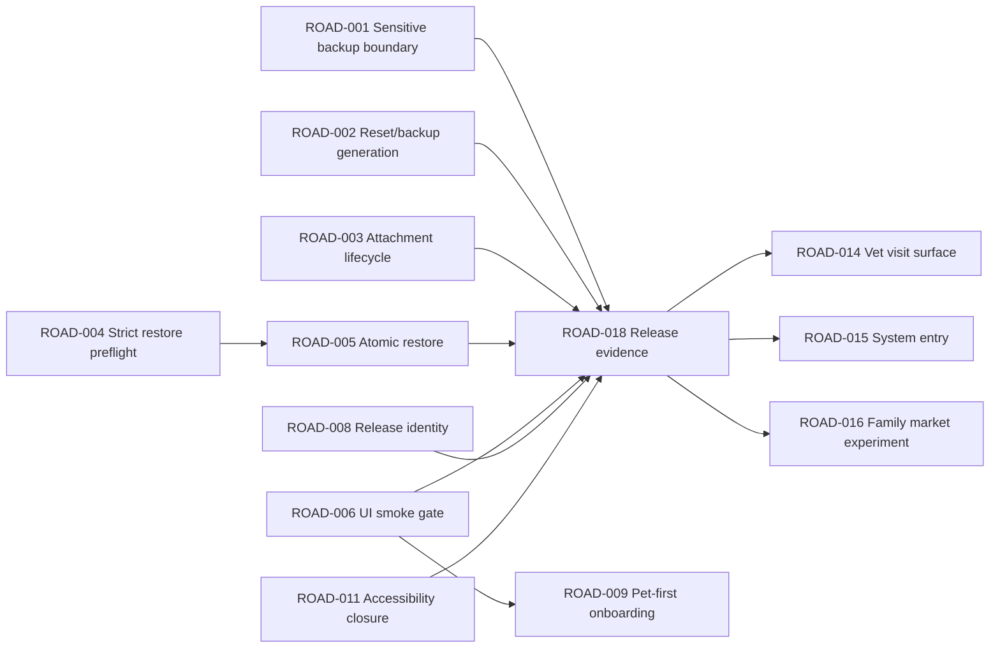

# Ohana Unified Roadmap

> Baseline: `4d434d5354efdfb0eb7864cadad9ccf3df3825b5`
>
> Planning date: 2026-07-10
>
> This roadmap is a plan only. No implementation, migration, Store action, or PR has started.

## Priority Logic

The order is judgment-based, not a mechanical score. Privacy/deletion/restore work precedes activation or architecture polish because the harm is harder to recover from. Existing domain boundaries, typed routes, V85 migration history, runtime policy, and tests are retained.

## Phase 0 — Release Blockers

### ROAD-001 — Close the personal-health OS backup boundary

| Field | Plan |
|---|---|
| Related findings | `SEC-001`, `MARKET-002` |
| User problem / value | A user needs a truthful guarantee about where personal-health data and Human Note attachments can leave the device. Closing the boundary restores trust and reduces App Review risk. |
| Technical value / evidence | Application Support stores are normally part of regular backup; no current `isExcludedFromBackup` control exists. Apple Review 5.1.3 disallows personal-health information in iCloud. |
| Modules | `SharedModelContainer`, `HumanNoteAttachmentStore`, privacy policy, release-data-safety tests; proposed focused backup-exclusion helper. |
| Minimum implementation | Identify every primary/default/fallback SwiftData URL plus sidecars and Human Notes root; apply and re-verify exclusion after create/migrate/fallback/file writes; expose a testable report of protected paths; align public wording. |
| Explicitly not doing | No data-store rewrite, no CloudKit enablement, no separation of all models in the first patch unless excluding the whole sensitive store is rejected by product. |
| Effort / change risk | M / High |
| Dependencies | Product accepts the release-safe default: exclude the mixed store from OS backup and rely on restricted/manual backup for approved data. |
| Acceptance | Automated resource-value tests for all path variants; new/fallback/migrated stores remain excluded; real-device backup/restore contains no prohibited health payload; policy and Store answers match. |
| Required tests | Unit file-attribute tests, container recovery tests, migration/fallback tests, real-device iCloud Backup/restore. |
| Rollback | Do not re-enable unsafe backup. If path control fails, disable the Human-health release surface and narrow claims until a safe partition exists. |
| Release / manual | Blocks external TestFlight and App Store; device verification required. |

### ROAD-002 — Serialize automatic backup with Reset

| Field | Plan |
|---|---|
| Related findings | `SEC-002`, `MARKET-002` |
| User problem / value | “Delete all” must remain true even if a backup is already exporting or writing. |
| Technical value / evidence | Current `AutomaticBackupService` owns only `isRunning`; `AppResetService` uses a different cleaner and cannot cancel/await the active run. |
| Modules | `AutomaticBackupService`, `AppResetService`, automatic-backup status/file-store protocols, focused tests. |
| Minimum implementation | One coordinator owns run task, generation and cleanup; Reset increments generation, cancels, waits with bounded timeout, removes managed files, resets status; generation checks occur after export, before write, after write, and before success state. |
| Explicitly not doing | No generic background-job framework and no CloudKit synchronization actor. |
| Effort / change risk | M / Medium |
| Dependencies | None; can run in parallel with ROAD-001/003/004. |
| Acceptance | Every deterministic export/reset/write interleaving leaves no old-generation file/status after Reset; a new post-reset backup is not deleted; cancellation is not swallowed. |
| Required tests | Pausable exporter/writer, timeout, background cancellation, cleanup failure/retry, new-generation success. |
| Rollback | Disable automatic backup rather than restore the race; retain manual export until the coordinator is safe. |
| Release / manual | Blocker; real iCloud Drive timing check required after unit closure. |

### ROAD-003 — Give Human Note attachments explicit lifecycle ownership

| Field | Plan |
|---|---|
| Related findings | `SEC-003`, `MARKET-002` |
| User problem / value | Deleting a note, Human or all data must remove its private files without deleting files still used elsewhere. |
| Technical value / evidence | Current store only cleans pending attachments on save failure; successful attachment paths are absent from deletion state machines. |
| Modules | `HumanNoteAttachmentStore`, `HumanNoteCommands`, `PhysicalDeletionService`, `AppResetService`, attachment tests. |
| Minimum implementation | Parse references before mutation; commit database deletion first; calculate surviving references; remove only unreferenced owned files; delete a Human directory on Human removal and the full root on Reset; publish cleanup failure visibly. |
| Explicitly not doing | No universal media asset database or reference-count schema unless tests prove cross-record sharing needs it. |
| Effort / change risk | M / High |
| Dependencies | Confirm whether the same path can be referenced by multiple note records; implementation must assume it can until proven otherwise. |
| Acceptance | Note/Human/Reset leave no orphan; failed database save deletes nothing; shared reference survives; cleanup failure is recoverable and not reported as complete. |
| Required tests | File-system integration tests for save failure, one note, multiple notes, Human deletion, Reset, repeated deletion. |
| Rollback | Stop future cleanup if an ownership bug appears; irreversible deletions require pre-merge shared-reference tests and atomic rename-to-quarantine during the operation before final purge. |
| Release / manual | Blocker if attachments remain reachable; simulator file tests autonomous, final device reset check manual. |

### ROAD-004 — Strictly validate backup identity before writing

| Field | Plan |
|---|---|
| Related findings | `DATA-001` (merged `DATA-002`), `RULE-001` |
| User problem / value | A corrupt backup must fail clearly instead of fabricating IDs/dates that look valid. |
| Technical value / evidence | `DataBackupManager+Decode` repeatedly uses `UUID(...) ?? UUID()` and required-date `?? Date()`. |
| Modules | `DataBackupDTOs`, `DataBackupManager+Decode`, `DataBackupManager`, restore UI error mapping, tests. |
| Minimum implementation | Add a version-aware preflight that validates required IDs, required dates, uniqueness, referential links, payload limits and a documented whitelist of optional defaults; produce an error report before live mutation. |
| Explicitly not doing | No automatic “repair” of required identity/history; no broad DTO redesign in the first PR. |
| Effort / change risk | M / Medium |
| Dependencies | Define the small optional-field repair whitelist and legacy-version compatibility matrix. |
| Acceptance | Invalid identity/date/reference is rejected before `applyBackup`; error names the category without leaking sensitive content; known valid legacy fixtures pass. |
| Required tests | Invalid UUID/date, duplicate ID, missing parent, oversized payload, valid legacy versions, encrypted/media package variants. |
| Rollback | Keep validation versioned; relax only a documented optional field, never required identity/date. Restore can be temporarily disabled for an unsupported legacy version. |
| Release / manual | Blocker component; autonomous tests sufficient for preflight, followed by ROAD-005. |

### ROAD-005 — Make Restore atomic and cancellable

| Field | Plan |
|---|---|
| Related findings | `DATA-001`, `PERF-001` |
| User problem / value | A failed/cancelled restore must leave the user’s existing island exactly unchanged. |
| Technical value / evidence | Live context is saved at multiple checkpoints and later code can throw; `rollback()` cannot undo committed checkpoints. |
| Modules | `DataBackupManager`, restore runtime/UI, model-container factory, notification/revision side effects, fault-injection tests. |
| Minimum implementation | After ROAD-004, build and validate in a scratch/staging store with cursor, budget and cancellation; only publish to the live store after complete validation using a documented atomic handoff or equally strong transaction; defer notifications/revisions until commit. |
| Explicitly not doing | No replacement of SwiftData across the app and no “best effort” compensation that can itself partially fail. |
| Effort / change risk | L / High |
| Dependencies | ROAD-004; enough free disk for staging; explicit maximum backup/media budget. |
| Acceptance | Fault injection after every previous checkpoint, media stage, disk-full and cancellation leaves live database/defaults unchanged; success is complete/idempotent; side effects fire once after commit. |
| Required tests | Scratch-container integration, checkpoint faults, duplicate restore, cancellation, low storage, large media, notification/default state. |
| Rollback | Keep Restore behind a release feature gate; if staging cannot be proven, ship 1.0 with import disabled rather than expose non-atomic restore. |
| Release / manual | Blocker while Restore is exposed; low-storage/device validation required. |

### ROAD-008 — Align production identity, privacy metadata and public links

| Field | Plan |
|---|---|
| Related findings | `MARKET-006`, `DOC-004`, `DOC-003` |
| User problem / value | Users must identify the correct Ohana, see the actual version, and reach valid privacy/support/review pages. |
| Technical value / evidence | Project version is 1.0, Settings says v4.5.0, review Apple ID is unverified, and Bundle ID had no confirmed DE/US public page on the research date. |
| Modules | `SettingsView+MainSections`, `OhanaPublicLinks`, bundle configuration, privacy/support docs, App Store Connect metadata. |
| Minimum implementation | Read version/build from Bundle; inject/configure the verified App Store Apple ID; cross-check Bundle/developer/site; prepare accurate DE/EN/ZH metadata and screenshots using only shipped Solo capabilities. |
| Explicitly not doing | No broad rebrand, no promise of Family/AI/CloudKit, no mixing DE and US price/rating evidence. |
| Effort / change risk | S–M / Low |
| Dependencies | App Store Connect access and final Storefront/product-name decision. |
| Acceptance | Production About/version/link checks pass; privacy/support URLs are public; Apple ID matches the app; screenshots and review notes match capabilities and permissions. |
| Required tests | Bundle-value unit test, URL smoke test, Release-build Settings UI smoke, metadata checklist. |
| Rollback | Hide the Rate App row until the verified ID exists; keep support/privacy available. |
| Release / manual | Blocks App Store submission; some repository work autonomous, App Store Connect manual. |

### ROAD-018 — Produce the missing signed and real-device release evidence

| Field | Plan |
|---|---|
| Related findings | `VERIFY-001`–`VERIFY-008`, `COMPAT-001`, all blockers |
| User problem / value | A green simulator/unit suite cannot prove signing, HealthKit, iCloud, notifications, background location, VoiceOver or real energy behavior. |
| Technical value / evidence | Signed Archive, physical-device R1–R6, Instruments/Energy and Store metadata were not executed. |
| Modules | Release configuration/profile, `release-true-device-test-plan.md`, App Store Connect, physical iPhone. |
| Minimum implementation | After blockers: signed Archive, entitlement inspection, install Release, run R1–R6, iCloud/restore/reset, HealthKit, notification actions, locked walk, VoiceOver, dense media and Store metadata checklist. Record exact build/OS/device and artifacts. |
| Explicitly not doing | No production purchase, no personal production account data, no acceptance based only on screenshots. |
| Effort / change risk | M / Medium |
| Dependencies | ROAD-001–006, ROAD-008, ROAD-011; connected unlocked test iPhone and App Store Connect role. |
| Acceptance | Every mandatory gate has pass evidence or a new scoped finding; exported entitlements match Solo; no open blocker; Release Gates signed off. |
| Required tests | See `RELEASE_GATES.md` and Human-only validation plan. |
| Rollback | Do not promote the build; keep internal development active and fix only the failed scope. |
| Release / manual | Final TestFlight/App Store gate; device/manual required. |

## Phase 1 — Core Correctness

### ROAD-006 — Restore a trustworthy UI release smoke gate

| Field | Plan |
|---|---|
| Related findings | `TEST-001` |
| User problem / value | Core journeys need regression proof without mistaking a harness selector for a product failure. |
| Technical value / evidence | 68/72 UI failures share first-pet identity; setup accepts disappearance instead of a positive saved marker. |
| Modules | `OhanaUITests/OhanaUITests.swift`, `TodayFocus/Views/TodayFocusCard+ContentCards.swift`, member creation saved-state UI. |
| Minimum implementation | Expose one intentional accessibility role/identifier; require explicit post-save marker; create fast smoke tests for onboarding/first care/relaunch/failed save/delete cancel. |
| Explicitly not doing | No coordinate-driven rewrite of the full suite and no accessibility grouping solely for tests. |
| Effort / change risk | M / Medium |
| Dependencies | None; complete before ROAD-009 changes onboarding. |
| Acceptance | Target test 10/10; no common bootstrap failure; residual failures classified; VoiceOver order remains logical. |
| Required tests | Accessibility tree inspection, targeted 10-run loop, full UI suite, manual VoiceOver. |
| Rollback | Revert only harmful element grouping; retain positive saved marker and smoke-suite split. |
| Release / manual | Should fix before release; manual smoke can temporarily compensate only for controlled internal testing. |

### ROAD-007 — Decide the writable fallback-store failure mode with fault injection

| Field | Plan |
|---|---|
| Related findings | `DATA-003` |
| User problem / value | A user must not unknowingly write to a separate fallback store and later reopen an older primary store. |
| Technical value / evidence | Primary → default → named disk fallback → memory fallback path is real; the cross-launch data result is unverified. |
| Modules | `SharedModelContainer`, fallback indicator UI, recovery tests. |
| Minimum implementation | Inject each open failure and model primary→fallback→primary across launches; choose fail-closed read-only/recovery or an explicit migration path; never silently switch writable identity. |
| Explicitly not doing | No database-framework migration. |
| Effort / change risk | M / High if production behavior changes; S for tests. |
| Dependencies | Product choice on fail-closed vs explicit recovery after evidence. |
| Acceptance | No silent split brain; fallback identity is visible; return to primary either migrates explicitly or refuses writes; tests cover kill/relaunch. |
| Required tests | Store-open fault injection, disk permissions/full disk, relaunch, primary recovery, backup interaction. |
| Rollback | Prefer visible read-only/fail-closed mode over another silent writable store. |
| Release / manual | Runtime verification required; promote to blocker if split data is reproduced. |

### ROAD-010 — Enforce expense invariants at domain and restore boundaries

| Field | Plan |
|---|---|
| Related findings | `LOGIC-003` |
| User problem / value | Totals must not contain NaN, infinity, zero or disallowed negative amounts regardless of input path. |
| Technical value / evidence | UI constraints do not protect domain commands or backup rehydrate. |
| Modules | Expense command/write kernel, backup preflight/rehydrate, summary tests. |
| Minimum implementation | Central amount value/invariant; reject invalid values with typed error; keep currency behavior “display-only, no historical FX conversion.” |
| Explicitly not doing | No currency conversion engine or finance subsystem. |
| Effort / change risk | S / Low |
| Dependencies | ROAD-004 shares restore validation. |
| Acceptance | All write paths reject invalid values; valid locale decimals persist; legacy invalid input is reported, not normalized silently. |
| Required tests | Domain, rehydrate, locale/rounding, summary non-finite guard. |
| Rollback | Feature-gate only the failing expense import path; do not accept non-finite data. |
| Release / manual | Should fix before 1.0 if expenses are public; fully autonomous verification. |

## Phase 2 — Low-risk, High-return Experience

### ROAD-009 — Implement the authoritative pet-first 90-second flow

| Field | Plan |
|---|---|
| Related findings | `RULE-002`, `MARKET-001` |
| User problem / value | A new user should complete the job they downloaded for before creating a Human profile or granting optional permissions. |
| Technical value / evidence | D17 is explicit; current `OnboardingView` requires four intro pages and profile. |
| Modules | Onboarding views/coordinator, member creation, first-pet empty state, first care/reward/Oasis, UI tests. |
| Minimum implementation | Compress/skip intro; create Pet first; use an implicit local owner or defer Human; complete one safe preset care fact; display saved state then Coconut/Oasis feedback. |
| Explicitly not doing | No Family join, paywall, broad onboarding redesign, or permission bundle. |
| Effort / change risk | M / Medium |
| Dependencies | ROAD-006; explicit local-owner/interruption state machine. |
| Acceptance | Median <=90 seconds across 10 clean installs; no duplicate Human/Pet/care/reward on interruption; optional permissions are contextual. |
| Required tests | Fresh install, skip, force quit each step, save failure, no pet image, long locale, Reduce Motion, UI smoke. |
| Rollback | Keep old flow behind a temporary internal flag until new state migration is proven; do not maintain two public flows. |
| Release / manual | Strongly recommended before public 1.0; usability timing manual. |

### ROAD-011 — Close the core accessibility and localization runtime gap

| Field | Plan |
|---|---|
| Related findings | `A11Y-001`, `A11Y-002`, `TEST-001` |
| User problem / value | Core care must be understandable with VoiceOver, maximum text, Reduce Motion and every marketed language. |
| Technical value / evidence | Static audit passes 956 files, but XCUI identity mismatch and permission-localization gaps remain; runtime assistive testing is absent. |
| Modules | `AppWorkloadPolicy`, onboarding/Home/quick care/delete/PDF flows, InfoPlist localization, accessibility tests. |
| Minimum implementation | Distinguish full/efficient/minimal motion; localize usage descriptions for marketed locales or narrow Store claims; verify labels/value/hint/order/focus and 44pt targets. |
| Explicitly not doing | No RTL claim without an RTL locale/product decision; no cosmetic redesign. |
| Effort / change risk | M / Medium |
| Dependencies | ROAD-006 identity fix and target Store language decision. |
| Acceptance | Core path passes VoiceOver/Voice Control, max Dynamic Type, Reduce Motion, contrast and long German; system permission text matches marketed locale. |
| Required tests | Static audit, snapshot/layout tests, runtime assistive checklist on device. |
| Rollback | Revert individual animation/layout regressions, not accessibility metadata or locale truth. |
| Release / manual | Should fix before language/accessibility claims; device/manual required. |

### ROAD-012 — Make Today care states explicit and recoverable

| Field | Plan |
|---|---|
| Related findings | `MARKET-003`, `PERF-002` |
| User problem / value | Users need to know what is due, what was done, whether a save is pending/failed, and how to undo without opening many modules. |
| Technical value / evidence | Today Focus, command pipeline, scoped invalidation and covered-surface coalescing already exist; the gap is state semantics and validation, not a new architecture. |
| Modules | Today Focus snapshots/views, domain result/error mapping, undo/retry, Home refresh policy. |
| Minimum implementation | Add subject, last-done, due/overdue, pending, failed/retry and limited undo; preserve one business-fact write; keep refresh paused while covered and coalesce on dismiss. |
| Explicitly not doing | No FamilyWall-style all-module dashboard and no general workflow engine. |
| Effort / change risk | M / Medium |
| Dependencies | Data-save error semantics; user validation before broad redesign. |
| Acceptance | Rapid repeated actions do not duplicate facts; failed save never appears done/rewarded; undo is domain-safe; hidden/covered Home stays inert. |
| Required tests | Domain idempotency, failure/retry/undo, dense snapshot, covered sheet, Low Power, UI task study. |
| Rollback | Retain current Today Focus rendering and disable only new optimistic/undo layer. |
| Release / manual | Not a blocker unless existing failure semantics are found misleading; market experiment recommended. |

## Phase 3 — Architecture and Maintainability

### ROAD-013 — Incrementally unify lifecycle ownership and Swift concurrency boundaries

| Field | Plan |
|---|---|
| Related findings | `ARCH-001`, `CONC-001`, `CONC-002`, `CONC-003`, `CONC-004`, `PERF-002` |
| User problem / value | Lifecycle leaks and stale callbacks eventually become duplicated work or inconsistent UI; users gain reliability, not a new screen. |
| Technical value / evidence | `AppServices` and static registries coexist; strict build reports actor/Sendable warnings; scoped invalidation already provides a migration path. |
| Modules | One touched registry/service at a time, Avatar/Medication boundaries, QuickFeed route tasks, Home revision consumers. |
| Minimum implementation | New dependencies instance-injected; `@ModelActor` returns IDs/DTOs; route owns/cancels tasks; migrate measured broad revision consumers to domain/entity surface tokens. |
| Explicitly not doing | No all-repo DI rewrite, no Swift 6 switch in one PR, no mass renames or folder moves. |
| Effort / change risk | L over multiple slices / Medium per slice |
| Dependencies | Release blockers closed; each slice requires focused behavior tests. |
| Acceptance | Registry count and strict warnings decrease monotonically; no live SwiftData models cross actor boundaries; route leave/reopen tests pass; measured refresh count improves or remains bounded. |
| Required tests | Strict-concurrency focused build, actor boundary tests, route cancellation, refresh probes, existing domain suite. |
| Rollback | Revert one slice through protocol adapter; never batch unrelated migrations. |
| Release / manual | Can ship and fix incrementally; required before Swift 6 migration. |

## Phase 4 — Market Competitiveness

### ROAD-014 — Surface the existing Vet PDF as “Prepare for a vet visit”

| Field | Plan |
|---|---|
| Related findings | `MARKET-004` |
| User problem / value | Health, weight, medication, symptoms, insurance and documents are scattered when a vet visit starts. |
| Technical value / evidence | A4 `PetVetSummaryPDFRenderer` and ShareLink already exist; 11pets/PetDesk visibly sell handoff value. |
| Modules | Pet profile/health IA, `PetVetSummaryPDFView`, Store screenshots/help. |
| Minimum implementation | One clear entry, completeness review, preview and share/save; state that it is a recorded summary, not diagnosis. |
| Explicitly not doing | No provider network, medical advice, AI diagnosis or PDF engine rewrite. |
| Effort / change risk | S–M / Low |
| Dependencies | Release trust/identity and PDF field validation. |
| Acceptance | Empty/dense/long German/no-image/multi-medication A4 output passes; only intended pet data is included; discoverable from pet health. |
| Required tests | Snapshot/PDF render, privacy field matrix, share failure, manual print/readability. |
| Rollback | Hide the new entry while retaining existing export. |
| Release / manual | Can follow safety closure; strong P1 market value. |

### ROAD-015 — Add system entry in two safe stages

| Field | Plan |
|---|---|
| Related findings | `MARKET-005` |
| User problem / value | Frequent care logging should not always require opening and navigating the full app. |
| Technical value / evidence | Ohana has no Widget/App Intent/App Group; Reminders, Finch and FamilyWall expose system surfaces. |
| Modules | Proposed Widget extension/App Group, small shared snapshot, typed routes, later App Intents. |
| Minimum implementation | Stage A read-only next-care Widget with privacy-redacted lock-screen content and deep link. Stage B idempotent App Intents for quick care/open pet/Today Focus. |
| Explicitly not doing | No full SwiftData model sharing with extension, no sensitive medication text by default, no Family sync. |
| Effort / change risk | L / High |
| Dependencies | All release blockers, cache ownership, verified App Group `group.com.guanchen.li.Ohana`, route/idempotency tests. |
| Acceptance | Offline works; locked device reveals no sensitive detail; stale snapshots expire; intents write exactly one fact or open typed route with clear error. |
| Required tests | Extension snapshot/privacy, deep link, duplicate invocation, locked state, background budget, upgrade/removal. |
| Rollback | Ship/disable extension independently; keep app core unchanged; Widget remains read-only until intent writes are proven. |
| Release / manual | Not a 1.0 blocker; device and market validation required. |

## Phase 5 — Differentiation

### ROAD-016 — Validate Family accountability and cross-life value before building it

| Field | Plan |
|---|---|
| Related findings | `MARKET-007`, `MARKET-009`, Family pricing hypothesis |
| User problem / value | Multi-caregiver households need to prevent duplicate/missed care; pet users may value plant/Human continuity, but neither willingness-to-pay nor scope is proven. |
| Technical value / evidence | DogLog/FamilyWall/Planta show public coordination patterns; Ohana capability gates correctly keep Family closed. |
| Modules | Product research, Family state-machine spec, no production CloudKit changes in the experiment. |
| Minimum implementation | Interview/concept-test 5–8 households around “who/when/done,” conflict/offline/revoke and pricing; separately test pet-first + later plant unlock. |
| Explicitly not doing | No CKShare/APNs enablement, chat, map, bounty, AI diagnosis or fake collaboration. |
| Effort / change risk | S for validation, XL/High for later implementation |
| Dependencies | Stable Solo and release evidence. |
| Acceptance | Clear repeated problem and willingness to pay; state-machine acceptance exists before technical work; no harm to pet-first comprehension. |
| Required tests | Research protocol and decision record; implementation tests defined only after validation. |
| Rollback | Keep Family capability gate closed; retain Solo value independently. |
| Release / manual | MARKET VALIDATION REQUIRED; not a Solo blocker. |

## Phase 6 — Documentation, Rules and Automation

### ROAD-017 — Reconcile source-of-truth docs and encode semantic gates

| Field | Plan |
|---|---|
| Related findings | `DOC-002`, `DOC-003`, `RULE-001`, `RULE-002`, `RULE-004`, `TRACE-001`, `MARKET-006` |
| User problem / value | Incorrect policy/status makes future changes unsafe even when the current code is good. |
| Technical value / evidence | Root authority is strong, but status says no reachable P1, older plans cite V60, capability drafts mention disabled features, and current audits pass despite semantic drift. |
| Modules | `AGENTS.md`, product foundation, privacy policy, status ledgers, release plan, permission rationale, privacy ownership manifest, AI playbook, governance scripts. |
| Minimum implementation | Preserve one authority chain; update release/status/privacy/capability facts; archive obsolete plan; split mandatory AI workflow from future/advisory material; add Rule→Code→Test rows and semantic fixture checks. |
| Explicitly not doing | No new parallel root rule, no rewrite of every Markdown file, no deletion before content/links are checked. |
| Effort / change risk | M / Low |
| Dependencies | Final product choices and actual blocker implementation; status should update in each PR, final consolidation follows. |
| Acceptance | No current-policy conflict in active docs; status names all open gates; automated checks catch stale schema/capability/release assertions; historical docs clearly marked. |
| Required tests | `git diff --check`, doc-ledger audit, agent governance, link/path validation, rule traceability fixtures. |
| Rollback | Revert one documentation decision; archive rather than delete uncertain history. |
| Release / manual | Documentation truth for privacy/Store is release-required; broad consolidation can finish after core fixes. |

## Phase Summary

| Phase | Roadmap IDs | Release meaning |
|---|---|---|
| Phase 0 | ROAD-001–005, ROAD-008, ROAD-018 | Four data blockers, production identity, signed/device evidence |
| Phase 1 | ROAD-006, ROAD-007, ROAD-010 | Core regression proof, store-fallback truth, domain invariants |
| Phase 2 | ROAD-009, ROAD-011, ROAD-012 | First value, accessibility/localization, Today recovery |
| Phase 3 | ROAD-013 | Incremental ownership/concurrency migration only |
| Phase 4 | ROAD-014, ROAD-015 | Vet handoff visibility and system entry |
| Phase 5 | ROAD-016 | Validate Family/cross-life differentiation before implementation |
| Phase 6 | ROAD-017 | Single source of truth, traceability and semantic automation |
