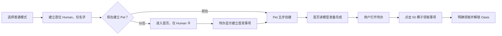
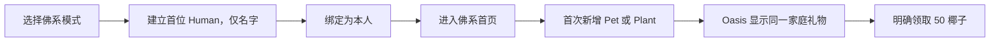

# Ohana V4 设计系统与页面设计交付方案

Status: External design handoff; derived guidance, not a new product source of truth

Version: 1.0

Prepared: 2026-07-22

Owner: Product owner

适用范围：Ohana iPhone 首发版的设计系统、Figma 组件库、页面设计稿、交互原型和设计验收。

## 0. 文件地位与使用方式

这是一份可以直接交给外部设计公司的执行方案。它把现有产品规则、UI token、当前代码中的成熟模式和首发范围整理成一套可报价、可制作、可验收的设计任务。

它不替代以下正式来源，发生冲突时按顺序处理：

1. 产品行为：[`../specs/product-foundation.md`](../specs/product-foundation.md)
2. UI 机器源：[`../../ui规范.selection.json`](../../ui规范.selection.json)
3. UI 模式合同：[`ohana-ui-spec.md`](ohana-ui-spec.md)
4. 当前源码中的成熟组件和页面
5. 本交付方案

设计公司不得根据本文件自行改变产品范围、商业规则、成长解锁、隐私边界或信息架构。确有冲突时，应在设计前提交一份逐项 gap analysis，由产品负责人裁决后再继续。

### 0.1 本项目的完成定义

设计完成不是“画完若干页面”，而是同时满足：

- 有一套可发布的 Figma 变量与组件库；
- 所有首发核心页面均从组件库装配，不是逐页手绘；
- 深色、浅色、长文案、空数据、错误、隐私、锁定和无障碍状态有明确设计；
- 普通模式和佛系模式共享品牌，但保持独立信息架构；
- 关键流程有可点击原型；
- 设计标注能映射到现有 SwiftUI token 与组件；
- 页面不引入首发范围之外的账号、云协作、AI、社交或诊断能力；
- 交付包通过本文第 16 节的验收清单。

## 1. 产品设计简报

### 1.1 一句话定位

> 认真记录照护的家庭，值得一座越来越繁茂的岛。

Ohana 是一款本地优先的 iPhone 家庭生命照护应用。家庭可以由人、宠物和植物组成；首发由一位主理人在一台 iPhone 上记录全家的照护。

### 1.2 核心用户与核心任务

核心用户是承担主要照护责任的人。用户每天最常做的事是：

1. 看见当前家庭和成员状态；
2. 三秒内完成一笔喂食、饮水、清洁、用药、遛狗或其他照护记录；
3. 查看今天需要处理的事项；
4. 看到记录带来的连胜、椰子和 Oasis 成长反馈；
5. 在更长时间尺度上回看健康、花费、照片和家庭记忆。

### 1.3 情感弧线

```text
日常照护 → 习惯 → 惊喜与奖励 → 家庭资产与记忆 → 告别与铭记
```

界面既要像高频工具一样快，也要在奖励、成长和纪念时保留情感重量。

### 1.4 产品气质

- **紧凑**：高信息密度但有呼吸，不做营销页式大标题和大段说明。
- **平静**：背景低噪，状态清楚，视觉层级稳定。
- **有触感**：按下、选中、展开和记录成功都应立即反馈。
- **坚实**：高频业务卡片使用不透明实色 surface，不用廉价半透明卡片堆叠。
- **温暖但不幼稚**：圆润、亲近、有生命感；不使用 emoji 或彩色拟物图标代替功能图标。
- **先行动后解释**：页面优先显示“当前状态”和“下一步”，不常驻教程文字。

### 1.5 平台与技术边界

- iPhone-only，最低 iOS 26.2；不设计原生 iPad 或 watchOS App。
- 当前无 Ohana 账号、登录、开发者后端或远程协作。
- iCloud Drive 仅用于用户自己的受限备份，不是 App 登录。
- 默认离线可用；基础照护不能等待 StoreKit、网络或云服务。
- 支持深色和浅色模式。
- 当前注册九种语言：中文、英语、德语、西班牙语、葡萄牙语、法语、日语、韩语、意大利语。
- 中文和英文在设计稿阶段必须有真实文案；德语用于长文案压力测试。

### 1.6 首发禁止设计成现行能力的内容

- Apple / Google 登录或 Ohana 账号；
- 多设备实时同步、成员邀请、跨设备家庭协作；
- AI 诊断、医疗判断、植物识别或天气智能建议；
- 公开社交、动态广场、儿童或老人监管；
- 用真钱购买椰子或付费提高奖励倍率；
- iPad、Apple Watch 独立 App、Shortcuts、Siri 或 Spotlight 页面；
- 用“数据会丢失”“家人不完整”等焦虑推动购买。

## 2. 顶层信息架构

### 2.1 普通模式 Standard

顶层区域固定为：

```text
首页 → 待办 → Oasis → 植物
```

- `首页`：家庭成员卡堆、当前状态、快捷照护和全局入口。
- `待办`：Event、Reminder、本机 FamilyTask 和系统旅程的统一清单/日历。
- `Oasis`：椰子、成长树、成就、收藏和奖励反馈。
- `植物`：普通模式达到 Lv.4 后出现；已有植物数据可 grandfather 保持可达。

Oasis 在首次家庭礼物明确领取前保持隐藏。植物不在 Lv.1–3 的普通模式中伪装成可用页面。

### 2.2 佛系模式 Zen

佛系模式是独立 Shell，不是普通首页的样式开关：

```text
首页 → Streak → Oasis
```

- `首页`：Human、Pet、Plant 共用的纵向卡堆和每日轻打卡。
- `Streak`：对象、月份和日格组成的轻量连续记录。
- `Oasis`：短内容在可用视口居中，内容过高时自然滚动。

佛系模式不挂载普通待办、普通植物 Dashboard 或其他重型页面。两个模式共享成员、历史、椰子、Oasis 和购买权益，但路由和 Tab 状态隔离。

### 2.3 页面呈现层级

| 用户意图 | 正确呈现方式 | 禁止做法 |
| --- | --- | --- |
| 顶层区域切换 | 原生 `TabView` | 自绘网页式底栏 |
| 层级页面 | `NavigationStack` + 系统返回 | 浮动自绘返回圆片 |
| 快速记录、编辑、轻管理 | 原生 Sheet + NavigationStack/Form/List | 页面内伪弹窗、手绘拖拽柄 |
| 破坏性或短确认 | Alert / confirmationDialog | 自绘遮罩确认卡 |
| 少量即时命令 | Menu | 额外跳转一整页 |
| 遛狗进行中 | 全屏任务表面 + Live Activity | 普通小卡承担整段定位流程 |
| 奖励揭晓 | 稳定 ZStack 自定义场景 | 多个延时拼接的跳变动画 |

## 3. 核心流程

### 3.1 普通模式首次体验



设计不得在建立 Pet 后自动弹出奖励；必须由用户在待办点击领取事项。

### 3.2 佛系模式首次体验



### 3.3 高频照护循环

```text
识别对象 → 触发快捷动作 → 第一帧按压/路由反馈 → 输入最少必要信息
→ 明确提交 → 成功/失败反馈 → 余额、待办和历史随后同步
```

### 3.4 付费介绍时机

只在用户自然遇到价值时介绍 Personal，例如：

- 达到免费活跃对象数量上限；
- 创建第 4 个普通活跃提醒/计划；
- 选择 90 天、1 年、全部时间或跨对象比较；
- 使用高级报告、Widget、多版本备份或高级本地工具。

不得在首次打开、Onboarding、健康紧急场景、备份失败、导出已有数据或纪念模式中强弹付费墙。

## 4. Figma 项目结构

外部公司应交付两个独立但相互引用的 Figma 文件，不把组件库和几十页业务稿混在一个文件中。

### 4.1 文件 A：`Ohana DS · iOS V4`

建议页面结构：

```text
00 Cover
01 Getting Started
02 Governance & Naming
03 Foundations · Color
04 Foundations · Type
05 Foundations · Spacing & Radius
06 Foundations · Grid & Safe Area
07 Foundations · Motion
08 Foundations · Accessibility
--- COMPONENTS ---
C01 Button
C02 Icon Button & FAB
C03 Quick Action
C04 Chip Tag Badge
C05 Text Field & Search
C06 Picker & Control Row
C07 Navigation & Toolbar
C08 Sheet Form & Dialog Reference
C09 Card & Metric
C10 Member Identity Card
C11 Task & Reminder
C12 Avatar & Media
C13 Progress & Coconut
C14 Chart
C15 Calendar & Agenda
C16 Banner Toast Empty Error
C17 Locked Private Memorial
C18 Paywall & Entitlement
C19 Zen Presence Card
C20 Oasis Reward
--- UTILITIES ---
90 Icons
91 Assets
92 QA Fixtures
99 Changelog
```

每个组件页必须包含用途、何时不用、属性、变体、所有状态、变量绑定、无障碍说明和代码映射。

### 4.2 文件 B：`Ohana Product · iOS 1.0`

```text
00 Cover & Scope
01 Flow Map
02 Release Matrix
10 Onboarding
20 Standard Shell & Home
30 Zen Shell
40 Members & Memorial
50 Care & Quick Record
60 Tasks Calendar Notifications
70 Plants
80 Oasis Economy Growth
90 Insights Reports Memory
100 Settings Commerce Data
110 System Surfaces
120 Prototype Flows
900 Rejected / Archive
```

### 4.3 命名规则

- 变量：`color/bg/canvas`、`color/text/primary`、`spacing/md`、`radius/card`。
- 组件：`Button`、`Input`、`Task Row`，不使用团队成员姓名或版本号命名。
- 变体：`Size=Regular, Role=Primary, State=Default`。
- 页面 frame：`AREA / Screen / Variant / State / Appearance`。
- 示例：`CARE / Feeding / Overview / Data / Dark`。
- 层级名称必须表达语义：`Header`、`Primary Action`、`Empty State`；禁止 `Frame 482`、`Group 19`。

### 4.4 Figma 构建规则

- 先建变量和样式，再建组件，再建模板，最后组装页面。
- 组件填充、描边、间距、圆角必须绑定变量；不得在实例中散落硬编码值。
- 使用 Auto Layout、可伸缩文字和最小高度，不按一条短中文 fixture 定死高度。
- icon 使用 instance swap，不为每个 SF Symbol 建一套 Button variant。
- 单个 variant set 超过 30 个组合时拆分子组件，避免变体爆炸。
- 本地组件优先；如需引用外部 iOS UI Kit，应记录来源、许可证、版本和包装方式。
- 设计稿中系统 Sheet、Alert、Menu、Toggle、DatePicker 等只记录内容与状态，不重新发明系统 chrome。
- 每个页面必须可追溯到组件实例；需要 detach 时写明原因。

### 4.5 设计开始前的强制 gap analysis

目前没有提供正式 Figma 文件或公司已有组件库，因此设计公司在任何创建动作前必须提交：

1. 现有 Figma 文件、订阅库和可复用组件清单；
2. 代码有但 Figma 没有的 token/组件；
3. Figma 有但代码没有的内容；
4. 代码、Figma、本文三者冲突的逐项表；
5. 每项冲突的建议裁决及影响范围；
6. 锁定后的 v1 token 和组件清单。

未经产品负责人确认，不得让外部库覆盖 Ohana 的色彩、圆角、组件 API 或页面结构。

## 5. Foundations

### 5.1 画布、尺寸与安全区

首要设计画布使用当前 `iPhone 17` Simulator 的逻辑尺寸：

| 用途 | 逻辑尺寸 | 说明 |
| --- | --- | --- |
| 主设计画布 | 402 × 874 pt | iPhone 17，所有主要稿件使用 |
| 紧凑验收 | 390 × 844 pt | iPhone 17e，检查换行和固定控件 |
| 大屏验收 | 440 × 956 pt | iPhone 17 Pro Max，检查过度拉伸 |

布局规则：

- 页面先预留状态栏、Dynamic Island、导航栏、Tab bar、键盘和 safe area，再排内容。
- 标准页面水平边距 16 pt；沉浸式 hero 可延伸到边缘，但内容安全边距仍为 16 pt。
- 列表、Form 和系统导航使用系统默认容器间距；不要用网页 12-column grid 套移动 App。
- meaningful content 不得被固定 header、底栏、键盘或宿主容器遮住。
- 主要布局使用 2 pt 微网格、4 pt 主节奏；视觉偏移可有 1 pt 光学校正，但不能成为结构间距。

### 5.2 Spacing variables

| Token | 值 | 常见用途 |
| --- | ---: | --- |
| `spacing/0` | 0 | 重合、无间距 |
| `spacing/1` | 2 | 光学微调 |
| `spacing/2` | 4 | icon 内部、紧凑标签 |
| `spacing/3` | 6 | badge 内部 |
| `spacing/4` | 8 | 小型 gap |
| `spacing/5` | 10 | 紧凑控件 |
| `spacing/6` | 12 | 行内、卡片小 padding |
| `spacing/7` | 14 | 紧凑模块 |
| `spacing/8` | 16 | 页面边距、标准 gap |
| `spacing/9` | 18 | 标准卡片 padding |
| `spacing/10` | 20 | 区块间距 |
| `spacing/12` | 24 | 页面段落、外层 padding |
| `spacing/14` | 28 | 大区块 |
| `spacing/16` | 32 | hero 与大节奏 |
| `spacing/20` | 40 | 强分区 |
| `spacing/24` | 48 | 特殊大留白 |

语义 alias：`spacing/xs=8`、`sm=12`、`md=16`、`lg=20`、`xl=24`、`2xl=32`。

### 5.3 Radius variables

与当前 `OhanaRadius` 一致：

| Token | 值 | 用途 |
| --- | ---: | --- |
| `radius/hairline` | 1 | 细线、微型几何 |
| `radius/micro` | 4 | 极小装饰面 |
| `radius/tiny` | 6 | 小 badge |
| `radius/icon` | 8 | icon tile、缩略图 |
| `radius/badge` | 10 | badge |
| `radius/chip` | 12 | chip |
| `radius/row` | 14 | 列表行、内嵌格 |
| `radius/control` | 16 | segmented、紧凑卡 |
| `radius/control-lg` | 18 | 大控件 |
| `radius/input` | 20 | 输入框 |
| `radius/card` | 20 | 标准业务卡 |
| `radius/card-soft` | 22 | 柔和业务卡默认值 |
| `radius/card-lg` | 24 | summary 卡 |
| `radius/hero` | 28 | 身份、预览、hero |
| `radius/sheet-mini` | 30 | 仅自定义小型空间表面 |
| `radius/sheet-compact` | 32 | 紧凑表面参考 |
| `radius/sheet-comfort` | 34 | 创建流程卡 |
| `radius/sheet-page` | 36 | 长页面参考 |
| `radius/sheet-lg` | 38 | 大预览参考 |
| `radius/inline-popup` | 52 | 明确批准的 inline popup |
| `radius/full` | 999 | pill / capsule |

系统 Sheet 的真实圆角由 iOS 管理，Figma 中的 sheet radius 只用于说明和自定义内容，不得作为生产硬编码。

### 5.4 Typography

正式字体以当前 `OhanaFont` 为准：SF Pro Rounded / iOS system rounded。旧说明中出现的自定义中文圆体不是本次交付目标。

| Text style | 基准字号 | 默认字重 | 用途 |
| --- | ---: | --- | --- |
| `metric/large` | 36 | Black | 资产、体重、完成率大数字 |
| `display/large-title` | 34 | Black | 真正页面身份，一屏最多一个 |
| `heading/title` | 24 | Bold | 卡片大标题、核心步骤 |
| `heading/title-2` | 20 | Bold | 模块标题 |
| `heading/title-3` | 17 | Semibold | 小节标题 |
| `heading/headline` | 16 | Bold | 列表主标题、重要 label |
| `body/default` | 15 | Medium | 正文、详情 |
| `body/callout` | 14 | Medium | 控件与短说明 |
| `body/subheadline` | 13 | Medium | 副标题 |
| `meta/footnote` | 12 | Medium | 说明、时间 |
| `meta/caption` | 11 | Medium | 字段标签 |
| `meta/caption-2` | 10 | Medium | 最小辅助文案 |

规则：

- Figma line height 使用 Auto，并注明映射到 iOS Dynamic Type，不固定成网页行高。
- 每个 style 最多保留默认与强调两档字重；不要逐页面创建新的文字样式。
- 数字保持 tabular/monospaced digit；余额和指标切换使用 numeric transition。
- 德语、长名字和大数字必须允许合理换行；不能只靠缩小字体解决。

### 5.5 Color collections

Figma 至少建立：

1. `Primitives`：单模式原始色；
2. `Color`：Light / Dark 两个 mode，全部语义色 alias 到 Primitives；
3. `Member Theme`：Light / Dark 两个 mode；
4. `Spacing`、`Radius`：单模式数值；
5. `Motion`：Normal / Reduced 两个 mode 的时长和说明。

#### 品牌与基础语义色

| Semantic token | Light | Dark | 用途 |
| --- | --- | --- | --- |
| `color/action/primary` | `#2563EB` | `#C8F34A` | 唯一全局主操作色 |
| `color/action/on-primary` | `#FFFFFF` | `#1A1A2E` | 主 CTA 文字/icon |
| `color/surface/card` | `#EEF1F6` | `#1A2030` | 标准业务卡 |
| `color/surface/elevated` | `#F7F8FB` | `#171B2A` | 抬高控件、未选项 |
| `color/surface/control` | `#E9EDF4` | 白色 9% | 控件与内嵌 surface |
| `color/text/primary` | `#1A1A2E` | `#F8FAFC` | 主文字 |
| `color/text/secondary` | `#1A1A2E` 62% | 白色 62% | 副文字 |
| `color/text/tertiary` | `#1A1A2E` 42% | 白色 42% | 辅助文字 |
| `color/border/divider` | 黑色 8% | 白色 12% | hairline |
| `color/border/glass` | 黑色 8% | 白色 14% | 允许的玻璃描边 |
| `color/icon/functional` | alias `action/primary` | alias `action/primary` | 功能 icon |

默认 App 背景使用 `goIsland`：

| Mode | 渐变三色 |
| --- | --- |
| Light | `#F5F3ED → #ECEAE2 → #E0DFD6` |
| Dark | `#151716 → #10130F → #080A08` |

浅色背景必须比浅色卡片深一档，让卡片自然分离；不要铺满高饱和蓝。

#### 业务语义色

| Token | Light | Dark / 通用 | 语义 |
| --- | --- | --- | --- |
| `color/status/success` | `#00D4AA` | `#00D4AA` | 完成、健康、成功 |
| `color/status/warning` | `#FFF44F` | `#FFF44F` | 进行中、注意 |
| `color/status/error` | `#FF4757` | `#FF4757` | 错误、危险、删除 |
| `color/feed/manual` | `#FF8C42` | `#FF8C42` | 手动喂食 |
| `color/feed/planned` | `#A855F7` | `#A855F7` | 计划喂食 |
| `color/feed/automatic` | `#00D4AA` | `#00D4AA` | 自动喂食 |
| `color/food/dry` | `#D97706` | `#FFB84D` | 干粮 |
| `color/food/wet` | `#DB2777` | `#F472B6` | 湿粮 |
| `color/food/stock` | alias `action/primary` | alias `action/primary` | 余粮、库存、零食 |

`goBlue` 和 `goLime` 只作为全局主色在对应 appearance 中使用，不得再充当普通信息色、成员主题色或图表系列色。

#### Alert palettes

| 状态 | Light：背景 / 边框 / 文字 | Dark：背景 / 边框 / 文字 |
| --- | --- | --- |
| Success | `#F0FDF4 / #10B981 / #065F46` | `#052E16 / #34D399 / #6EE7B7` |
| Warning | `#FFFBEB / #F59E0B / #92400E` | `#78350F / #FBBF24 / #FCD34D` |
| Error | `#FEF2F2 / #EF4444 / #DC2626` | `#7F1D1D / #F87171 / #FCA5A5` |
| Info | `#EFF6FF / #3B82F6 / #1D4ED8` | `#1E3A8A / #60A5FA / #93C5FD` |

#### 成员主题色

成员主题色只表达身份和图表系列，不表达“可点击”。Figma 建立 16 对 Light/Dark palette：

| ID | Light | Dark |
| --- | --- | --- |
| `member/01` | `#C23616` | `#FF5252` |
| `member/02` | `#E15F41` | `#FF793F` |
| `member/03` | `#E67E22` | `#FF9F43` |
| `member/04` | `#F39C12` | `#FDCB6E` |
| `member/05` | `#F1C40F` | `#FFEAA7` |
| `member/06` | `#8D6E63` | `#A1887F` |
| `member/07` | `#D35400` | `#E67E22` |
| `member/08` | `#833471` | `#B33771` |
| `member/09` | `#C71585` | `#FF66CC` |
| `member/10` | `#E84393` | `#FD79A8` |
| `member/11` | `#8A2BE2` | `#D980FA` |
| `member/12` | `#3C40C6` | `#575FCF` |
| `member/13` | `#4834D4` | `#686DE0` |
| `member/14` | `#192A56` | `#273C75` |
| `member/15` | `#475569` | `#94A3B8` |
| `member/16` | `#BE185D` | `#F472B6` |

禁止成员主题色使用 `#2563EB`、`#C8F34A` 及其明暗 alias。Pet fallback 为 `#FF5252`，Human fallback 为 `#F97316`；Plant 使用自身主题色，创建默认参考为 `#21A88B`。

### 5.6 背景选项范围

本次设计系统只把 `ui规范.selection.json` 当前列出的选项视为正式展示范围：

- Supporter：`goDefault`、`midnight`、`neonGrid`；
- Paired：`ohanaWarmth`、`botanicalMoon`、`pawLeafWhisper`、`silverSymbiosis`、`goIsland`、`cleanBlueGray`、`paperCream`、`forestGlade`、`deepAmbient`；
- 用户自定义：`customPhoto`。

背景选择页需要展示所有正式选项，但业务页面只需用 `goIsland` 完成完整验收，再选一个高对比 Supporter 背景做玻璃与文字压力测试。源码中存在但未列入机器源的兼容背景，不自动进入设计公司范围。

### 5.7 Iconography

- 功能 icon 使用 SF Symbols 或 template vector，默认 20–22 pt、单色 `color/icon/functional`。
- icon-only 控件保留至少 44 × 44 pt 命中区。
- Settings leading icon 不加彩色 tile。
- Tab bar 视觉只显示 SF Symbol，仍保留本地化 accessibility label。
- 状态不能只靠 icon 变色；结合文字、badge、位置或进度。
- 快捷照护 icon 是唯一批准的双色功能图标：32 pt 实心几何，白色主轮廓 + 当前成员主题色细节。
- 头像、宠物 2.5D 形象、照片、商品、收藏和 App Icon 属于内容资产，可以使用彩色视觉。
- 禁止用 emoji、拟物图标或多色插画充当导航、设置、列表或主命令。

### 5.8 Surface、玻璃与阴影

- 普通业务卡、按钮、chip、输入、列表行均使用实色 surface。
- 卡片只用于可点击、可进入、可展开或可编辑的分组；纯信息用无框指标和行节奏。
- 禁止卡片套卡片、装饰性边框和普遍阴影。
- 系统导航、toolbar、返回/关闭、系统浮动控件和原生控件交互面可以使用系统 Liquid Glass。
- Sheet、Alert、Menu、Toggle、Slider、Segmented Picker、DatePicker 的材质和状态由系统所有。
- 内容层长期玻璃例外只有成员身份主卡：一层非交互 regular glass + 半透明五段主题光场 + 克制高光边；无装饰阴影。
- Reduce Transparency 或 reduced-effects 时，成员身份卡回退为不透明五段渐变。
- 自定义阴影只允许 toast、关键浮层、重要角色/头像/奖励视觉；每个例外要有用途说明。

### 5.9 图片与资产

- 优先使用现有品牌和 icon 资产：[`../../DesignExports/`](../../DesignExports/)。
- 外部公司不得用无授权图库、AI 素材或临时占位图作为最终资产。
- 头像必须覆盖：2.5D 默认、用户照片、透明背景、缺失图片、超长名字。
- 用户照片需要明确 crop、安全遮罩和文字可读性规则。
- 自定义背景只保存一张原图，Light/Dark 通过不同 scrim 和轻模糊适配。
- 所有最终图像交付原始文件、许可证说明、导出尺寸、色彩空间和命名规则。

## 6. Motion system

### 6.1 Motion token 表

| Token | 参数 / 时长 | 用途 |
| --- | --- | --- |
| `motion/page` | spring `0.44 / 0.88 / 0.26` | 页面级自定义状态 |
| `motion/hero` | spring `0.42 / 0.86 / 0.22` | 首页卡、头像主体 |
| `motion/fab` | spring `0.34 / 0.74 / 0.18` | FAB、较强入口 |
| `motion/feedback` | spring `0.24 / 0.82 / 0.10` | 完成、轻状态 |
| `motion/quick` | ease-out `180ms` | 快速淡出/出现 |
| `motion/reduced` | ease-in-out `120ms` | Reduce Motion |
| `motion/tap` | spring `0.18 / 0.84 / 0.08` | 按下反馈 |
| `motion/selection` | spring `0.32 / 0.88 / 0.16` | chip、选择态 |
| `motion/state-change` | spring `0.38 / 0.90 / 0.18` | 空/有数据、任务状态 |
| `motion/hero-expand` | spring `0.62 / 0.91 / 0.18` | 卡片展开 |
| `motion/hero-collapse` | spring `0.54 / 0.94 / 0.14` | 卡片收起 |
| `motion/reward-pop` | spring `0.30 / 0.72 / 0.12` | 奖励揭晓 |
| `motion/chart-line` | ease-out `720ms` | 图表线 trim |
| `motion/list-stagger` | `35ms/item`，上限 `240ms` | 自定义列表入场 |
| `motion/zen-reveal` | cubic `0.20,0.76,0.24,1`，`760ms` | 佛系玻璃淡出与颜色揭示 |

表中的 spring 三个数依次对应 SwiftUI response、dampingFraction、blendDuration。Figma Smart Animate 只用于表达节奏，生产参数以代码 token 为准。

### 6.2 Motion 原则

- 手指触发的第一帧只改变局部视觉状态、选择、route 或 frozen snapshot。
- 持久化、奖励、提醒同步和重计算在视觉 handoff 后开始。
- 原生 Tab、Navigation、Sheet、Alert、Menu 和表单控件保持系统动画。
- Chart 是例外：线从左到右慢绘，面积轻淡入，点位随后轻显，不做奖励式弹跳。
- 关键 hero、奖励和卡堆使用稳定 ZStack；动画期间不插入/删除复杂 view。
- 卡片展开/收起由一个 motion scene 同时拥有 frame、alignment、padding、avatar source、zIndex 和 hit testing。
- Power Saving 只减少背景漂浮、粒子、光晕等 ambient motion，不降低当前可见核心交互质量。
- Reduce Motion 使用短 fade/ease，不硬切；Reduce Transparency 使用不透明高对比 fallback。

## 7. Component library v1

所有组件都要有 Light/Dark 展示，并在组件页记录 SwiftUI 对应物。以下为最小完整组件集。

### 7.1 Action components

| Component | 必要属性/变体 | 必要状态 | 关键规则 |
| --- | --- | --- | --- |
| `Button` | Role: Primary/Secondary/Ghost/Destructive；Content: Text/Icon+Text；Size: Regular/Compact | Default/Pressed/Disabled/Loading | 一屏一个 Primary，min 44 pt |
| `Icon Button` | Context: Content/Toolbar/Hero；Style: Plain/System Glass/Prominent/Contrast | Default/Pressed/Disabled | 视觉 30–40 pt，命中区 44 pt |
| `FAB` | Collapsed/Expanded；Badge: None/Count | Default/Pressed/Disabled | 原生圆形主按钮，右下安全区 |
| `Quick Action` | Type: care action；State: Pending/In progress/Complete | Default/Pressed/Disabled | 32 pt 双色 glyph，状态不只靠颜色 |
| `Choice Chip` | Selected Bool；Icon Bool；Size | Default/Pressed/Disabled | 选中实色主色，未选实色 elevated surface |
| `Tag / Status Badge` | Type: Neutral/Success/Warning/Error/Locked/Personal | Default | Tag 不可点击，状态配文字/icon |

### 7.2 Input and control components

| Component | 必要属性/变体 | 必要状态 | 关键规则 |
| --- | --- | --- | --- |
| `Text Field` | Style: Boxed 52/Compact Capsule 42；Leading icon；Helper text | Empty/Filled/Focused/Error/Disabled | flat surface，focus 1.5 pt 主色描边 |
| `Search Field` | Clear button Bool | Empty/Typing/Results/No results | 使用系统 searchable 语义 |
| `Picker Row` | Has value Bool；Disclosure/Sheet/Menu | Default/Pressed/Disabled | 左 label，右当前值，min 64 pt |
| `Control Row` | Toggle/Date/Stepper/Menu/Segmented | Rest/Changed/Disabled/Error | label + current value + 短 footnote |
| `Form Section` | Header/Footer Bool | Default/Error | 使用系统 Form/List 节奏 |
| `Inline Keypad Key` | Number/Delete/Decimal；Selected Bool | Rest/Pressed/Disabled | 实色 elevated key，不做磨砂键帽 |

Toggle、Slider、DatePicker 和 Segmented Picker 在 Figma 中展示完整状态，但生产必须使用原生系统控件。

### 7.3 Navigation and presentation

| Component | 变体 | 说明 |
| --- | --- | --- |
| `Tab Reference` | Standard 4 tabs / Zen 3 tabs；Badge | 记录 label、icon 和 badge，不重画系统 tab behavior |
| `Navigation Bar Reference` | Root/Push/Sheet | 系统标题、返回、取消、完成 |
| `Sheet Template` | Record/Overview/Form/Management | medium/large 语义 detent，不硬编码高度 |
| `Alert Reference` | Info/Confirm/Destructive/Error | 使用系统 action roles |
| `Menu Reference` | Command/Picker | 少量即时选择 |
| `Section Header` | Title/Title+Action | 紧凑，无营销式 eyebrow 堆叠 |

### 7.4 Container and data components

| Component | 必要变体 | 必要状态 | 关键规则 |
| --- | --- | --- | --- |
| `Business Card` | Interactive/Static summary；Tint none/domain | Default/Pressed/Disabled | 只有可操作分组使用卡面 |
| `Member Identity Card` | Human/Pet/Plant；Photo/2.5D/Placeholder；Collapsed/Expanded | Default/Pressed/Private/Memorial/Reduce Transparency | 唯一内容层玻璃例外 |
| `Metric Block` | Value/Delta/Icon | Data/Empty/Private | 纯信息优先无框 |
| `Avatar` | Human/Pet/Plant；Photo/Asset/Placeholder | Default/Private/Memorial/Missing | crop 与背景对比稳定 |
| `Progress` | Bar/Ring/Step | 0/Partial/Complete/Disabled | 进度须有文字值 |
| `Coconut Balance` | Compact/Expanded；Delta Bool | Stable/Gain/Spend/Error | 数字等宽，变更用 numeric transition |
| `Chart` | Area/Minimal bar；Range | Loading/Empty/Data/Selected/Error/Private | quiet axes，视觉不替代数值语义 |
| `Calendar Day` | Today/Selected/Event/Disabled/Outside month | Default/Pressed | minimal number + event dots |
| `Agenda Row` | Event/Reminder/FamilyTask/System journey | Scheduled/Active/Done/Overdue/Failed | time rail，不靠颜色区分 |

### 7.5 State and domain components

| Component | 必要状态/属性 | 关键规则 |
| --- | --- | --- |
| `Task Row` | Scheduled/Action required/Reward ready/Pending review/Completed/Cancelled | 文案、按钮和奖励都来自同一任务状态 |
| `Locked Card` | Growth level/Personal/Unavailable | 显示锁类型和明确解锁条件，不隐藏入口 |
| `Private Placeholder` | Field/Section/Whole page | 只显示 icon + 文案，绝不泄露真实值轮廓 |
| `Empty State` | First use/Filtered/No data | icon + 标题 + 一句说明 + 最多一个主操作 |
| `Error State` | Load/Write/Permission/Store/Backup | 保留上次安全内容，提供明确重试 |
| `Inline Banner` | Info/Warning/Error/Success | 长期页面状态 |
| `Toast` | Success/Error/Undo/Reward | 2–3 秒，必要时撤回；不遮挡底部主操作 |
| `Paywall Choice` | Monthly/Yearly/Lifetime；Eligible trial Bool；Selected Bool | Loaded/Loading/Unavailable/Active | 年付可突出但不得预选或隐藏其他选项 |
| `Zen Presence Card` | Pending/Checked/Score 1–10；Collapsed/Expanded；Human/Pet/Plant | Touched/Holding/Dragging/Release | 卡面自身显示分数和档位，不叠加教学箭头或蒙层 |
| `Oasis Reward` | Gift/Level/Collectible/Gacha | Ready/Revealing/Claimed/Failed | 一次性强反馈，失败可重试且不重复发奖 |

## 8. Page archetypes

### 8.1 Root tab page

结构：系统导航/toolbar → 可滚动主内容 → 可选 FAB → 原生 Tab bar。先扣除固定 chrome，不让主内容从 `y=0` 开始。

### 8.2 Member profile

顺序：身份主卡 → 关键指标 → 健康/照护 → 活动 → 财务与文档 → 时间线/记忆。Human 隐私数据使用锁定占位，不保留模糊数值轮廓。

### 8.3 Care detail sheet

顺序：系统 sheet chrome → 对象身份与当前状态 → 高位 quick record → 建议/习惯 → 最近历史或图表 → 提醒管理 → 次级设置。快速记录必须先给局部反馈，再提交业务事实。

### 8.4 Short record sheet

使用 NavigationStack + Form/List + Section，取消/完成放系统 toolbar。只保留一项主要提交动作；不画额外外壳、遮罩、拖拽柄或页面内关闭按钮。

### 8.5 Long overview / management sheet

使用真实 navigation title、系统返回/取消、List/Form 和 quiet Section。适用于历史、设置、管理和诊断。

### 8.6 Dashboard

顺序：overview 大指标 → 2–4 个 bento 指标 → 图表 → 可扫描明细。图表必须回答一个照护问题，否则改用更简单的指标行。

### 8.7 Task Center

一处承载清单与 agendaHybrid 日历。系统旅程、提醒、事件和本机 FamilyTask 使用同一行语法，但通过 icon、标题、状态和操作明确区分。

### 8.8 Step wizard

顶部显示当前步骤和进度；中部使用固定视觉主卡；底部只保留当前步骤的主操作与必要次操作。键盘出现时主操作不能被遮挡。

### 8.9 Paywall

先说明即时个人价值，再展示 Monthly/Yearly/Lifetime 和真实 StoreKit 本地化价格；恢复购买始终可见。商品失败时保持 Free 可用，不把错误包装成购买紧迫感。

### 8.10 Reward reveal

稳定 ZStack、冻结业务快照、单一 progress 驱动。明确展示来源、数量和归属；关闭或重试不能重复发奖。

### 8.11 Settings

使用系统 Form、稳定行高、plainGlyph leading icon、主副标题和右侧控件。危险操作二次确认；内部设计/测试入口不进入面向用户的设计稿。

### 8.12 Locked / private / memorial

- Growth lock：显示所需树等级和价值，不隐藏将来可达入口。
- Personal lock：解释高级工具价值，不暗示基础数据受限。
- Private：完全隐藏真实数据。
- Memorial：照护只读、回忆可写；不出现新的照护、任务、奖励或连胜操作。

## 9. 页面设计范围矩阵

以下每一行都是必须有明确设计结论的页面族。`代表页面 + 组件变体` 可以复用，不要求每个业务名都发明一套视觉语言；但表中列出的关键状态必须提供独立验收 frame。

### 9.1 P0：首发核心闭环

#### First run 与 Onboarding

| ID | 页面/流程 | 必须交付的 frame 或状态 |
| --- | --- | --- |
| `APP-01` | 使用模式选择 | 普通/佛系两项、长文案、紧凑屏、VoiceOver 顺序说明 |
| `ONB-01` | 首位 Human 名字 | Empty、Focused+Keyboard、Validation error、Saving |
| `ONB-02` | 现在/以后建立 Pet | 两个选择、返回逻辑、长文案 |
| `ONB-03` | Pet 创建五步 | 名字；物种与品种含 Other；外观；性格与主题；头像与最终保存 |
| `ONB-04` | 首页 handoff | Preparing、Pet 已保存但 Home 未准备好、Retry |
| `ONB-05` | 首次 Home | 只有 Human、Human+Pet、建立首宠入口 |
| `ONB-06` | 50 椰子家庭礼物 | 待办 Ready、Reward presentation、Claiming、Claim failure/retry、Claimed |
| `ONB-07` | 佛系首次进入 | owner 已绑定、无 Pet/Plant、第一次新增后的 Oasis 礼物 ready |

#### Standard Shell 与 Home

| ID | 页面/流程 | 必须交付的 frame 或状态 |
| --- | --- | --- |
| `HOME-01` | 家庭卡堆 | 单 Human、单 Pet+Human、多成员、长名字、缺头像 |
| `HOME-02` | 展开成员卡 | Pet、Human、Plant；资料与 quick action；收起/展开端点 |
| `HOME-03` | 首页快捷动作 | FAB closed/open、一级动作、二级菜单、不可用/隐私/冷却 |
| `HOME-04` | Today Focus / 当前反馈 | 有事项、无事项、奖励 ready、完成反馈 |
| `HOME-05` | 全部功能入口 | 六组功能、成员选择、成长锁、Personal 锁、Plant Lv.4 锁 |
| `HOME-06` | Shell 级导航 | Home/Tasks/Oasis/Plants；badge；Oasis 隐藏；Plant 隐藏/可见 |

#### Zen Shell

| ID | 页面/流程 | 必须交付的 frame 或状态 |
| --- | --- | --- |
| `ZEN-01` | 首页卡堆 | Pending、仅打卡 Checked、Score 1/5/10、多对象 |
| `ZEN-02` | 按住上下滑评分 | Touch、Hold、Drag、Release；卡面中心 `n/10` 与档位 |
| `ZEN-03` | 展开卡 | Human/Pet/Plant；资料、性格物语、最近七日观察、资料入口 |
| `ZEN-04` | Streak 月历 | 当前月、左右分页、单/多对象、空月份、长对象名 |
| `ZEN-05` | Zen Oasis | 短内容居中、内容溢出后自然滚动、礼物 locked/ready/claimed |
| `ZEN-06` | Members 与 owner | Human/Pet/Plant 列表、新增、本人重绑、无可用 Human |
| `ZEN-07` | 轻反馈 | 自动打卡首次 toast、已打卡提示、失败/预算已满 |

#### Members、Profile、Privacy 与 Memorial

| ID | 页面/流程 | 必须交付的 frame 或状态 |
| --- | --- | --- |
| `MEM-01` | Crew roster / switcher | 单成员、多成员、当前 Human、纪念成员、Free 超额 grandfather |
| `MEM-02` | Pet profile | 身份卡、关键指标、健康、活动、财务/文档、时间线 |
| `MEM-03` | Human profile | 正常可见、部分隐私、全部隐私、无数据 |
| `MEM-04` | Plant profile | 基础资料、照护状态、历史、照片、提醒入口 |
| `MEM-05` | Basic info read/edit | Human/Pet/Plant 共用结构、保存中、校验错误、缺图片 |
| `MEM-06` | 新增 Human | 基础资料、头像、主题三步；Free limit 自然触发 Personal |
| `MEM-07` | 纪念模式 | 只读照护、可新增回忆、冻结钱包说明、从活跃流程退场 |
| `MEM-08` | 归档/恢复/删除 | Plant 归档恢复；成员不可撤回删除 confirmation；不设计回收站 |

#### Care、Quick Record 与 Walk

| ID | 页面/流程 | 必须交付的 frame 或状态 |
| --- | --- | --- |
| `CARE-01` | Member feature collection | Pet/Human 两套内容组织、不可用浅模板、成长锁 |
| `CARE-02` | Feeding detail master | Overview、quick record、计划、库存、最近历史、empty/error |
| `CARE-03` | Feeding record sheets | 手动/计划/自动、干粮/湿粮、零食、补粮、提交失败 |
| `CARE-04` | Water detail | 当前状态、快速记录、建议、历史、提醒 |
| `CARE-05` | Potty/Litter/Play | 用同一 care template 做三个可辨识业务变体 |
| `CARE-06` | Hygiene | 护理类型、待处理、记录、历史、提醒 |
| `CARE-07` | Health | Overview、健康记录、症状、疫苗/保障、空态、隐私、非诊断文案 |
| `CARE-08` | Medication | 药品列表、快速服用、漏服/延迟、余量、补充、健康关键提醒 |
| `CARE-09` | Weight | Quick record、历史、7/30 天趋势、错误和异常大数值 |
| `CARE-10` | Walk | 开始前、GPS 进行中、暂停、便便计数、结束确认、总结、定位失败 |
| `CARE-11` | Moment / Photo | 快速时刻、照片权限按需、历史、无权限、无照片 |
| `CARE-12` | Shared care | 选动作、选有效对象、一次确认、部分对象失效、结果摘要、一次撤销 |

#### Tasks、Calendar 与 Notifications

| ID | 页面/流程 | 必须交付的 frame 或状态 |
| --- | --- | --- |
| `TASK-01` | Task Center list | 全部/当前成员/等待/待审核；system journey；empty/loading/error |
| `TASK-02` | agendaHybrid Calendar | 月历、event dots、time rail、今天、选中日、无事件、密集日 |
| `TASK-03` | 创建/编辑事项 | Pet/Plant care、日期时间、重复、提醒、Free quota、validation |
| `TASK-04` | 本机 FamilyTask | 0 奖励直接完成；正奖励提交/确认；余额不足；取消 |
| `TASK-05` | Task states | Scheduled/Active/Reward ready/Pending review/Completed/Cancelled |
| `TASK-06` | Notification settings | 权限未决定/允许/拒绝；分类预算；健康关键与普通提醒区分 |
| `TASK-07` | Reminder safety summary | 权限异常、逾期、发送失败始终可见；详细历史 locked/unlocked |

#### Plants

| ID | 页面/流程 | 必须交付的 frame 或状态 |
| --- | --- | --- |
| `PLANT-01` | Lv.4 locked preview | 明确“生命树冠 Lv.4”、价值、当前进度；不伪装成付费墙 |
| `PLANT-02` | Plant Dashboard | 无植物、单株、多株、需要照护、房间筛选、grandfather 数据 |
| `PLANT-03` | Add Plant 四步 | 植物与房间、头像、养护、确认；Free 5 株上限 |
| `PLANT-04` | Plant detail | Hero、照护、健康/成长、照片、时间线、编辑、归档 |
| `PLANT-05` | Plant care detail | 浇水代表页 + 施肥/修剪/换盆/喷雾等组件变体 |
| `PLANT-06` | Batch care | 选动作、有效对象、多对象、失效重验、成功摘要、撤回 |
| `PLANT-07` | Zen Plant exception | 仅基础资料和打卡，不出现普通植物 Dashboard/照护能力 |

#### Oasis、Economy 与 Growth

| ID | 页面/流程 | 必须交付的 frame 或状态 |
| --- | --- | --- |
| `OAS-01` | Oasis home/tree | Locked/ready、等级、资产、短/长内容、树视觉安全区 |
| `OAS-02` | Growth roadmap | Lv.1–10、当前级、下一级、锁定功能、满级 |
| `OAS-03` | Coconut ledger | 岛屿储备、成员钱包、收入/支出、空态、筛选、不可负余额 |
| `OAS-04` | Daily streak | 当前连胜、日历、里程碑、空态、中断/恢复说明 |
| `OAS-05` | Starter/growth reward | Ready、Reveal、Claiming、Failed、Claimed、预算已满零奖励 |

#### Settings、Commerce 与 Data Safety

| ID | 页面/流程 | 必须交付的 frame 或状态 |
| --- | --- | --- |
| `SET-01` | Settings root | Standard/Zen、Personal active/inactive、加载中/保留内容、长文案 |
| `SET-02` | Region & Language | 国家、九语言、单位、货币、更新中 |
| `SET-03` | Appearance & Performance | System/Light/Dark、背景选择、Power Saving、Supporter lock |
| `SET-04` | Notifications | 系统权限、常规提醒、分类提醒、Zen 安全设置入口 |
| `SET-05` | Privacy & Security | App switcher 遮罩、生物识别可用/不可用、成员隐私 |
| `SET-06` | Data & Backup | 手动导出、自动备份、最近状态、Personal 多版本、恢复、失败 |
| `SET-07` | About | 版本、评价、隐私政策、支持；不出现账号/同步宣传 |
| `SET-08` | Personal page | Products loading/loaded/unavailable；Monthly/Yearly/Lifetime；trial eligible；restore；active |
| `SET-09` | Limit interception | Pet/Human/Plant/Plan 各自自然上限；继续照护已有数据不受阻 |
| `SET-10` | Downgrade protection | 超额对象仍可见、已有历史可用、高级新建受限、外观温和回退 |
| `SET-11` | Reset/delete confirmation | 明确后果、系统 confirmation、成功/失败；不得设计回收站 |

#### System surfaces

| ID | 页面/流程 | 必须交付的 frame 或状态 |
| --- | --- | --- |
| `SYS-01` | Today Care Widget | 最多三项、Personal active、stale、empty、missing snapshot、entitlement lost |
| `SYS-02` | Walk Live Activity | Lock Screen、Dynamic Island compact/minimal/expanded、ended/stale |

Widget 不显示自由文本任务标题、健康细节或用药内容；Live Activity 只读展示阶段、时间、距离和便便次数，不提供旁路奖励或业务写入。

### 9.2 P1：首发可轻量但不能粗糙

| ID | 页面族 | 必须交付的设计结论 |
| --- | --- | --- |
| `INS-01` | Household Insights shell | 固定横向 Tab：体重、花费、周报、照护分析、提醒健康、长期回顾 |
| `INS-02` | Weight | Lv.1 7/30 天；Personal 90 天/1 年/全部/比较/导出 |
| `INS-03` | Expenses | 与 Weight 分离；基础趋势、对象筛选、历史、导出 |
| `INS-04` | Weekly report | 标准周报、海报、空数据、Personal 高级报告 |
| `INS-05` | Care analysis | Lv.8/Personal lock、数据不足、趋势、建议但不诊断 |
| `INS-06` | Reminder health | 安全摘要始终可见、详细调度和趋势 locked/unlocked |
| `INS-07` | Long-term review | Lv.9 月份记忆、Personal 统计/比较/导出 |
| `ARC-01` | Achievements/Milestones | 进度、完成日期、奖励 ready/claimed、空态 |
| `ARC-02` | Moments/Timeline/Album | 时间线、照片网格、详情、空态、纪念内容 |
| `ARC-03` | Documents/Insurance | 列表、详情、添加、扫描/附件入口、空态、基础壳 |
| `ARC-04` | Retention/Bond Vault | 概览、历史、锁定、数据不足 |
| `GAME-01` | Shop | 分类、商品、已拥有、余额不足、购买确认 |
| `GAME-02` | Gacha | 入口、费用确认、揭晓、重复收藏、失败恢复 |
| `GAME-03` | Inventory/Critter codex | 已拥有/未发现、筛选、装备、空态 |
| `LIFE-01` | Human workout/notes/wishlist | 使用 care/history 模板的轻量业务变体，不另造视觉系统 |

### 9.3 P2 / Future：本轮明确不画成现行页面

- 家庭邀请、多人权限、远程活动审计；
- CloudKit 实时同步和冲突处理 UI；
- Family / Care+ 商品页；
- AI 总结、诊断、植物识别、天气建议；
- Apple/Google 登录、账号中心、远程会话；
- 原生 iPad / Watch App、Shortcuts / Siri / Spotlight；
- 公开社交与排行榜社区。

可以在 `Future` 页记录概念边界，但不得混入 1.0 prototype、销售页或用户流程。

## 10. 状态覆盖矩阵

### 10.1 全局状态

每个页面族按风险选择状态；带 `必须` 的状态不得省略。

| 状态 | 适用范围 | 设计要求 |
| --- | --- | --- |
| Loading | 数据页、商品、备份 | 首帧稳定，不用整页无限 skeleton；保留安全已知内容 |
| Empty | 列表、历史、成员、图表 | icon + 标题 + 一句说明 + 最多一个主动作 |
| Error | 读取、写入、权限、Store、备份 | 原因可理解、可重试、已有数据不消失 |
| Disabled | 控件、CTA、locked capability | 说明为什么，不能只降低 opacity |
| Dense data | Task、历史、日历、图表 | 可扫描，不横向溢出，不靠极小字体 |
| Long text | 所有页面 | 用德语、长名字、长金额和大数值测试 |
| Missing image | 头像、照片、背景 | 稳定 placeholder，不破坏几何 |
| Private | Human/健康/用药 | icon + 文案占位，绝不泄露值 |
| Growth locked | 六个洞察 Tab、植物、玩法 | 保留入口、显示锁和所需等级 |
| Personal locked | 高级范围、规模、工具 | 解释价值，不锁原始数据 |
| Grandfathered | 降级后超额对象/计划 | 继续可见、可照护、可读历史 |
| Memorial | 已离世成员 | 照护只读、回忆可写、无奖励/任务 |
| Permission denied | 通知、相机、照片、定位 | 按需解释，提供系统设置路径，不在首次体验预请求 |
| Reduced Motion | 所有动态页面 | 短 fade/ease，信息不依赖动画 |
| Reduced Transparency | 玻璃例外 | 不透明高对比 fallback |

### 10.2 关键状态 fixture

设计公司必须使用一套共享 fixture，而不是每页随意写假数据：

- 一个 Human、一个 Pet、零 Plant 的新用户；
- 两个 Human、三只 Pet、五株 Plant 的成熟家庭；
- 一个纪念 Pet；
- 一个完全隐私 Human；
- 一个没有头像的对象和一个透明 2.5D 全身头像；
- 一个 28 字符名字、一个长德语任务标题和一个大额本地化货币值；
- 空历史、密集 30 天历史、写入失败和权限拒绝；
- Free、Personal active、Personal expired 三种 entitlement；
- Growth Lv.1、Lv.4、Lv.8、Lv.10；
- Light、Dark、Reduce Transparency、最大常用 Dynamic Type。

fixture 不得包含真实用户或客户数据。

## 11. Accessibility、Localization 与隐私

### 11.1 无障碍硬标准

- 所有交互命中区至少 44 × 44 pt。
- 正文和核心控件满足 WCAG AA 对比；大字不得成为低对比豁免理由。
- 状态用文字、icon、位置或数值补充，不能只靠颜色。
- icon-only 控件提供本地化 label；装饰图标从 accessibility tree 隐藏。
- VoiceOver 顺序与视觉/任务顺序一致；合并卡片要提供可理解的整体 label/value/hint。
- Dynamic Type 下允许卡片增高、横排转纵排、Tab 横向滚动或内容自然滚动。
- 不因字体变大隐藏按钮、截断主动作或把有意义内容放到不可发现的滚动区域。
- 对 Reduce Motion、Reduce Transparency、Increase Contrast 和 RTL 做单独验收。

### 11.2 多语言策略

- 设计基准使用中文和英语真实文案。
- 德语用于每个模板的长文案 frame。
- 日语、韩语检查断行和标点；西/葡/法/意检查按钮和日期长度。
- 当前没有 RTL 正式语言，但使用系统 RTL layout direction 做未来适配检查。
- 日期、单位、货币和小数不能硬编码；设计只表达格式槽位。
- StoreKit 价格使用真实本地化占位，例如 `{localizedPrice}`，不在 UI 稿写死欧元。

### 11.3 隐私显示

- 锁定字段不显示模糊后的真实数字、图表轮廓或可推断长度。
- Widget 不显示自由文本、健康详情或用药内容。
- App switcher 隐私遮罩要覆盖健康和用药等敏感页面。
- 备份界面明确受限导出边界，不宣传“包含全部数据”。
- 无账号、本地 Human 和未来操作者身份不得在文案中混为一谈。

## 12. 内容与文案系统

### 12.1 文案语气

- 温和、具体、短句；像可靠的家庭助手，不像游戏运营或医疗机构。
- 先说发生了什么，再说用户能做什么。
- 奖励可有轻松感，但不能掩盖照护事实是否成功。
- 错误不责备用户；限制不制造羞耻或数据焦虑。

### 12.2 必须遵守的表达规则

- 不暗示“添加更多人类成员才是完整家庭”。
- 不把本机 Human 称作账号、远程用户或已收到通知的人。
- 不把趋势描述成诊断、风险结论或急救保证。
- 不承诺云同步、跨设备通知或 AI 能力。
- 不用“数据将被删除”推动续费；降级后已有数据仍可查看、编辑和手动导出。
- Growth lock 写清具体等级，例如“生命树冠 Lv.4 解锁植物照护”。
- 奖励预算触顶使用温和透明文案，例如“今日椰子已装满，明天继续～”；照护记录仍显示成功。
- 破坏性删除明确“不可撤回”，不提供虚假的 30 天恢复承诺。

### 12.3 术语表

| 中文 | 英文 | 使用说明 |
| --- | --- | --- |
| 首页 | Home | 顶层家庭状态 |
| 待办 | Tasks | Event、Reminder、FamilyTask、journey 的统一入口 |
| 佛系模式 | Zen mode | 独立极简 Shell |
| 椰子 | Coconuts | 奖励与消费资产，不是付费货币 |
| 岛屿储备 | Island reserve | 系统级钱包 |
| 成员钱包 | Member wallet | 有明确成员归属的奖励 |
| Oasis | Oasis | 保持品牌专名 |
| 连续记录 | Streak | 习惯反馈，不做惩罚性表述 |
| 纪念模式 | Memorial | 照护只读、回忆可写 |
| Ohana Personal | Ohana Personal | 产品名不翻译 |

## 13. Prototype 要求

至少交付以下七条可点击原型。原型必须使用最终组件和真实 fixture，不得用孤立热点假装完成流程。

1. 普通模式：选择模式 → Human → 立即建 Pet → Home → 用户打开 Tasks → 领取 50 椰子 → Oasis。
2. 普通模式：Human → Later → Home → Tasks 建立首宠事项 → 建 Pet。
3. 高频照护：Home 展开 Pet → Quick Action → Feed record Sheet → 成功/失败反馈。
4. Tasks：建立提醒 → Calendar 查看 → 完成 → 奖励 ready/claim。
5. Zen：自动打卡提示 → 轻点普通打卡 → 长按滑动选择 1–10 → 展开资料 → Streak。
6. Personal：在自然上限或高级范围触发 → 查看 Monthly/Yearly/Lifetime → 恢复购买/商品错误。
7. Data safety：Settings → Backup → 失败可见 → Retry；另做不可撤回删除 confirmation。

原型说明需标注：系统动画、自定义 motion token、手势、haptic、Reduce Motion fallback、失败恢复和持久化发生时点。

## 14. 设计公司执行流程与阶段门

### Phase A：Discovery 与 Scope Lock

交付：代码/Figma/库 gap analysis、屏幕清单、token 清单、组件清单、固定 baseline build/commit、风险和待决项。

退出条件：产品负责人逐项确认冲突裁决与 v1 范围。

### Phase B：Foundations

交付：变量 collections/modes、颜色、字体、间距、圆角、grid、motion、无障碍规则和 foundations 文档页。

退出条件：所有 token 有 scope、命名、Light/Dark 值和代码映射；没有未解释的 hardcoded 值。

### Phase C：Components

按依赖顺序逐个完成：Actions → Inputs → Navigation reference → Cards → Data display → Domain components → States。

退出条件：每个组件 variant count 正确、属性可用、变量绑定完整、Light/Dark/Disabled/Long text 经截图验收。

### Phase D：Templates 与 P0 Screens

先完成第 8 节模板，再按第 9.1 节组装 P0 页面。页面审查只允许修正真实产品差异，不得产生第二套局部设计系统。

退出条件：七条核心 prototype 里前五条可完整点击，所有 P0 页面和关键状态齐全。

### Phase E：P1、System Surfaces 与 Final QA

完成第 9.2 节、Widget、Live Activity、最终原型、无障碍/命名/变量/资产审计。

退出条件：本文第 16 节全部通过，未通过项有明确 owner、风险和处理决定。

### Review 机制

- 每个阶段先评结构和任务流，再评视觉 polish；避免在错误信息架构上反复抛光。
- 每个阶段建议包含两轮集中修订；新增范围单独估价，不混入 bug fix。
- 所有口头决定在 Figma changelog 和 decision log 中落地。
- 被拒绝的方向移入 Archive，不保留在可发布组件或页面中。

## 15. 最终交付物

设计公司必须交付：

1. `Ohana DS · iOS V4` Figma library，可发布组件和变量；
2. `Ohana Product · iOS 1.0` 全页面设计文件；
3. 七条核心可点击 prototype；
4. Foundations 与 component usage 文档；
5. 页面/状态覆盖矩阵，逐项对应第 9、10 节；
6. Light/Dark、390/402/440 宽度和 Dynamic Type QA 证据；
7. 无障碍、命名、变量绑定和 hardcoded-value 审计结果；
8. 资产源文件、导出文件、许可证和使用说明；
9. icon 名称与 SF Symbol 映射表；
10. 文案表，至少含中文、英文、德语长文案验收列；
11. 交互与 motion spec，包含 Reduce Motion/Transparency fallback；
12. SwiftUI handoff mapping：Figma token/component → 当前代码 token/component；
13. Change log、decision log、未决风险和 future-only 清单；
14. 一份只读 PDF 或可离线归档的最终规范快照。

### 15.1 所有权与可维护性

- Ohana 获得最终设计文件、组件、可编辑源文件和定制资产的完整使用权。
- 外部库、字体、图片、插件和 AI 资产必须披露来源、许可证和替换风险。
- 不接受只能在设计公司账号中使用的私有组件依赖。
- Figma library 发布权限、owner 和移交日期要写进交付清单。
- 所有 token 和组件应可由 Ohana 团队继续维护，不依赖不可复现的手工流程。

## 16. 验收清单

### 16.1 Foundations

- [ ] Figma 变量采用 Primitive → Semantic alias，不重复写 raw value。
- [ ] `Color` 有 Light/Dark 两个 mode，所有语义色都绑定 mode。
- [ ] 每个变量有明确 scope、description 和 Swift code mapping。
- [ ] 字体统一为 system rounded，支持 Dynamic Type；无局部新字体。
- [ ] Spacing、Radius、Motion 与本文表格一致；例外有 decision record。
- [ ] 默认、Supporter 和 custom photo 背景的可读性规则清楚。

### 16.2 Components

- [ ] 页面共用元素全部使用组件 instance；detach 有记录。
- [ ] Primary/Secondary/Destructive、Pressed/Disabled/Loading 状态完整。
- [ ] Input 有 Empty/Focused/Filled/Error/Disabled。
- [ ] Private/Locked/Memorial/Grandfathered 状态可辨识且不靠颜色。
- [ ] 44 pt 命中区在组件尺寸与标注中明确。
- [ ] Toggle、Picker、DatePicker、Sheet、Alert 等保持系统语义。
- [ ] 没有 variant set 超过 30 而无拆分说明。

### 16.3 Pages

- [ ] 第 9 节 P0 和 P1 页面族均有设计结论。
- [ ] 同一业务族复用一个成熟 template，不逐页改风格。
- [ ] 一屏最多一个主 CTA。
- [ ] 无卡片套卡片、双背景、重复关闭、横向溢出或被遮挡控件。
- [ ] 主内容不被状态栏、Dynamic Island、Tab bar、键盘或 Sheet chrome 裁切。
- [ ] Light/Dark、390/402/440 pt、长德语、长名字、大数字通过。
- [ ] Empty/Loading/Error/Private/Locked/Dense 状态按风险覆盖。
- [ ] P2/Future 能力没有混入首发页面或销售文案。

### 16.4 Motion 与 Prototype

- [ ] 第一帧反馈与业务写入时点在 spec 中分离。
- [ ] 原生导航和系统呈现没有被自定义动画替代。
- [ ] Hero/Reward 使用稳定 ZStack 和单一 progress 说明。
- [ ] Chart 使用 720ms slow line draw，不做奖励式弹跳。
- [ ] Reduce Motion/Transparency fallback 可在 prototype 或 motion board 中查看。
- [ ] 第 13 节七条 prototype 可从头到尾执行，无死链接。

### 16.5 Accessibility、Content 与 Privacy

- [ ] 正文/控件通过 AA 对比，玻璃在复杂背景上仍可读。
- [ ] 交互状态不只靠颜色，icon-only 控件有 label。
- [ ] Dynamic Type 与 VoiceOver 顺序有标注和证据。
- [ ] 私密、健康、用药和 Widget 不泄露值或自由文本。
- [ ] 文案不诊断、不制造数据焦虑、不暗示账号/云能力。
- [ ] StoreKit 价格为本地化动态值，不硬编码。

### 16.6 Handoff

- [ ] Figma owner、library 发布、源资产和许可证已移交。
- [ ] Token/component/code mapping 完整。
- [ ] 所有页面有稳定命名和版本状态。
- [ ] 未决项、风险和 future-only 内容单独列出。
- [ ] 最终 PDF/归档快照与 Figma 发布版本一致。

任何一项未通过，都不能把对应阶段标记为完成；如果产品负责人接受限制，必须在 decision log 中写出影响和后续 owner。

## 17. 供应商报价与合同拆分建议

要求设计公司按以下工作包分别报价，不接受只报“整套 UI 若干页面”的模糊总价：

报价前，供应商必须把第 9 节逐行回填为 `Master frames / Variant frames / State acceptance frames` 三类准确数量；不能把一行默认理解为一张图，也不能把组件状态重复计为独立视觉方向。

| 工作包 | 范围 | 付款/验收依据 |
| --- | --- | --- |
| A. Discovery | gap analysis、固定 baseline、信息架构与 scope lock | Phase A 退出条件 |
| B. Design System | Foundations、组件、文档、变量绑定 | Phase B/C 退出条件 |
| C. P0 Product | 第 9.1 节所有 P0 页面与前五条 prototype | Phase D 退出条件 |
| D. P1 + System | 第 9.2 节、Widget、Live Activity、后两条 prototype | Phase E 退出条件 |
| E. Final QA & Handoff | 无障碍、状态、资产、代码映射、归档 | 第 16 节全量验收 |

供应商响应中必须说明：

- 团队角色、每阶段负责人和实际投入；
- 组件库和 iOS 原生控件经验；
- 每个工作包的交付周期与依赖；
- 包含的评审轮数和新增范围计价方式；
- Figma/资产所有权和第三方许可证；
- 无障碍、Localization、Light/Dark 和原型 QA 方法；
- 如何保证页面来自组件库而不是逐页手绘；
- 交付后维护、bug fix 和知识移交窗口。

建议把付款节点绑定到阶段退出条件，而不是“已投入工时”或“已画页面数量”。视觉偏好调整属于评审轮次；违反本方案、组件失效、状态遗漏、命名混乱或无障碍不合格属于质量修正，不应算新增范围。

## 18. 已知差异与本方案裁决

| 差异/风险 | 本方案裁决 | 后续动作 |
| --- | --- | --- |
| 尚未提供正式 Figma 文件和订阅库 | 不假设已有组件；外部公司先做 gap analysis | Phase A 完成前不创建正式 library |
| 旧说明提到自定义中文圆体，当前代码使用 `OhanaFont` system rounded | 以当前代码为准，使用 SF Pro Rounded/system rounded | 设计库只建一套 system rounded styles |
| 源码存在比 `ui规范.selection.json` 更多的兼容背景 | 设计 v1 只覆盖机器源列出的正式选项 | 新增背景需产品负责人单独批准并更新机器源 |
| 当前 spacing 主要分散在成熟组件中，没有独立统一代码 enum | 本文的 2 pt 微网格是 Figma 整理层，不自动改变生产代码 | 实现阶段如要集中 token，另行立项并更新正式源 |
| 部分旧代码名含 `Glass` / `Translucent`，实际可能已映射为实色 | 不按名字模仿；以 V4 surface 规则和实际 token 为准 | handoff mapping 标明 legacy alias |
| 个别旧页面仍有硬编码颜色或局部视觉债 | 不把实现偏差当设计目标 | 只复制 Canonical Surface Map 中成熟页面的结构与交互 |
| 仓库在持续开发 | 外部设计 kickoff 必须固定 commit/build 和截图基线 | 每次范围变更更新 baseline 与 changelog |

## 19. 源码映射索引

| 设计域 | 当前代码/文档入口 |
| --- | --- |
| 产品范围与成长/商业规则 | `docs/specs/product-foundation.md` |
| UI 机器源 | `ui规范.selection.json` |
| UI 模式合同 | `docs/design/ohana-ui-spec.md` |
| 颜色与成员主题 | `Ohana/Shared/Design/ColorExtensions.swift` |
| 字体 | `Ohana/Shared/Design/OhanaFont.swift` |
| Radius、Text Field、Choice Chip、Picker Row | `Ohana/Shared/Components/OhanaFormControls.swift` |
| Motion | `Ohana/Shared/Design/GoMotion.swift` |
| App 背景 | `Ohana/Shared/Design/AppBackgroundStyle.swift` |
| Standard tabs | `Ohana/Features/Home/VerticalSolidHomeModels.swift` |
| Zen tabs 与状态 | `Ohana/Features/Zen/ZenModels.swift` |
| 全局 route | `Ohana/App/AppRouteCoordinator.swift` |
| Onboarding | `docs/specs/Onboarding-logic.md` |
| Settings 分类 | `Ohana/Features/Settings/Views/SettingsDestinationPages.swift` |
| 注册语言 | `Ohana/Shared/LocalizationSettings.swift` |
| 品牌与 icon 源资产 | `DesignExports/` |

## 20. 开工前由产品负责人提供

- 本轮设计的固定 Git commit/build；
- 现有 Figma team/file/library 链接和权限；
- 一组当前成熟页面截图或可操作 Release build；
- 最终品牌/logo/icon 原始资产；
- 产品、设计、工程三个唯一审批人及决策方式；
- P0/P1 是否一次性采购或分包采购；
- 评审节奏、交付日期、知识产权与保密要求。

这些输入不改变本文规则，只用于固定外部公司的工作基线和合同范围。
