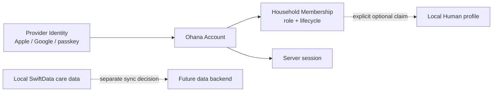

# Deferred Account and Backend Extension

Status: **Deferred design reference — not an active product capability**
Owner: `docs/specs/product-foundation.md` decision D25
Last reviewed: 2026-07-12

## Current Product Decision

Ohana is local-first. The current Solo product:

- stores primary app data in local SwiftData;
- offers an optional restricted backup file in the user's own iCloud Drive;
- has no Ohana account, Apple/Google login, developer-hosted backend, remote
  session, account credential, or server-side membership;
- does not upload care, health, route, note, photo, document, or economy data;
- keeps CloudKit live sync and family collaboration disabled and separately
  governed by `docs/cloud-sync-todo.md`.

This document preserves a future-compatible design. It does not authorize code,
dependencies, entitlements, privacy declarations, provider configuration,
backend deployment, or App Store claims.

## Keep These Concepts Separate

| Capability | Identity owner | Purpose | Current state |
| --- | --- | --- | --- |
| iCloud Drive backup | User's system Apple/iCloud account | Store and restore a restricted backup file | Active, optional |
| CloudKit sync | User's iCloud identity | Apple-platform live sync or sharing | Deferred and capability-gated |
| Ohana account | Developer-selected identity providers and backend | Cross-platform identity, membership, server services | Deferred; absent |

Using iCloud Drive does not require Ohana to know who the user is. Sign in with
Apple does not create backup or sync by itself. A local Human profile is care
content, not an authenticated operator or remote account.

## Revisit Only When a Real Product Trigger Exists

Reconsider an Ohana account/backend when at least one approved requirement
cannot be met safely by local storage or the user's iCloud identity:

- Android or web clients need the same identity and data;
- household invitations, roles, or collaboration must work across different
  Apple/iCloud accounts or outside the Apple ecosystem;
- a server must own subscription entitlement, fraud control, support recovery,
  or another durable cross-device fact;
- users explicitly require provider-neutral recovery independent of iCloud.

The following are **not** sufficient triggers:

- prefilling a Human name, gender, or birthday;
- backing up to the user's iCloud Drive;
- restoring on another Apple device signed into the same iCloud account;
- switching among local Human profiles on one device;
- adding login because other apps display a login screen.

## Decision Order

1. If the need is only backup/restore, extend the restricted iCloud Drive
   package and its migration/rollback tests.
2. If the need is Apple-only live sync or family sharing, evaluate CloudKit
   under `docs/cloud-sync-todo.md` before adding a third-party backend.
3. If the need is cross-platform or cross-provider server identity, introduce
   the account architecture below after an explicit product/privacy decision.

## Preserved Future Domain Boundaries

- `ProviderIdentity`: provider, stable provider subject, verification state.
- `OhanaAccount`: provider-neutral operator identity and account lifecycle.
- `HouseholdMembership`: role, invitation, ownership, suspension, and removal.
- `Human`: care subject/content record. It must never be silently created,
  merged, or claimed merely because an account signed in.
- `ServerSession`: revocable authentication state, separate from local app data.

Provider name/email may be a one-time editable suggestion. Gender, birthday,
avatar, HealthKit, and care data must not be inferred from an identity provider.

## Future First-Run UX Contract

This contract applies only after the account capability satisfies the activation
criteria below and `docs/specs/product-foundation.md` promotes it to active:

1. The first-run identity page may feature **Continue with Apple**, but it must
   also present a clear **Continue without an account** path. Local Pet creation,
   care, reminders, rewards, iCloud Drive backup, export, restore, and deletion
   remain usable without an Ohana account.
2. Do not show a disabled Google button. Add Google only after its provider,
   linking, duplicate-account, deletion, and signed-device matrices pass.
3. Explain the immediate account value and state that iCloud Drive backup uses
   the user's system iCloud identity independently of Ohana login.
4. Apple authorization creates or restores the provider-neutral Ohana Account.
   It must not silently create, merge, overwrite, or claim a Human.
5. After authorization, present an explicit confirmation such as **Create my
   member card**. The Apple name is an editable proposal only. The confirmation
   may make creation one tap, but Account, Household Membership, and Human remain
   separate persisted identities and the operation must be idempotent/recoverable.
6. Gender, birthday, avatar, HealthKit, and care information are never inferred
   from Apple. Ask only when a real feature needs the field; allow not set and
   prefer-not-to-say states where applicable.
7. Post-value profile quests may award a small, bounded, one-time
   `system:island` grant for completing a setup decision. Choosing **Later** or
   **Prefer not to say** earns the same completion result as disclosing optional
   personal data. Rewards never purchase sensitive information.
8. Mandatory login is not allowed while the core product remains usable without
   significant account-based services. Reconsider only when the approved product
   itself depends on cross-device/cross-platform identity or collaboration and
   the no-login behavior is deliberately redefined.

## Backend Requirements If Activated

Provider/vendor selection remains open. A hosted platform such as Supabase was
previously evaluated as a possible implementation, but no provider is approved,
configured, deployed, or required by the current product.

Any future backend must provide:

- separate development and production environments;
- provider-neutral account, household, membership, invitation, session, and
  security-audit models;
- least-privilege authorization enforced server-side, including forced row-
  level security or equivalent policy enforcement;
- direct-write restrictions for ownership, membership, and destructive facts;
- indexed authorization paths, serialized ownership transfer, and protection
  against removing the last owner;
- idempotent create/link/claim/delete/retry operations;
- fresh reauthentication for destructive operations;
- complete account deletion, provider-token revocation where required, and
  documented log/backup retention;
- regional/privacy assessment, DPA/subprocessor review, incident response,
  access logging, and secret rotation.

Authentication secrets and refresh tokens belong in the Data Protection
Keychain, never SwiftData, `UserDefaults`, backup payloads, logs, or source
control. OAuth/OIDC must use current provider SDKs or a reviewed implementation
with PKCE and state/nonce validation. Do not revive prototype code from chat or
history without revalidating it against current SDK and platform requirements.

## Data Scope Default

An account launch does not automatically authorize data sync. By default the
backend may hold only the minimum identity, session, membership, invitation,
and security-audit facts needed for the approved feature. HealthKit, human
health, care, route, note, photo, document, PIN, and economy/ledger data remain
local until a separate product rule, threat model, privacy disclosure, export
boundary, migration plan, deletion plan, and test matrix explicitly approve
each category.

## Reintroduction Sequence

1. Approve the exact user problem, data categories, cost owner, regions,
   retention, account recovery, and deletion behavior in product/privacy docs.
2. Compare CloudKit and provider-neutral backend options against the trigger;
   select a vendor only after dependency, privacy, availability, and exit-plan
   review.
3. Build isolated development infrastructure first. Keep project URLs/keys and
   provider configuration out of source control; do not ship blank or fallback
   production configuration.
4. Implement server schema/policies/RPCs and executable authorization tests
   before exposing client UI.
5. Add a narrow `AccountBackend` boundary, Keychain session store, cancellation,
   stale-response protection, and offline/recovery state machine.
6. Add optional post-onboarding login. Local care remains usable without login
   unless an approved future product explicitly changes that contract.
7. Prove on a signed physical device: cancel, success, relaunch restore, offline,
   expired/revoked credential, duplicate action, account linking, ownership
   edge cases, sign-out, provider revocation, deletion failure/retry, and Reset.
8. Update entitlements, privacy manifest, App Store privacy answers, public
   policy, support procedures, threat model, release gates, and status ledgers
   in the same capability change.

## Activation Exit Criteria

Do not call an account system complete until all of the following are true:

- backend authorization and destructive-path tests run against a deployed
  non-production environment;
- no client path can bypass membership/ownership invariants;
- provider and account deletion are recoverable, idempotent, and observable;
- current signed-device lifecycle tests pass for every enabled provider;
- privacy, retention, support, incident-response, and App Store declarations
  match actual production behavior;
- local-only users retain a documented backup/export/delete path;
- a tested migration and provider exit plan exists;
- `docs/specs/product-foundation.md` explicitly promotes the capability from
  Deferred to active.
