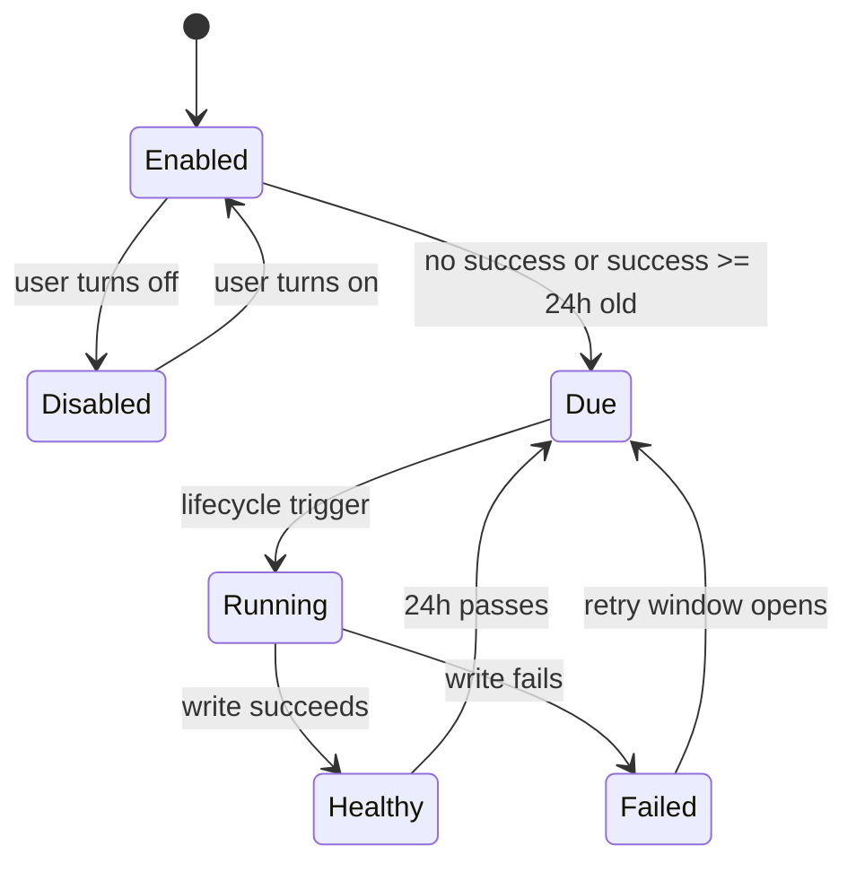

# GAP-3 Automatic Backup Logic

> Status: confirmed on 2026-06-12; health-data iCloud boundary tightened on 2026-07-09. Product choices: Q1=A daily interval, Q2=A opportunistic lifecycle trigger without a new BGTask, Q3=A iCloud Drive ubiquity container file, Q4=A plaintext **restricted** automatic JSON backup, Q5=A settings-visible failure plus gentle in-app reminder after repeated failures, Q6=A privacy reset removes Ohana-managed automatic backup files, Q7=A restore contract is backup-to-wipe-to-restore within the declared scope.

## Purpose

Automatic backup implements Product Foundation D11 and G10. The launch version
of Ohana remains single-device and local-first, but it must not depend on a
user remembering to export data manually. Ohana therefore keeps manual export
and adds a default-on automatic backup to the user's iCloud Drive as a file.
This is not CloudKit sync, does not accept shares, and must not enable any
online collaboration or multi-device merge behavior.

## Scope

In scope:

- Default-on automatic backup.
- User-facing on/off control in Settings.
- One Ohana-managed backup file in the app's iCloud Drive ubiquity container.
- Automatic backup uses the `OhanaBackup` package format with an explicit
  `automaticICloudDriveRestricted` scope. It excludes structured human health
  data, HealthKit-derived workouts, human weight/workout/medication/health
  records, human-scoped free-form calendar/reminder items (except structured
  birthdays and anniversaries), all free-text family-task sidecars, and all
  derived wallet/ledger/budget sidecars and legacy wallet-log projections.
  Manual export uses the same health-safe restriction because its Files and
  Share surfaces can also target iCloud or another provider.
- Last attempt, last success, last failure, and the current backup file name are
  visible in Settings.
- Repeated failures are surfaced with a gentle in-app reminder, no more than
  once per day.
- Manual export and manual restore remain available.
- Restore acceptance is tested as backup, wipe/reset to an empty store, restore,
  then verify data completeness.

Out of scope:

- CloudKit sync, CKShare, remote merge, shared database scope, or multi-device
  conflict resolution.
- New SwiftData schema.
- Background execution guarantees beyond opportunistic app lifecycle triggers.
- Password-protected automatic backups for launch. Manual encrypted export
  remains the protected-export path.

## Invariants

AB-001. Automatic backup is enabled by default. The user can turn it off in
Settings; when off, lifecycle triggers must do nothing and must not write files.

AB-002. Automatic backups use the same `OhanaBackup` package format as manual
export, but not the same data scope. Automatic iCloud Drive files carry the
`automaticICloudDriveRestricted` scope and must never contain structured human
health data or HealthKit-derived values. To avoid free-form reminder titles
leaking health details, external packages retain only direct-human birthday
and anniversary events; they omit other direct-human, medication, and
human-note schedule items plus all free-text family tasks and all derived
wallet/ledger/budget sidecars. Manual export uses
`manualExternalRestricted` and has the same health-data exclusion.
User-visible recoverable-delete state is not part of either backup contract
because the 2026-06-14 product model removed that feature; all backup scopes
continue to omit local-only secrets such as human PIN hash/salt.

AB-003. Automatic backups are files in the user's iCloud Drive ubiquity
container, not CloudKit records. No automatic-backup code may call CKShare,
CloudSync enablement, shared database APIs, or online collaboration gates.

AB-004. The first-release schedule is daily. A backup is due when automatic
backup is enabled and the most recent successful automatic backup is at least
24 hours old, or there has never been a successful automatic backup.

AB-005. Scheduling is opportunistic. The app may check whether a backup is due
from foreground/background lifecycle points, but the check must be cheap and
must not build a backup on app startup or in the first visible interaction
frame.

AB-006. At most one automatic backup run may execute at a time. A concurrent
trigger must return the existing in-flight state instead of starting a second
export.

AB-007. Success and failure metadata persist outside SwiftData so backup status
is available even when model loading or restore is not active. Metadata includes
enabled state, last attempt date, last success date, last failure date, last
failure reason, current automatic backup file name or path, and consecutive
failure count. A failed reset cleanup is separate durable state with its own
failure message and pending-retry flag.

AB-008. Failure is never silent. If iCloud Drive is unavailable, file writing
fails, or the backup projection throws, Settings must show the latest failure
state. After two consecutive failures, or when the last success is overdue by
more than one day, Ohana may show a gentle in-app reminder at most once per day.

AB-009. Manual export and manual import remain available. Manual encrypted
export keeps using the password flow. Automatic backups are plaintext JSON in
the user's iCloud Drive container for launch.

AB-010. Privacy reset/delete-all disables automatic backup and attempts to
remove Ohana-managed automatic backup files. Manual files the user explicitly
exported or shared are not touched. If the iCloud Drive deletion fails, local
reset still completes but Settings must warn that the old file may remain and
offer a retry; it must not clear the deletion-failure state or claim success.

AB-011. Restore correctness for GAP-3 is defined as backup, wipe/reset to an
empty local store, restore, then verify that the data declared by that backup's
scope is complete. Every current external backup intentionally does not restore
excluded human-health content. A merge import into a non-empty store remains
best-effort and is not the GAP-3 acceptance contract.

AB-012. A managed automatic-backup status with a successful file but no
`automaticICloudDriveRestricted` scope marker is from a pre-scope release and
is treated as potentially containing human health data. Settings must expose
both: (a) a user-triggered restricted backup that replaces the same managed
file, and (b) deletion of the managed file. It must not clear the warning until
one operation succeeds.

## State Machine

## Implementation Shape

- Service boundary: add an automatic-backup service that owns due calculation,
  one-run-at-a-time coordination, status persistence, and failure visibility
  decisions.
- File boundary: isolate iCloud Drive file access behind an injectable file
  store so tests can simulate success, unavailable iCloud, and write failure
  without depending on a real iCloud account.
- Backup payload: reuse `DataBackupManager` / `DataBackupActor` package code,
  while passing an explicit restricted scope for every externally shareable
  package. Tests must prove that manual and automatic exports omit every
  classified human-health field/model.
- Lifecycle: hook only a cheap due check into app lifecycle. If due, schedule an
  asynchronous automatic run after lifecycle handoff; do not add a new
  `BGTaskScheduler` identifier for launch.
- Settings: extend the existing data backup section with an automatic-backup
  toggle, last status, failure reason, and optional "back up now" action.
- Reset: connect app reset/delete-all to automatic-backup cleanup if the reset
  service is already centralized; persist cleanup failure and offer a Settings
  retry instead of swallowing it.
- Legacy files: use the persisted export-scope marker to flag pre-scope managed
  files. A successful restricted run replaces the known managed file in place;
  deletion clears its status and makes the next enabled run due again.
- Tests: cover default-on/toggle-off behavior, daily due semantics, iCloud
  unavailable failure visibility, successful file write, concurrent trigger
  suppression, automatic backup content coverage, and backup-to-wipe-to-restore.

## Entitlement And Cloud Boundary

The iCloud Drive target may require iCloud Documents capability and an
associated ubiquity container. That entitlement work is allowed only for the
file-backup path. It must not enable CloudKit sync behavior, CKShare handling,
or shared-database routing.

The implementation must keep a mechanically auditable boundary: searching the
automatic-backup service and settings additions must show no calls to
`CloudSyncEngineRuntime`, `CloudSyncHouseholdShareService`, CKShare acceptance,
or `OnlineFeatureGate`.
