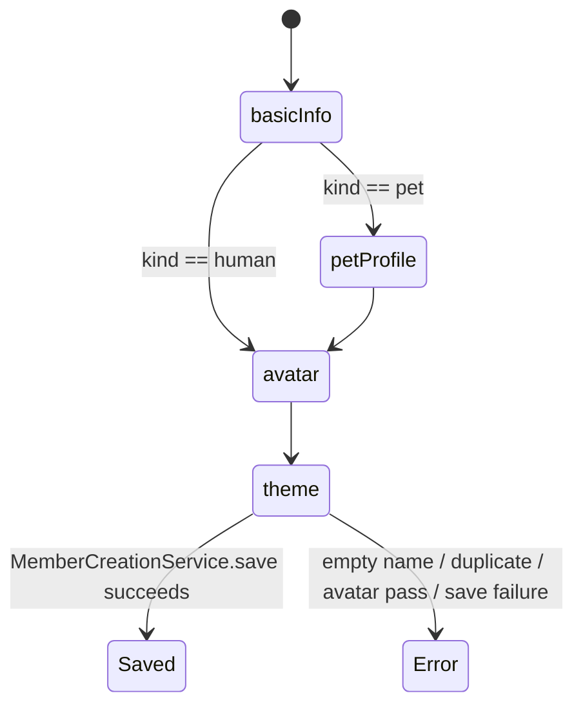
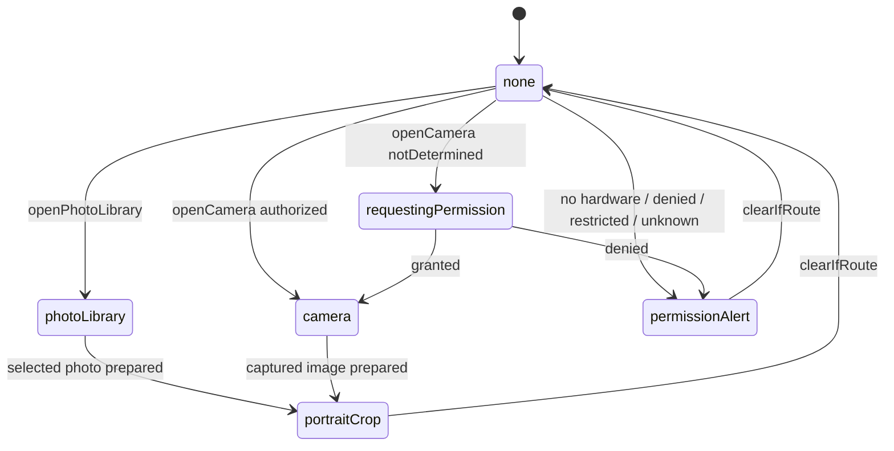
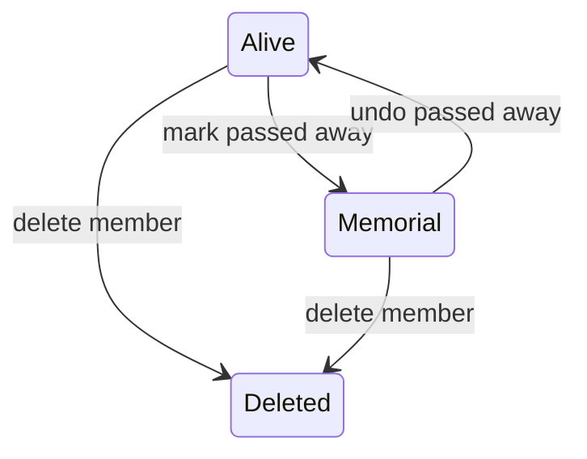
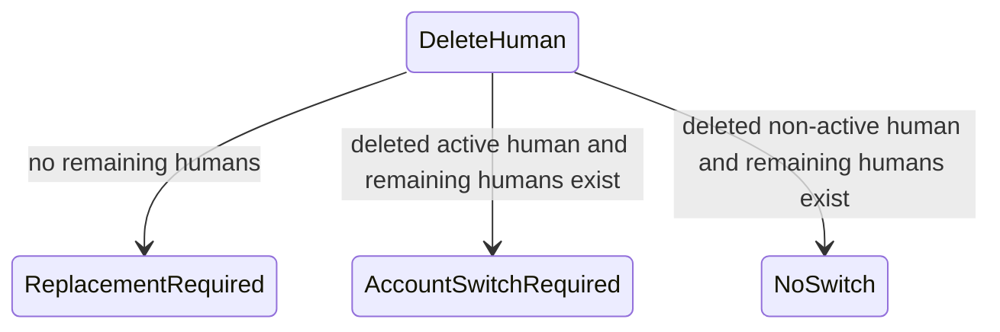

# Members 业务规则书

> 状态：已按 2026-07-14 成员名册与统一待办架构更新；S-MEM-006 仍为余留项。
> 范围：`Ohana/Features/Members`、`Ohana/Features/CrewRoster`，以及它们到统一 Task Center 的成员筛选入口。

## 1. 业务不变量

### MBR-001 成员创建名称唯一

任何情况下，创建宠物或人类成员前，名称会先 trim 空白；空名抛 `emptyName`，与现有宠物/人类名称大小写不敏感重复时抛 `duplicateName`。来源：`Ohana/Features/Members/MemberCreationService.swift:154`、`Ohana/Features/Members/MemberCreationService.swift:161`、`Ohana/Features/Members/MemberCreationService.swift:164`。

### MBR-002 2.5D 头像券先校验再消费

任何情况下，只有当草稿选择 `.avatar2D` 且有 `avatarImageData` 时才需要 2.5D 头像权限；权限不足抛 `avatarPassRequired`，保存成功后才调用 `Avatar2DAccess.consumeIfNeeded`。来源：`Ohana/Features/Members/MemberCreationService.swift:193`、`Ohana/Features/Members/MemberCreationService.swift:195`、`Ohana/Features/Members/MemberCreationService.swift:239`、`Ohana/Features/Members/MemberCreationService.swift:303`、`Ohana/Features/Members/MemberCreationService.swift:305`、`Ohana/Features/Members/MemberCreationService.swift:363`。

### MBR-003 购买头像券必须由当前人类账户支付

任何情况下，购买 2.5D 头像券会优先使用当前 active human；找不到 active human 时退回 `humans.first`，没人则抛 `missingActiveHuman`。余额不足抛 `insufficientCoconuts`；余额足够时写一条 care ledger coconut 事件，调用 wallet 扣款，保存成功后才给库存加 1 张券。来源：`Ohana/Features/Members/MemberCreationService.swift:71`、`Ohana/Features/Members/MemberCreationService.swift:79`、`Ohana/Features/Members/MemberCreationService.swift:85`、`Ohana/Features/Members/MemberCreationService.swift:88`、`Ohana/Features/Members/MemberCreationService.swift:95`、`Ohana/Features/Members/MemberCreationService.swift:119`、`Ohana/Features/Members/MemberCreationService.swift:145`、`Ohana/Features/Members/MemberCreationService.swift:151`。

### MBR-004 新宠物创建会写 Pet、相关日历事实和首宠完成标记

任何情况下，新宠物会从草稿写入核心资料、头像数据、性别、毛色和性格标签；创建流程不再分配“首页可见名额”，也不写新的隐藏首页偏好。Pet 插入后会标记 CloudSync modified。保存成功后，若草稿包含生日则创建生日 Event + Reminder，若包含到家日则创建周年 Event 和若干 PetMilestone，并确保默认 CarePlan 日历计划；生日 Event、生日 Reminder、到家周年 Event 都必须写入 CloudSync 本地 dirty state。首只宠物只设置 pet wizard quest flag；D17 的 50 椰子启动赠礼由 `StarterGiftService` 在第一笔照护事实持久化后独立写入 `system:island`，不属于 Pet 创建事务，也不绑定 Pet/Human。来源：`Ohana/Features/Members/MemberCreationService.swift`、`Ohana/Features/Economy/StarterGiftService.swift`、`docs/specs/Onboarding-logic.md`。

### MBR-005 新人类创建会写 Human、可选初始体重、生日 Event 和隐私字段

任何情况下，新人类会从草稿写入姓名、生日、血型、性别头像、角色、国籍/居住地、头像数据、主题色、MBTI、notes、高度和 privacy fields。第一个人类或显式角色草稿可保留选择角色，否则新成员角色固定为 `member`。初始体重大于 0 时创建 `HumanWeightLog`，executorId 来自当前 active human，并标记初始体重 quest 状态。生日打开时创建 `relatedEntityType == "Human"` 的年度生日 Event，并写入 CloudSync 本地 dirty state。Human 插入后会标记 CloudSync modified。来源：`Ohana/Features/Members/MemberCreationService.swift:308`、`Ohana/Features/Members/MemberCreationService.swift:337`、`Ohana/Features/Members/MemberCreationService.swift:338`、`Ohana/Features/Members/MemberCreationService.swift:339`、`Ohana/Features/Members/MemberCreationService.swift:344`、`Ohana/Features/Members/MemberCreationService.swift:355`。

### MBR-006 创建保存失败回滚未提交的创建事务

任何情况下，Pet 或 Human 首次 `context.save()` 失败时，会调用 `context.rollback()` 回滚本次尚未提交的成员创建事务，包括主实体及同事务派生事实；没有需要恢复的首页隐藏列表副作用。来源：`Ohana/Features/Members/MemberCreationService.swift`。

### MBR-007 成员资料更新走 Members command service

任何情况下，Pet/Human/Plant 资料更新由 `MemberProfileCommandService` 写 SwiftData 并返回 changedFields；Pet/Human 更新会标记 CloudSync modified，Plant 更新当前只保存本地，不标记 CloudSync。Pet 更新会重新 ensure 默认 CarePlan；Human 更新会标准化角色、性别、主题色，并在传入 `privateFieldsRaw` 时覆盖所有已知隐私字段。来源：`Ohana/Features/Members/MemberProfileCommands.swift:199`、`Ohana/Features/Members/MemberProfileCommands.swift:207`、`Ohana/Features/Members/MemberProfileCommands.swift:273`、`Ohana/Features/Members/MemberProfileCommands.swift:274`、`Ohana/Features/Members/MemberProfileCommands.swift:308`、`Ohana/Features/Members/MemberProfileCommands.swift:319`、`Ohana/Features/Members/MemberProfileCommands.swift:326`、`Ohana/Features/Members/MemberProfileCommands.swift:342`、`Ohana/Features/Members/MemberProfileCommands.swift:347`、`Ohana/Features/Members/MemberProfileCommands.swift:367`、`Ohana/Features/Members/MemberProfileCommands.swift:384`。

### MBR-008 隐私字段只对非本人锁定

任何情况下，`HumanPrivateField` 当前包含 weight、workout、medication、wishlist、expense、note。`Human.isPrivate` 对本人查看永远返回 false，对非本人查看时检查 `privateFieldsRaw` 是否包含该字段。Human 详情页如果所有隐私字段对查看者私有，则显示全隐私占位；否则按字段分别替换为占位或显示真实卡片。来源：`Ohana/Models/Human.swift:12`、`Ohana/Models/Human.swift:372`、`Ohana/Models/Human.swift:387`、`Ohana/Features/Members/Views/HumanDetailView.swift:64`、`Ohana/Features/Members/Views/HumanDetailView.swift:69`、`Ohana/Features/Members/Views/HumanDetailView.swift:83`、`Ohana/Features/Members/Views/HumanDetailView.swift:121`。

### MBR-009 人类 feature hub 会在打开目的地前做隐私路由门控

任何情况下，`HumanAllFeaturesSheet.open` 在目的地声明了 privacy field 且该字段对当前 viewer locked 时，不打开目的地，只设置 `lockedField` 并触发 warning feedback。来源：`Ohana/Features/Members/Views/HumanAllFeaturesSheet.swift:187`。

### MBR-010 宠物纪念模式只写生命周期字段

任何情况下，标记宠物离世调用 `RainbowBridgeService.markPassedAway`，只设置 `passedAwayDate`、标记 Pet modified，并返回 action `passed.mark`；撤销调用 `RainbowBridgeService.undoPassedAway`，清空 `passedAwayDate`、标记 Pet modified，并返回 action `passed.undo`。标记离世不删除、不恢复、不改写未来 Event / Reminder / 照护事实；既有数据只读保留。来源：`Ohana/Features/Members/MemberInteractionCommands.swift:14`、`Ohana/Features/Members/MemberInteractionCommands.swift:19`、`Ohana/Features/Members/MemberInteractionCommands.swift:20`、`Ohana/Features/Members/MemberInteractionCommands.swift:31`、`Ohana/Features/Members/MemberInteractionCommands.swift:35`、`Ohana/Features/Memorial/RainbowBridgeService.swift:19`。

### MBR-011 人类纪念模式只写 passedAwayDate

任何情况下，标记人类离世只是设置 `human.passedAwayDate = date`，撤销只是置 nil；二者都会标记 Human modified 并保存。当前 Members UI 只在 all-features header 使用人类纪念模式文案。来源：`Ohana/Features/Members/MemberInteractionCommands.swift:68`、`Ohana/Features/Members/MemberInteractionCommands.swift:73`、`Ohana/Features/Members/MemberInteractionCommands.swift:85`、`Ohana/Features/Members/MemberInteractionCommands.swift:89`、`Ohana/Features/Members/Views/HumanAllFeaturesSheet.swift:197`。

### MBR-012 清空宠物活动记录通过 Domain cleanup service

任何情况下，清空宠物记录会调用 `PetActivityRecordCleanupService.clearActivityRecords`，清空 per-pet quest auxiliary state，标记 Pet modified 并保存。来源：`Ohana/Features/Members/MemberInteractionCommands.swift:47`、`Ohana/Features/Members/MemberInteractionCommands.swift:53`、`Ohana/Features/Members/MemberInteractionCommands.swift:55`、`Ohana/Features/Members/MemberInteractionCommands.swift:57`。

### MBR-013 删除宠物会物理删除宠物与相关 Event，并写 CloudSync tombstone

任何情况下，删除 Pet 会抓取 `relatedEntityId == pet.id.uuidString` 的 Event，先通过 `PhysicalDeletionService.deleteEvent` 为 Event 与 Reminder 写不可见 sync tombstone 并物理删除，再移除 `quickActionItems_v2` 中指向该 Pet 的条目，最后通过 `PhysicalDeletionService.deletePet` 为 Pet 及从属照护 / 健康 / 遛狗 / 档案等记录写 tombstone 并物理删除。删除没有用户可见回收站、恢复窗口或 30 天过期清理。来源：`Ohana/Features/Members/MemberDeletionCommands.swift:51`、`Ohana/Features/Members/MemberDeletionCommands.swift:53`、`Ohana/Features/Members/MemberDeletionCommands.swift:61`、`Ohana/Domain/Services/PhysicalDeletionService.swift:14`、`Ohana/Domain/Services/PhysicalDeletionService.swift:44`。

### MBR-014 删除人类会物理删除 Human、成员日历事实与人类侧从属数据

任何情况下，删除 Human 会先查询是否还存在其他 active Human（`passedAwayDate == nil`）；如果删除的是 active human 且还有剩余 active human，返回 `requiresAccountSwitch = true`；如果没有剩余 active human，返回 `requiresReplacementHuman = true`。删除会通过 `PhysicalDeletionService.deleteEvent` 删除相关 Event / Reminder，通过 `PhysicalDeletionService.deleteHuman` 删除 Human、直接归属的人类侧费用、用药、健康、愿望清单、体重 / 运动 / 健康指标日志等从属数据，并为可同步实体写不可见 sync tombstone。来源：`Ohana/Features/Members/MemberDeletionCommands.swift:88`、`Ohana/Features/Members/MemberDeletionCommands.swift:103`、`Ohana/Features/Members/MemberDeletionCommands.swift:113`、`Ohana/Domain/Services/PhysicalDeletionService.swift:61`。

### MBR-015 删除人类后的 UI 路由由 notification route event 接管

任何情况下，Human 详情/基本信息删除成功后，如果 result 要求清空 active human，则把 `currentActiveHumanId` 设为空；随后发布 `.humanDeleted(requiresReplacementHuman:requiresAccountSwitch:)`。来源：`Ohana/Features/Members/Views/HumanDetailView+RemindersActions.swift:180`、`Ohana/Features/Members/Views/HumanDetailView+RemindersActions.swift:189`、`Ohana/Features/Members/Views/HumanDetailView+RemindersActions.swift:192`、`Ohana/Features/Members/Views/HumanBasicInfoDetailView.swift:657`、`Ohana/Features/Members/Views/HumanBasicInfoDetailView.swift:673`、`Ohana/Features/Members/Views/HumanBasicInfoDetailView.swift:676`。

### MBR-016 头像媒体路由是四态单通道

任何情况下，成员头像媒体路由只有 photoLibrary、camera、portraitCrop、permissionAlert 四种。打开相册直接设置 route；打开相机先检查硬件和权限，未授权时请求权限，授权后进入 camera，否则进入 permissionAlert。来源：`Ohana/Features/Members/MemberAvatarMediaCoordinator.swift:14`、`Ohana/Features/Members/MemberAvatarMediaCoordinator.swift:62`、`Ohana/Features/Members/MemberAvatarMediaCoordinator.swift:83`、`Ohana/Features/Members/MemberAvatarMediaCoordinator.swift:89`、`Ohana/Features/Members/MemberAvatarMediaCoordinator.swift:97`。

### MBR-017 创建向导步骤由成员类型决定

任何情况下，人类创建步骤为 basicInfo -> avatar -> theme；宠物创建步骤为 basicInfo -> petProfile -> avatar -> theme。来源：`Ohana/Features/Members/MemberCardCreationSupport.swift:309`、`Ohana/Features/Members/MemberCardCreationSupport.swift:317`。

### MBR-018 成员页只管理名册，家庭分工进入统一 Task Center

成员页是单一名册面：`CrewRosterOverlay` 以首页同源的 `FocusHomeVerticalSolidCardSurface` 排列 Human / Pet，支持搜索、类型筛选、添加成员、查看成员钱包和进入详情；头像媒体只随 LazyVGrid 可见单元按需加载。旧 `.collaboration` 路由由 `resolvedInitialMode` 收敛到 `.members`，成员页不再挂载独立协作面、任务 dashboard 或 FamilyTask 查询，也不提供“是否显示在首页”开关。

成员页的“查看待办”通过 `onOpenTaskCenter` 打开统一 Task Center；Human 详情页的“查看全部”通过 `TaskCenterRouteContext.human` 打开带该成员筛选的同一入口。家庭分工的创建、领取、提交与审核由 Task Center 和 `FamilyTaskService` 承载，而不是在成员页复制一套任务中心。来源：`CrewRosterOverlay`、`CrewRosterOverlayRouteContainer`、`AppHumanRouteContainer`、`HumanDetailView`、`TaskCenterRouteContext`、`TaskCenterRouteContainer`、`FamilyTaskService`。

## 2. 状态机

### 2.1 Member creation draft

代码实际约束：步骤列表由 `MemberCreationStep.steps(for:)` 静态决定；保存时才执行名称、2.5D 权限、SwiftData 写入和派生事件/里程碑。来源：`Ohana/Features/Members/MemberCardCreationSupport.swift`、`Ohana/Features/Members/MemberCreationService.swift`。

### 2.2 Avatar media route

代码实际约束：`clearIfRoute` 只会清掉当前 route id 匹配的 route；相机预热只执行一次。来源：`Ohana/Features/Members/MemberAvatarMediaCoordinator.swift:67`、`Ohana/Features/Members/MemberAvatarMediaCoordinator.swift:119`。

### 2.3 Member lifecycle

代码实际约束：Pet memorial 委托 RainbowBridgeService；Human memorial 只改 `passedAwayDate`。删除 Pet 和删除 Human 直接进入 `PhysicalDeletionService`：先写不可见 sync tombstone，再物理删除相关 Event / Reminder、成员和从属记录；没有用户可恢复中转态或到期清理。来源：`Ohana/Features/Members/MemberInteractionCommands.swift:14`、`Ohana/Features/Members/MemberInteractionCommands.swift:68`、`Ohana/Features/Members/MemberDeletionCommands.swift:43`、`Ohana/Features/Members/MemberDeletionCommands.swift:81`、`Ohana/Domain/Services/PhysicalDeletionService.swift:14`。

### 2.4 Human deletion account routing

代码实际约束：`clearsActiveHumanID` 在删除当前 active human 或删除最后一个 human 时为 true。来源：`Ohana/Features/Members/MemberDeletionCommands.swift:95`、`Ohana/Features/Members/MemberDeletionCommands.swift:104`。

## 3. 边界与冲突

### 多成员

- 当前 active Human 决定头像券购买付款人、初始 HumanWeightLog executorId、隐私查看者、删除 Human 后是否需要 account switch，也决定本机家庭任务中的当前发布者、执行者/确认者与对应成员钱包归属。统一待办通过 `TaskCenterSnapshotBuilder` 计算该成员可用动作，并由 `TaskActionCommandExecutor` 委托 `FamilyTaskService` 执行。来源：`MemberCreationService`、`Human`、`MemberDeletionCommands`、`TaskCenterSnapshotBuilder`、`TaskActionCommandExecutor`、`FamilyTaskService`。
- 删除非 active human 时不会清空 `currentActiveHumanId`；删除 active human 时由 UI 清空 active id 并发布 route event。来源：`Ohana/Features/Members/MemberDeletionCommands.swift:111`、`Ohana/Features/Members/Views/HumanBasicInfoDetailView.swift:673`。

### 多成员卡片

- Home 不再使用 `shouldShowOnHome` 或 `hiddenHomePetIDs` 过滤在世 Human / Pet，也没有旧 6 卡业务容量；8 张起切换为纵向滚动布局。当前 Home 高频 read model 仍以 80 Pet + 40 Human 的受控查询边界保护启动与内存，这不是成员页可配置的显隐规则。来源：`Ohana/Features/Home/FocusHomeCardDataSource.swift`、`Ohana/Features/Home/HomeReadModelStore.swift`、`Ohana/Features/Home/Views/FocusHomeVerticalSolidScenePolicies.swift`。
- Pet 删除会移除 quick action 中该 Pet 的两种引用格式：`petId` 或 `entityId + entityKindRaw == Pet`。来源：`Ohana/Features/Members/MemberDeletionCommands.swift:147`。

### 多设备 / CloudSync

- Pet/Human 创建、active 成员资料更新、生命周期标记与不可恢复删除会写 CloudSync state；离世成员资料更新 / 清空记录命令在服务层 no-op，不发布假 revision。旧首页显隐字段和 command 仅为 schema、备份与历史数据兼容，不再有用户入口，也不决定 Home 卡片集合。来源：`Ohana/Features/Members/MemberCreationService.swift`、`Ohana/Features/Members/MemberProfileCommands.swift`、`Ohana/Features/Members/MemberInteractionCommands.swift`、`Ohana/Features/Home/FocusHomeCardDataSource.swift`。
- Members 创建的生日 / 到家日 Event 与生日 Reminder 会写 CloudSync 本地 dirty state；删除成员时相关 Event、Reminder、成员和从属记录在 `PhysicalDeletionService` 边界写不可见 sync tombstone 后物理删除。`Reminder` 及若干人类侧模型目前只记录本地 sync metadata，不扩大 `CloudSyncEntityRegistry.uploadPipelineEntityNames`，因此不启用 CloudKit 上传 / 拉取流水线。来源：`Ohana/Features/Members/MemberCreationService.swift:355`、`Ohana/Features/Members/MemberCreationService.swift:407`、`Ohana/Features/Members/MemberCreationService.swift:410`、`Ohana/Features/Members/MemberCreationService.swift:423`、`Ohana/Domain/Services/PhysicalDeletionService.swift:14`、`Ohana/Domain/Services/PhysicalDeletionService.swift:44`。

### 时区 / 跨午夜 / 时间回拨

- 创建成员的年龄、生日、到家纪念、里程碑和初始体重都使用 `Date()` 或 `Calendar.current`；代码未在 Members 层固定 calendar/time zone。来源：`Ohana/Features/Members/MemberCardCreationSupport.swift:149`、`Ohana/Features/Members/MemberCreationService.swift:339`、`Ohana/Features/Members/MemberCreationService.swift:421`。
- 头像媒体恢复快照 30 分钟内才 fresh；系统时间回拨可能让旧快照保持 fresh 更久。来源：`Ohana/Features/Members/MemberCardCreationSupport.swift:190`、`Ohana/Features/Members/MemberCardCreationSupport.swift:292`。

## 4. 可疑清单

### S-MEM-001 Human 删除留下字符串关联敏感数据（已修复）

2026-06-14 二态模型修复结果：删除 Human 时相关 Event / Reminder、人类侧私密字符串关联记录和 Human 本体在同一物理删除边界写 tombstone 后删除，不再保留回收期恢复数据。覆盖测试：`PhysicalDeletionServiceTests.petDeletionPhysicallyDeletesChildFactsAndWritesSyncTombstones`、`HomeCommandExecutorTests.memberDeletionServicesPhysicallyDeleteMembersAndWriteTombstones`。

### S-MEM-002 Members Event 同步不完整（已修复）

2026-06-14 二态模型修复结果：Members 创建的 Human birthday Event、Pet birthday Event、Pet birthday Reminder、Pet home anniversary Event 都写入 CloudSync 本地 dirty state；成员删除路径通过 `PhysicalDeletionService` 对相关 Event / Reminder 写 tombstone 后物理删除。覆盖测试：`MemberCreationServiceTests.petCreationWritesBirthdayHomeMilestonesAndRevision`、`MemberCreationServiceTests.humanCreationWritesBirthdayEventCloudSyncState`、`PhysicalDeletionServiceTests.petDeletionPhysicallyDeletesChildFactsAndWritesSyncTombstones`。

### S-MEM-003 Pet 纪念模式提示与 Members 层可见行为不完全同源（已由 GAP-9 收敛）

GAP-9 已改为：UI 文案不再承诺删除；Members command 委托 `RainbowBridgeService`；规则书 `docs/specs/Memorial-logic.md` 明确未来提醒 / 事件以纪念退场标记退出活跃流并可撤销。来源：`Ohana/Features/Members/Views/PetBasicInfoDetailView+MemorialDanger.swift:93`、`Ohana/Features/Memorial/RainbowBridgeService.swift:16`。

### S-MEM-004 重复发布 member profile revision（已修复）

2026-06-28 修复结果：`MemberCommandExecutor.update*Profile` 仍是 profile revision 的唯一发布边界；Pet / Human 资料保存的 View 调用点只调用 executor，不再在 executor 返回后手动 `appServices.domainRevisions.publishMemberProfile`。`scripts/audit-architecture-boundaries.sh` 新增 `member-view-direct-profile-revision` guard，并由 bad/good fixture 锁住，防止 Members view 重新直发 profile revision。来源：`Ohana/Features/Members/MemberInteractionCommands.swift`、`Ohana/Features/Members/Views/PetBasicInfoDetailView+Commands.swift`、`Ohana/Features/Members/Views/HumanBasicInfoDetailView.swift`、`Ohana/Features/Members/Views/EditHumanSheet.swift`、`scripts/audit-architecture-boundaries.sh`、`scripts/tests/fixtures/Views/MemberProfileRevisionBoundaryBad.swift`。

### S-MEM-005 离世成员 command 层只读硬门（已修复）

2026-06-14 二态模型修复结果：Pet/Human profile 更新、legacy Human 首页显示 command、清空离世宠物记录在 command/service 层 no-op，且 revision 发布器不会为 no-op 发布假派生。2026-07-14 已移除该 legacy 显隐能力的用户入口和 Home 过滤语义。删除成员仍属于 D8 明确确认后的不可恢复删除路径，不走回收站。覆盖测试：`HomeCommandExecutorTests.memberCommandsNoOpForPassedAwayProfileVisibilityAndRecordClear`、`PetActivityRecordCleanupServiceTests.cleanupNoOpsForPassedAwayPet`。

### S-MEM-006 本地化覆盖不完整（余留）

2026-06-28 人类侧收敛结果：Human detail overview、basic-info 读写页、Human feature hubs、隐私占位、提醒 / 备注、route fallback/loading/missing、动态 role/age/blood chips、`EditHumanSheet`、人类可达 CrewRoster 编辑 / 删除 / accessibility 文案，以及共享头像选择 / 裁剪控件已走 `L10n.tr`，且不改变 role/gender/blood/MBTI 存储值、隐私规则、route 或 command 行为。TFU-20260612-020 仍 open，因为 Pet edit/read/danger-zone surfaces、sitter card、Pet health/medication 等宠物侧页面还有用户可见硬编码中文。产品意图仍是用户可见文案至少有中英文 authoring；见 `docs/task-follow-ups.md` 的 Members localization 余留项。

## 5. 确认与余留

- 2026-06-12 产品答复采用 A 路径：S-MEM-001、S-MEM-002 纳入本轮 P0 修复；RequiredHumanProfileView a11y 纳入 P1 修复。
- S-MEM-001 / S-MEM-002 已有定向测试覆盖并通过。
- RequiredHumanProfileView 的 decorative icon 已隐藏给 VoiceOver，44pt 容器通过 `scripts/audit-accessibility.sh Ohana/Features/Members`。
- S-MEM-006 与 Economy 侧删除后钱包/账本可见性审计作为跨范围余留，写入 `docs/task-follow-ups.md`。
