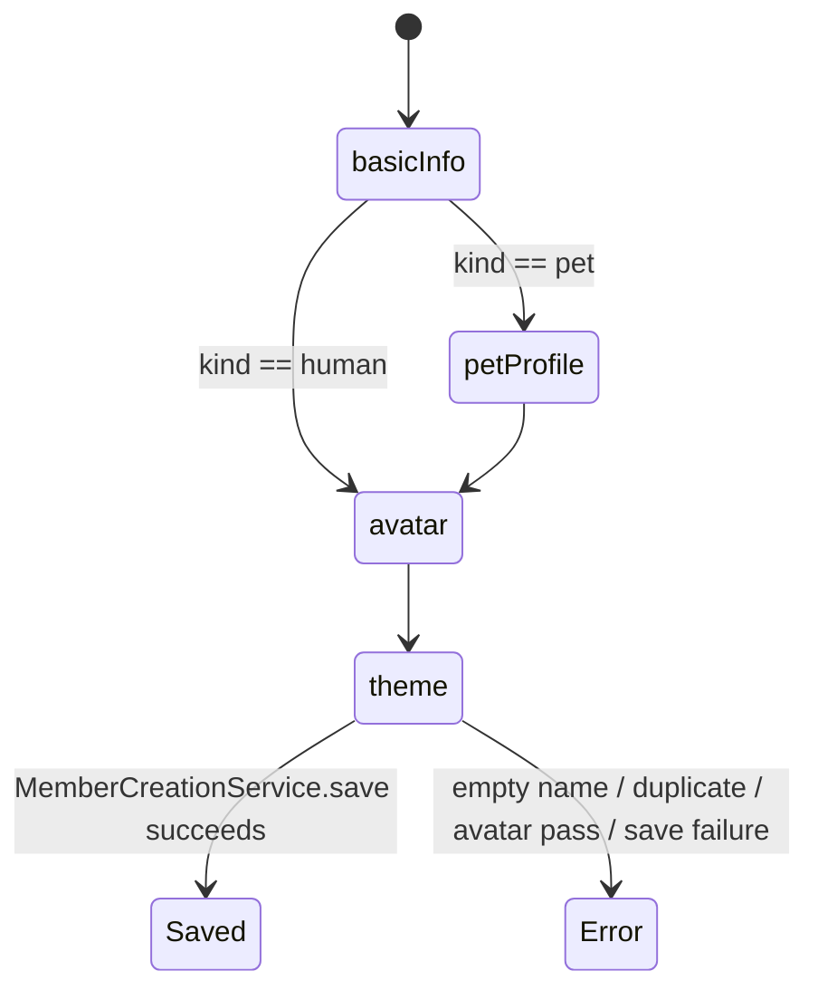
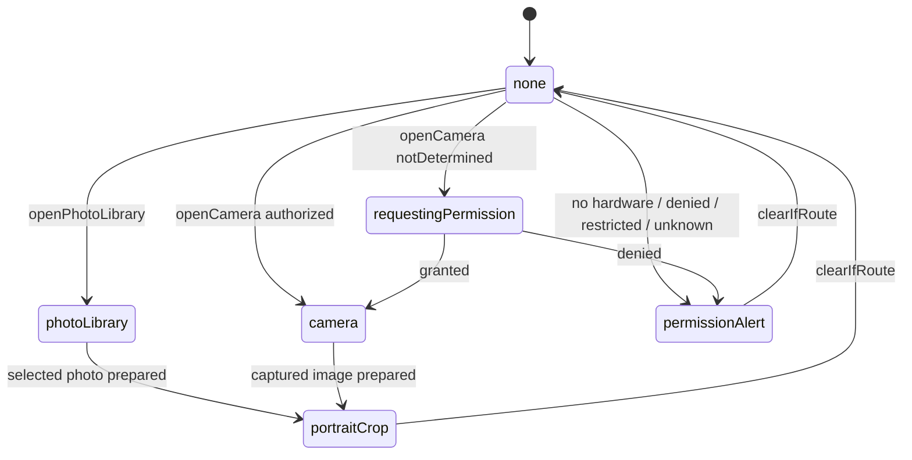
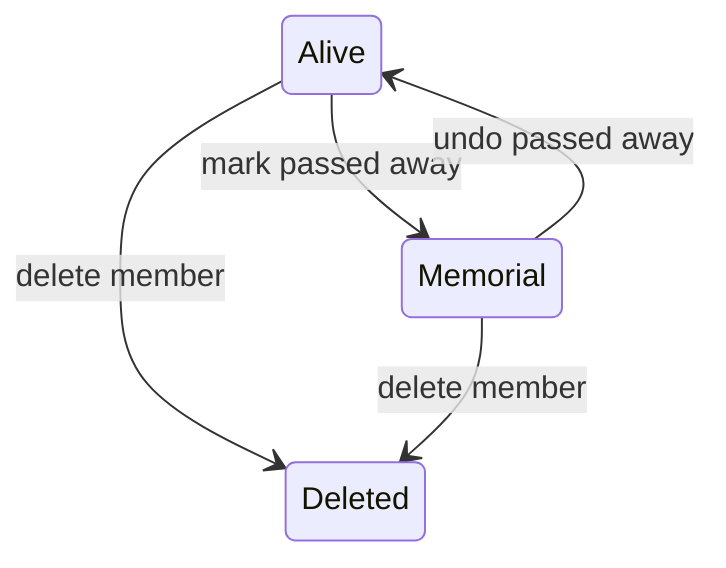
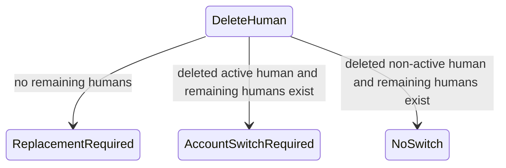

# Members 业务规则书（代码反推草案）

> 状态：待人工逐条确认。本文只描述当前代码实际行为，不代表产品意图已经正确。
> 范围：`Ohana/Features/Members`。来源行号按 2026-06-12 当前工作区记录。

## 1. 业务不变量

### MBR-001 成员创建名称唯一

任何情况下，创建宠物或人类成员前，名称会先 trim 空白；空名抛 `emptyName`，与现有宠物/人类名称大小写不敏感重复时抛 `duplicateName`。来源：`Ohana/Features/Members/MemberCreationService.swift:154`、`Ohana/Features/Members/MemberCreationService.swift:161`、`Ohana/Features/Members/MemberCreationService.swift:164`。

### MBR-002 2.5D 头像券先校验再消费

任何情况下，只有当草稿选择 `.avatar2D` 且有 `avatarImageData` 时才需要 2.5D 头像权限；权限不足抛 `avatarPassRequired`，保存成功后才调用 `Avatar2DAccess.consumeIfNeeded`。来源：`Ohana/Features/Members/MemberCreationService.swift:193`、`Ohana/Features/Members/MemberCreationService.swift:195`、`Ohana/Features/Members/MemberCreationService.swift:239`、`Ohana/Features/Members/MemberCreationService.swift:303`、`Ohana/Features/Members/MemberCreationService.swift:305`、`Ohana/Features/Members/MemberCreationService.swift:363`。

### MBR-003 购买头像券必须由当前人类账户支付

任何情况下，购买 2.5D 头像券会优先使用当前 active human；找不到 active human 时退回 `humans.first`，没人则抛 `missingActiveHuman`。余额不足抛 `insufficientCoconuts`；余额足够时写一条 care ledger coconut 事件，调用 wallet 扣款，保存成功后才给库存加 1 张券。来源：`Ohana/Features/Members/MemberCreationService.swift:71`、`Ohana/Features/Members/MemberCreationService.swift:79`、`Ohana/Features/Members/MemberCreationService.swift:85`、`Ohana/Features/Members/MemberCreationService.swift:88`、`Ohana/Features/Members/MemberCreationService.swift:95`、`Ohana/Features/Members/MemberCreationService.swift:119`、`Ohana/Features/Members/MemberCreationService.swift:145`、`Ohana/Features/Members/MemberCreationService.swift:151`。

### MBR-004 新宠物创建会写 Pet、本地首页可见性、相关日历事实和首宠欢迎奖励

任何情况下，新宠物会从草稿写入核心资料、头像数据、毛色/眼色和性格标签；如果首页可见卡片已满，会把该宠物写入隐藏首页列表。Pet 插入后会标记 CloudSync modified。保存成功后，生日会创建生日 Event + Reminder，到家日会创建周年 Event 和若干 PetMilestone，并确保默认 CarePlan 日历计划。首只宠物会设置 quest flag 并尝试发 50 椰子欢迎奖励；奖励失败只记录性能日志，不回滚宠物创建。来源：`Ohana/Features/Members/MemberCreationService.swift:198`、`Ohana/Features/Members/MemberCreationService.swift:209`、`Ohana/Features/Members/MemberCreationService.swift:213`、`Ohana/Features/Members/MemberCreationService.swift:220`、`Ohana/Features/Members/MemberCreationService.swift:227`、`Ohana/Features/Members/MemberCreationService.swift:228`、`Ohana/Features/Members/MemberCreationService.swift:249`、`Ohana/Features/Members/MemberCreationService.swift:250`、`Ohana/Features/Members/MemberCreationService.swift:253`、`Ohana/Features/Members/MemberCreationService.swift:258`、`Ohana/Features/Members/MemberCreationService.swift:271`、`Ohana/Features/Members/MemberCreationService.swift:394`、`Ohana/Features/Members/MemberCreationService.swift:405`、`Ohana/Features/Members/MemberCreationService.swift:408`、`Ohana/Features/Members/MemberCreationService.swift:420`。

### MBR-005 新人类创建会写 Human、可选初始体重、生日 Event 和隐私字段

任何情况下，新人类会从草稿写入姓名、生日、血型、性别头像、角色、国籍/居住地、头像数据、主题色、MBTI、notes、高度和 privacy fields。第一个人类或显式角色草稿可保留选择角色，否则新成员角色固定为 `member`。初始体重大于 0 时创建 `HumanWeightLog`，executorId 来自当前 active human，并标记初始体重 quest 状态。生日打开时创建 `relatedEntityType == "Human"` 的年度生日 Event。Human 插入后会标记 CloudSync modified。来源：`Ohana/Features/Members/MemberCreationService.swift:308`、`Ohana/Features/Members/MemberCreationService.swift:313`、`Ohana/Features/Members/MemberCreationService.swift:319`、`Ohana/Features/Members/MemberCreationService.swift:322`、`Ohana/Features/Members/MemberCreationService.swift:327`、`Ohana/Features/Members/MemberCreationService.swift:332`、`Ohana/Features/Members/MemberCreationService.swift:337`、`Ohana/Features/Members/MemberCreationService.swift:338`、`Ohana/Features/Members/MemberCreationService.swift:339`、`Ohana/Features/Members/MemberCreationService.swift:344`。

### MBR-006 创建保存失败只回滚已经插入的主实体

任何情况下，Pet 首次 `context.save()` 失败时，会恢复首页隐藏列表并删除刚插入的 Pet；Human 首次 `context.save()` 失败时，会删除刚插入的 Human。来源：`Ohana/Features/Members/MemberCreationService.swift:229`、`Ohana/Features/Members/MemberCreationService.swift:232`、`Ohana/Features/Members/MemberCreationService.swift:235`、`Ohana/Features/Members/MemberCreationService.swift:356`、`Ohana/Features/Members/MemberCreationService.swift:359`。

### MBR-007 成员资料更新走 Members command service

任何情况下，Pet/Human/Plant 资料更新由 `MemberProfileCommandService` 写 SwiftData 并返回 changedFields；Pet/Human 更新会标记 CloudSync modified，Plant 更新当前只保存本地，不标记 CloudSync。Pet 更新会重新 ensure 默认 CarePlan；Human 更新会标准化角色、性别、主题色，并在传入 `privateFieldsRaw` 时覆盖所有已知隐私字段。来源：`Ohana/Features/Members/MemberProfileCommands.swift:199`、`Ohana/Features/Members/MemberProfileCommands.swift:207`、`Ohana/Features/Members/MemberProfileCommands.swift:273`、`Ohana/Features/Members/MemberProfileCommands.swift:274`、`Ohana/Features/Members/MemberProfileCommands.swift:308`、`Ohana/Features/Members/MemberProfileCommands.swift:319`、`Ohana/Features/Members/MemberProfileCommands.swift:326`、`Ohana/Features/Members/MemberProfileCommands.swift:342`、`Ohana/Features/Members/MemberProfileCommands.swift:347`、`Ohana/Features/Members/MemberProfileCommands.swift:367`、`Ohana/Features/Members/MemberProfileCommands.swift:384`。

### MBR-008 隐私字段只对非本人锁定

任何情况下，`HumanPrivateField` 当前包含 weight、workout、medication、wishlist、expense、note。`Human.isPrivate` 对本人查看永远返回 false，对非本人查看时检查 `privateFieldsRaw` 是否包含该字段。Human 详情页如果所有隐私字段对查看者私有，则显示全隐私占位；否则按字段分别替换为占位或显示真实卡片。来源：`Ohana/Models/Human.swift:12`、`Ohana/Models/Human.swift:372`、`Ohana/Models/Human.swift:387`、`Ohana/Features/Members/Views/HumanDetailView.swift:64`、`Ohana/Features/Members/Views/HumanDetailView.swift:69`、`Ohana/Features/Members/Views/HumanDetailView.swift:83`、`Ohana/Features/Members/Views/HumanDetailView.swift:121`。

### MBR-009 人类 feature hub 会在打开目的地前做隐私路由门控

任何情况下，`HumanAllFeaturesSheet.open` 在目的地声明了 privacy field 且该字段对当前 viewer locked 时，不打开目的地，只设置 `lockedField` 并触发 warning feedback。来源：`Ohana/Features/Members/Views/HumanAllFeaturesSheet.swift:187`。

### MBR-010 宠物纪念模式由生命周期命令写入，撤销会清空

任何情况下，标记宠物离世调用 `RainbowBridgeService.markPassedAway`，标记 Pet modified，并返回 action `passed.mark`；撤销调用 `RainbowBridgeService.undoPassedAway`，标记 Pet modified，并返回 action `passed.undo`。未来提醒 / 事件由 `RainbowBridgeService` 以纪念退场标记退出活跃流，不硬删除；撤销只恢复纪念流程标记的内容。来源：`Ohana/Features/Members/MemberInteractionCommands.swift:14`、`Ohana/Features/Members/MemberInteractionCommands.swift:19`、`Ohana/Features/Members/MemberInteractionCommands.swift:20`、`Ohana/Features/Members/MemberInteractionCommands.swift:31`、`Ohana/Features/Members/MemberInteractionCommands.swift:35`、`Ohana/Features/Memorial/RainbowBridgeService.swift:16`。

### MBR-011 人类纪念模式只写 passedAwayDate

任何情况下，标记人类离世只是设置 `human.passedAwayDate = date`，撤销只是置 nil；二者都会标记 Human modified 并保存。当前 Members UI 只在 all-features header 使用人类纪念模式文案。来源：`Ohana/Features/Members/MemberInteractionCommands.swift:68`、`Ohana/Features/Members/MemberInteractionCommands.swift:73`、`Ohana/Features/Members/MemberInteractionCommands.swift:85`、`Ohana/Features/Members/MemberInteractionCommands.swift:89`、`Ohana/Features/Members/Views/HumanAllFeaturesSheet.swift:197`。

### MBR-012 清空宠物活动记录通过 Domain cleanup service

任何情况下，清空宠物记录会调用 `PetActivityRecordCleanupService.clearActivityRecords`，清空 per-pet quest auxiliary state，标记 Pet modified 并保存。来源：`Ohana/Features/Members/MemberInteractionCommands.swift:47`、`Ohana/Features/Members/MemberInteractionCommands.swift:53`、`Ohana/Features/Members/MemberInteractionCommands.swift:55`、`Ohana/Features/Members/MemberInteractionCommands.swift:57`。

### MBR-013 删除宠物会删除相关 Event、移除 quick actions、tombstone Pet 并调和 shared sessions

任何情况下，删除 Pet 会抓取 `relatedEntityId == pet.id.uuidString` 的 Event 并直接删除，移除 `quickActionItems_v2` 中指向该 Pet 的条目，标记 Pet deleted，删除 Pet 本体，保存后对引用该 Pet 的 shared sessions 调用 reconcile。返回结果包含删除的 Event IDs 和 quick action 数量。来源：`Ohana/Features/Members/MemberDeletionCommands.swift:43`、`Ohana/Features/Members/MemberDeletionCommands.swift:50`、`Ohana/Features/Members/MemberDeletionCommands.swift:51`、`Ohana/Features/Members/MemberDeletionCommands.swift:52`、`Ohana/Features/Members/MemberDeletionCommands.swift:56`、`Ohana/Features/Members/MemberDeletionCommands.swift:57`、`Ohana/Features/Members/MemberDeletionCommands.swift:60`、`Ohana/Features/Members/MemberDeletionCommands.swift:65`。

### MBR-014 删除人类只删除 Human 本体并返回账户切换信号

任何情况下，删除 Human 会先查询是否还存在其他 Human；如果删除的是 active human 且还有剩余 human，返回 `requiresAccountSwitch = true`。如果没有剩余 human，返回 `requiresReplacementHuman = true`。然后标记 Human deleted，删除 Human 本体并保存。返回结果当前固定 `removedRelatedEventIDs = []`、`removedQuickActionCount = 0`。来源：`Ohana/Features/Members/MemberDeletionCommands.swift:78`、`Ohana/Features/Members/MemberDeletionCommands.swift:85`、`Ohana/Features/Members/MemberDeletionCommands.swift:95`、`Ohana/Features/Members/MemberDeletionCommands.swift:96`、`Ohana/Features/Members/MemberDeletionCommands.swift:100`、`Ohana/Features/Members/MemberDeletionCommands.swift:101`、`Ohana/Features/Members/MemberDeletionCommands.swift:104`。

### MBR-015 删除人类后的 UI 路由由 notification route event 接管

任何情况下，Human 详情/基本信息删除成功后，如果 result 要求清空 active human，则把 `currentActiveHumanId` 设为空；随后发布 `.humanDeleted(requiresReplacementHuman:requiresAccountSwitch:)`。来源：`Ohana/Features/Members/Views/HumanDetailView+RemindersActions.swift:180`、`Ohana/Features/Members/Views/HumanDetailView+RemindersActions.swift:189`、`Ohana/Features/Members/Views/HumanDetailView+RemindersActions.swift:192`、`Ohana/Features/Members/Views/HumanBasicInfoDetailView.swift:657`、`Ohana/Features/Members/Views/HumanBasicInfoDetailView.swift:673`、`Ohana/Features/Members/Views/HumanBasicInfoDetailView.swift:676`。

### MBR-016 头像媒体路由是四态单通道

任何情况下，成员头像媒体路由只有 photoLibrary、camera、portraitCrop、permissionAlert 四种。打开相册直接设置 route；打开相机先检查硬件和权限，未授权时请求权限，授权后进入 camera，否则进入 permissionAlert。来源：`Ohana/Features/Members/MemberAvatarMediaCoordinator.swift:14`、`Ohana/Features/Members/MemberAvatarMediaCoordinator.swift:62`、`Ohana/Features/Members/MemberAvatarMediaCoordinator.swift:83`、`Ohana/Features/Members/MemberAvatarMediaCoordinator.swift:89`、`Ohana/Features/Members/MemberAvatarMediaCoordinator.swift:97`。

### MBR-017 创建向导步骤由成员类型决定

任何情况下，人类创建步骤为 basicInfo -> avatar -> theme；宠物创建步骤为 basicInfo -> petProfile -> avatar -> theme。来源：`Ohana/Features/Members/MemberCardCreationSupport.swift:309`、`Ohana/Features/Members/MemberCardCreationSupport.swift:317`。

## 2. 状态机

### 2.1 Member creation draft

代码实际约束：步骤列表由 `MemberCreationStep.steps(for:)` 静态决定；保存时才执行名称、2.5D 权限、首页可见性、SwiftData 写入和派生事件/里程碑。来源：`Ohana/Features/Members/MemberCardCreationSupport.swift:317`、`Ohana/Features/Members/MemberCreationService.swift:154`。

### 2.2 Avatar media route

代码实际约束：`clearIfRoute` 只会清掉当前 route id 匹配的 route；相机预热只执行一次。来源：`Ohana/Features/Members/MemberAvatarMediaCoordinator.swift:67`、`Ohana/Features/Members/MemberAvatarMediaCoordinator.swift:119`。

### 2.3 Member lifecycle

代码实际约束：Pet memorial 委托 RainbowBridgeService；Human memorial 只改 `passedAwayDate`。删除 Pet 和删除 Human 是两套不同清理策略。来源：`Ohana/Features/Members/MemberInteractionCommands.swift:14`、`Ohana/Features/Members/MemberInteractionCommands.swift:68`、`Ohana/Features/Members/MemberDeletionCommands.swift:43`、`Ohana/Features/Members/MemberDeletionCommands.swift:78`。

### 2.4 Human deletion account routing

代码实际约束：`clearsActiveHumanID` 在删除当前 active human 或删除最后一个 human 时为 true。来源：`Ohana/Features/Members/MemberDeletionCommands.swift:95`、`Ohana/Features/Members/MemberDeletionCommands.swift:104`。

## 3. 边界与冲突

### 多成员

- 当前 active human 只影响头像券购买付款人、初始 HumanWeightLog executorId、隐私查看者、删除 Human 后是否需要 account switch。来源：`Ohana/Features/Members/MemberCreationService.swift:71`、`Ohana/Features/Members/MemberCreationService.swift:339`、`Ohana/Models/Human.swift:387`、`Ohana/Features/Members/MemberDeletionCommands.swift:96`。
- 删除非 active human 时不会清空 `currentActiveHumanId`；删除 active human 时由 UI 清空 active id 并发布 route event。来源：`Ohana/Features/Members/MemberDeletionCommands.swift:111`、`Ohana/Features/Members/Views/HumanBasicInfoDetailView.swift:673`。

### 多宠物

- 新宠物和新人类共享首页最多可见卡片计数；可见位满时，新成员默认隐藏或写入隐藏 Pet ID 列表。来源：`Ohana/Features/Members/MemberCreationService.swift:213`、`Ohana/Features/Members/MemberCreationService.swift:322`、`Ohana/Features/Members/MemberCreationService.swift:382`。
- Pet 删除会移除 quick action 中该 Pet 的两种引用格式：`petId` 或 `entityId + entityKindRaw == Pet`。来源：`Ohana/Features/Members/MemberDeletionCommands.swift:147`。

### 多设备 / CloudSync

- Pet/Human 创建、更新、生命周期、删除会写 CloudSync state。来源：`Ohana/Features/Members/MemberCreationService.swift:228`、`Ohana/Features/Members/MemberCreationService.swift:338`、`Ohana/Features/Members/MemberProfileCommands.swift:274`、`Ohana/Features/Members/MemberInteractionCommands.swift:20`、`Ohana/Features/Members/MemberDeletionCommands.swift:57`、`Ohana/Features/Members/MemberDeletionCommands.swift:100`。
- Event 已属于 CloudSync upload pipeline，但 Members 内创建/删除的 Event 当前没有显式 dirty/tombstone。来源：`Ohana/Domain/Services/CloudSyncEntityRegistry.swift:101`、`Ohana/Features/Members/MemberCreationService.swift:344`、`Ohana/Features/Members/MemberCreationService.swift:394`、`Ohana/Features/Members/MemberDeletionCommands.swift:52`。

### 时区 / 跨午夜 / 时间回拨

- 创建成员的年龄、生日、到家纪念、里程碑和初始体重都使用 `Date()` 或 `Calendar.current`；代码未在 Members 层固定 calendar/time zone。来源：`Ohana/Features/Members/MemberCardCreationSupport.swift:149`、`Ohana/Features/Members/MemberCreationService.swift:339`、`Ohana/Features/Members/MemberCreationService.swift:421`。
- 头像媒体恢复快照 30 分钟内才 fresh；系统时间回拨可能让旧快照保持 fresh 更久。来源：`Ohana/Features/Members/MemberCardCreationSupport.swift:190`、`Ohana/Features/Members/MemberCardCreationSupport.swift:292`。

## 4. 可疑清单

### S-MEM-001 Human 删除留下字符串关联敏感数据

代码现在是：删除 Human 只删除 Human 本体和 CloudSync tombstone，不删除 `HumanMedication`、`HumanMedicationLog`、`HumanHealthReport`、`WishlistItem`、Human birthday Event/Reminder 等字符串关联数据。模型里只有 `Human.weightLogs`、`Human.workoutLogs`、`Human.healthMetricLogs` 是 cascade relationship。怀疑意图是：删除成员时至少应清理或匿名化该成员的隐私/账户归属数据。来源：`Ohana/Features/Members/MemberDeletionCommands.swift:78`、`Ohana/Models/Human.swift:196`、`Ohana/Models/HumanMedication.swift:247`、`Ohana/Models/HumanMedicationLog.swift:18`、`Ohana/Models/HumanHealthReport.swift:84`、`Ohana/Models/WishlistItem.swift:15`。

### S-MEM-002 Members Event 同步不完整

代码现在是：Members 创建生日/到家日 Event，删除 Pet 时删除 related Event，但没有为这些 Event 调 `CloudSyncMutationRecorder.markModified/markDeleted`。Event 已接入 upload pipeline。怀疑意图是：成员相关 Event 应跨设备同步，并在删除时生成 tombstone。来源：`Ohana/Domain/Services/CloudSyncEntityRegistry.swift:101`、`Ohana/Features/Members/MemberCreationService.swift:344`、`Ohana/Features/Members/MemberCreationService.swift:394`、`Ohana/Features/Members/MemberDeletionCommands.swift:52`。

### S-MEM-003 Pet 纪念模式提示与 Members 层可见行为不完全同源（已由 GAP-9 收敛）

GAP-9 已改为：UI 文案不再承诺删除；Members command 委托 `RainbowBridgeService`；规则书 `docs/specs/Memorial-logic.md` 明确未来提醒 / 事件以纪念退场标记退出活跃流并可撤销。来源：`Ohana/Features/Members/Views/PetBasicInfoDetailView+MemorialDanger.swift:93`、`Ohana/Features/Memorial/RainbowBridgeService.swift:16`。

### S-MEM-004 重复发布 member profile revision

代码现在是：`MemberCommandExecutor.update*Profile` 已发布 member profile revision；部分 View 在调用 executor 后又手动 `appServices.domainRevisions.publishMemberProfile`。怀疑意图是：每次资料保存只发布一次 domain mutation。来源：`Ohana/Features/Members/MemberInteractionCommands.swift:277`、`Ohana/Features/Members/Views/PetBasicInfoDetailView+Commands.swift:73`、`Ohana/Features/Members/Views/HumanBasicInfoDetailView.swift:635`、`Ohana/Features/Members/Views/EditHumanSheet.swift:148`。

### S-MEM-005 人类纪念模式没有阻止编辑/删除路径

代码现在是：Human all-features header 在 `hasPassedAway` 时显示“纪念模式 · 只读”，但 `MemberLifecycleCommandService.markHumanPassedAway` 只写日期；未看到 Members 层统一阻止 Human 编辑、删除、隐私切换等命令。怀疑意图是：若文案承诺只读，则 command 或 route 层需要硬边界。来源：`Ohana/Features/Members/Views/HumanAllFeaturesSheet.swift:197`、`Ohana/Features/Members/MemberInteractionCommands.swift:68`、`Ohana/Features/Members/MemberProfileCommands.swift:308`、`Ohana/Features/Members/MemberDeletionCommands.swift:78`。

### S-MEM-006 本地化覆盖不完整

代码现在是：Members 一部分文案走 `L10n`，但详情、编辑、隐私占位、Pet read content 仍大量硬编码中文。怀疑意图是：用户可见文案至少应有中英文 authoring。来源：`Ohana/Features/Members/Views/HumanDetailView.swift:121`、`Ohana/Features/Members/Views/HumanDetailView+PrivacyAssets.swift:20`、`Ohana/Features/Members/Views/EditHumanSheet.swift:36`、`Ohana/Features/Members/Views/PetBasicInfoDetailView+Read.swift:19`。

## 5. 待确认列表

- 请确认 MBR-001 至 MBR-017 哪些是正确产品意图。
- 请确认 S-MEM-001、S-MEM-002 是否作为本轮 P0 修复。
- 请确认 S-MEM-003、S-MEM-004、S-MEM-005、S-MEM-006 的优先级：P0/P1/P2/暂不修。
- 确认后，已确认的不变量需要在后续第 4 步补对应测试；不可单测的规则需在测试清单里标注原因。
