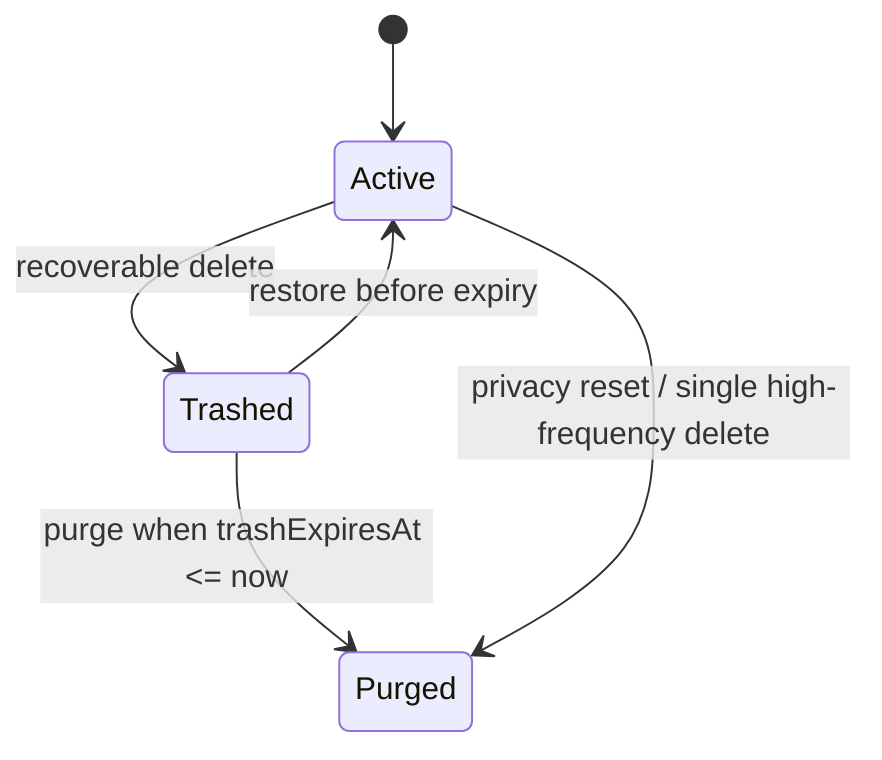

# GAP-2 Recycle Bin Logic

> Status: confirmed on 2026-06-12. Product choices: Q1=A source-model soft delete, Q2=A full constitutional scope, Q3=A one recycle-bin item per bulk clear, Q4=A aggregate-hide member children, Q5=A CloudSync tombstone on final purge, Q6=A keep current active-human routing semantics.

## Purpose

The recycle bin implements Product Foundation D8, D16, G5, and G6. Launch deletion must no longer destroy members or precious archives immediately. Recoverable deletion hides the item from normal product surfaces, keeps the original SwiftData object and relationships intact for 30 days, and allows restoration. Permanent deletion happens only when the 30-day retention expires or when the user invokes the privacy reset/delete-all path.

## Scope

Recoverable objects:

- Members: `Pet`, `Human`, `Plant`.
- Precious archives: `PetPhotoLog`, `PetMilestone`, `PetDocument`, `PetInsurance`; `InsuranceClaim` restores with its parent policy.
- Bulk clear operations: one recycle-bin batch for a pet's cleared activity records. Child records are source-model soft-deleted under the same batch id and are restored as a group.

Non-recoverable objects:

- Single high-frequency fact deletion, such as one feeding, potty, weight, expense, health, hygiene, walk, medication, or claim record, keeps the existing second-confirmation UX and does not appear in recycle-bin UI. The command must still write a CloudSync deletion tombstone before physical deletion when the entity is in the sync pipeline.
- App reset / delete-all-data remains immediate physical deletion and bypasses the recycle bin.

## Invariants

RB-001. Any recoverable delete sets `trashedAt` and `trashExpiresAt` on the source object instead of calling `context.delete`.

RB-002. Recoverable objects keep their original `id`, relationships, external-storage payloads, attachments, claims, and ledger/event links while in the recycle bin.

RB-003. Normal app surfaces must exclude trashed members and precious archives. A member in the recycle bin also aggregate-hides its child data from normal member, home, settings, document, insurance, milestone, and photo surfaces.

RB-004. Restoring a member or precious archive clears its trash fields and makes the same original object visible again. Restoring a bulk-clear batch clears trash fields on every item in the batch.

RB-005. Final purge after the retention window physically deletes the source object and writes CloudSync deletion tombstones for sync-pipeline entities at purge time. Moving an object into the recycle bin is a local modification, not a final deletion tombstone.

RB-006. Deleting the active human or the last human keeps the existing route/account semantics: deleting the active human clears `currentActiveHumanId` or asks for account switching; restoration does not automatically switch the active human back.

RB-007. A bulk pet-record clear appears as one recycle-bin batch item. Individual records in that batch do not appear as separate recycle-bin rows.

RB-008. App reset is the G6 privacy path and must remain immediate physical deletion with no recycle-bin retention.

## State Machine

## Implementation Shape

- Schema: bump latest `ArkSchemaV68` to `ArkSchemaV69`; add lightweight soft-delete fields with defaults to recoverable source models and batch-cleared record models.
- Service boundary: recycle-bin writes live in a domain service so views do not mutate trash fields directly.
- UI: Settings exposes a recycle-bin entry. The screen lists recoverable member/archive items plus one row per bulk-clear batch, with restore and purge actions.
- Tests: in-memory SwiftData tests cover member delete/restore, precious archive delete/restore, bulk clear batch restore, final purge tombstone timing, and app reset bypass.

## Open Follow-Up Policy

If a normal surface still requires broad query migration to filter trashed child records safely, it must be recorded as a concrete follow-up only after the core GAP-2 invariants and acceptance paths are implemented and verified. Do not use follow-up tracking to skip the recoverable deletion contract itself.
