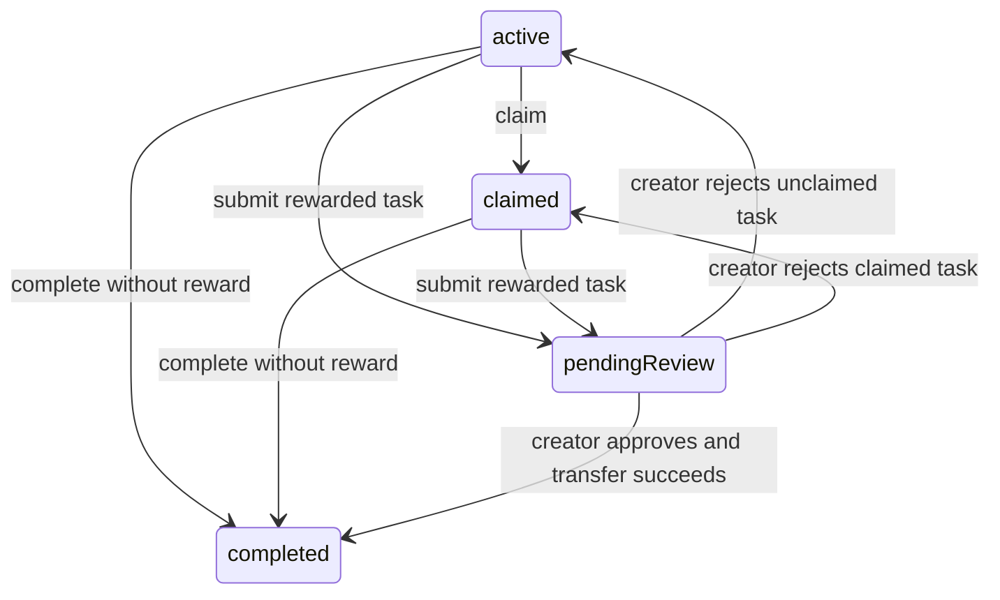

# Task Center 业务规则书

> 状态：当前工作区首发实现；测试与运行验收状态由 `docs/testing-progress.md` 单独记录。
> 最近核对：2026-07-15，依据 `TaskCenterRouteContainer`、`TaskCenterSnapshotBuilder`、`TaskCenterStarterJourneyProjection`、`HouseholdStarterJourneyService`、`TaskActionCommandExecutor`、`TaskCareAssignmentCommandExecutor`、`FamilyTaskService` 与 Home / Members / Plant 路由符号。
> 所有者：`TaskCenterRouteContainer`（入口与加载）、`TaskCenterSnapshotBuilder`（投影）、`TaskActionCommandExecutor`（动作编排）、`TaskCareAssignmentCommandExecutor`（类型化照顾待办创建）。

## 1. 职责与入口

用户可见的底部区域名称是“待办”，内部 legacy tab 枚举仍为
`VerticalSolidHomeTab.calendar`。页内由 `TaskCenterSurface` 切换“清单 / 日历”：

- 清单负责可执行的宠物、植物、人类与家庭事项，以及领取、完成、提交、通过和
  驳回。
- 日历由 `CalendarRouteContainer` 保留完整时间视图；非行动型 Event 只需要在
  日历出现。带日期的本机 FamilyTask 由 `TaskCenterCalendarWorkflowStrip` 补充
  工作流操作；无日期 FamilyTask 只进入清单的“未排期”。
- 成员名册、Human 详情和普通详情页都回到这个入口，不再各自维护
  一套任务中心。
- Pet / Plant 详情发起照顾待办时，路由携带值类型 `TaskCreationPreset`，创建页锁定
  当前对象和照顾类型；普通日历事项仍使用可编辑的对象选择器。

Task Center 不负责成员长期档案、体重趋势、植物领域分析或家庭洞察报表。

## 2. 统一快照

### TC-001 三类事实保持各自职责

- `Event` 提供日期、重复规则、发生次数、对象关联与 occurrence 完成状态。
- `Reminder` 提供提醒时间、通知状态及 Event / FamilyTask 之间的关联。
- `FamilyCollaborationTask` 提供发布者、指派 / 领取者、提交 / 审核状态和悬赏。

`TaskCenterRouteDataActor` 使用有界查询读取这些事实；跨 actor 只返回
`PersistentIdentifier` 和 `TaskCenterRouteDataReference` 等值，不返回 live
SwiftData model。主 actor 再由 `TaskCenterRouteData` 在当前 `ModelContext` 中重取
路由所需模型。

### TC-002 关联事实只显示一个任务项

`TaskCenterSnapshotBuilder` 通过 `relatedEventId` 或 `relatedReminderId` 找到关联
Event，并优先按同一 occurrence 日期匹配 FamilyTask。关联成功后生成单个
`TaskCenterItemSnapshot`，同时保留 `eventID`、`reminderID` 和 `familyTaskID`；不会
再把同一个 FamilyTask 作为独立项追加。

独立且未结束的 FamilyTask 也会生成快照；没有 due date 时进入 unscheduled。
Event 只有在 `isActionableTask` 为 true 时进入清单，普通信息事件仍由日历显示。

### TC-003 路由与 UI 只传稳定值

`TaskCenterItemSnapshot`、`TaskSubjectSnapshot`、`TaskActionCommand`、
`TaskActionResult`、`TaskCreationPreset`、`TaskCenterScope` 和
`TaskCenterRouteContext` 都是 Sendable 值。
路由可以按 all、human、pet 或 plant 过滤；Human scope 同时匹配任务 subject 与
发布者、指派者、领取者、完成者等 participant IDs。

`AppRoute.taskCenterContext` 为 Pet / Human / Plant 详情生成对象 scope；
`HumanDetailView` 使用 Human scope，“成员”名册的“查看待办”使用 all scope。

## 3. 统一动作边界

### TC-004 Task Center 动作先写业务事实，再推进工作流

Task Center 的 actionable row 和日历 FamilyTask strip 都把用户意图交给
`TaskActionCommandExecutor`：

1. Event-backed 完成先调用 `CalendarCommandExecutor`。
2. Calendar 路径负责照护事实、Event occurrence、Reminder、普通照护奖励与 ledger
   派生；FamilyTask 悬赏转账仍只发生在发布者审核通过时。
3. 只有 Calendar 完成成功后，executor 才继续推进关联 FamilyTask。
4. 领取、独立任务完成、提交、通过和驳回由
   `FamilyCollaborationCommandExecutor` / `FamilyTaskService` 执行。
5. 成功后 `TaskCenterRouteContainer` 重新加载统一快照。

因此照护事实写入失败时，Task Center 不得先完成关联 FamilyTask 或发放悬赏。
`TaskActionCommand.idempotencyKey` 由来源 ID、occurrence 日期和动作组成；已完成的
Event / FamilyTask 由 executor 返回 `alreadyApplied`，底层 Calendar、Reminder、
FamilyTask 和钱包命令继续拥有各自的持久化幂等与事务边界。

### TC-005 家庭分工状态机

本机 FamilyTask 使用以下主流程：

- 有悬赏任务由执行者完成时进入 pendingReview；发布者确认且钱包转账成功后才进入
  completed。
- 确认失败保持 pendingReview，不允许半笔钱包或 ledger 事实。
- 驳回只重新打开任务及关联 Reminder；已经由 Event completion 记录的现实照护
  事实不因此删除。
- 无悬赏任务可以直接完成，并同步完成关联 Reminder。

经济边界见 [`Economy-logic.md`](Economy-logic.md)。

### TC-006 Solo 与多 Human 呈现

家庭分工仍是本机 Solo 数据。奖励为 0 的普通分工可直接完成；正数悬赏才进入
提交 / 审核，并在审核通过后转账。创建普通分工时奖励默认保持 0，只有用户主动选择
添加奖励才展开悬赏字段和后续确认流程。角色数据服务于状态机与审计，界面只显示当前
可执行的下一步，不要求用户理解负责人、完成人、审核人等完整角色模型。

`currentActiveHumanId` 是这台设备上的默认任务视角和动作归属，不是账号或登录身份。
待办默认显示该 Human 负责或参与的项目。没有角色约束的照顾记录在存在至少两位在世
Human 时提供轻量的单次执行人覆盖；覆盖值随本次命令使用，不得回写
`currentActiveHumanId` 或影响之后的操作。已分工任务的领取、提交与确认则直接使用当前
Human 和快照已经计算出的可用动作，不在点击后再次展示整套成员选择，避免出现无权限
组合或把负责人、完成人、审核人同时暴露给用户。需要换人处理时，先切换本机当前成员。

只有存在至少两位在世 Human 时，
`TaskCenterSnapshotBuilder.availableActions` 才显示 claim、submit、approve 和 reject，
`TaskCenterRouteContainer.requestAdd` 才提供“家庭分工 / 日历事项”的选择。单 Human
下自动使用唯一 Human，直接创建日历事项，不展示执行、记录、分配、领取或审核控件；
已有的无悬赏本机 FamilyTask 可直接完成，悬赏任务不得由同一 Human 自审。没有在世
Human 时任务仍可作为家庭事项存在，但不伪造执行人，也不显示人员选择器。

多人家庭的清单默认采用“当前成员”，并可切换“全部 / 等待他人 / 待审核”；这些
筛选与 human、pet、plant 对象 scope 叠加，不会改变底层任务状态。单 Human 时整组
筛选隐藏，避免把本地档案误呈现成在线操作者。

这项本机能力不读取 `OnlineFeatureGate`；跨设备身份、邀请、同步和远端协作仍由
[`OnlineFeatureGate-logic.md`](OnlineFeatureGate-logic.md) 约束。

## 4. 系统旅程与成员路由

### TC-007 首宠建立与奖励领取是连续的系统旅程事项

延后建立宠物时，`TaskCenterSnapshotBuilder` 派生稳定 ID
`system-journey-create-first-pet`。它使用 `.systemJourney` 来源和类型化
`.createFirstPet` 目的地，显示 `+50` 奖励提示，但不写 Event、Reminder 或
FamilyTask，不进入日历，也不提供手动完成动作。

该事项不受默认 Human 筛选隐藏；点击整行或“建立”动作打开统一 Pet 创建流程。
取消后事项保留；第一只有效 Pet 保存后，该事项由稳定 ID
`system-journey-claim-starter-gift` 的 `.claimStarterGift` 事项替代。保存宠物本身不弹
奖励层；用户点击“领取”后才请求展示 50 椰子领取弹窗。领取成功后该事项消失并解锁
Oasis。两个事项都只进入清单、不进入日历，也不受默认 Human 筛选隐藏。

用户后来删除或归档宠物不会重新生成已经完成的旅程。待办 Tab 注意数按去重后的逾期、
今天、待审核和系统旅程事项计算。

### TC-008 成员页不拥有任务数据

`CrewRosterOverlay` 只查询和呈现 Human / Pet 名册；legacy
`CrewRosterMode.collaboration` 解析为 `.members`。它的 `onOpenTaskCenter` 只负责
路由交接，不读取 FamilyTask。

`AppHumanRouteContainer` 把 Human ID 包装成 `TaskCenterRouteContext.human`；
Human 详情页的待办按钮打开该筛选，而不是复制任务列表或写入逻辑。

## 5. 类型化照顾待办创建

### TC-009 Event、Reminder 与可选 FamilyTask 一次落盘

`TaskCareKind` 明确区分宠物喂水、喂食、猫砂、玩耍、卫生及可排期植物照顾；
`Event.taskCareKindRaw` 持久化该语义，Calendar 完成不再依赖标题猜测。
`TaskCareAssignmentCommandExecutor` 在同一保存边界内创建：

1. 一个带对象和 care marker 的 Event；
2. 每个 occurrence 一个内部 Reminder；
3. 仅当发布者与执行者是不同 active Human 时，每个 occurrence 一个关联 FamilyTask。

通知权限被拒绝只会跳过系统通知排期，不会删除内部 Reminder。循环悬赏创建前按
全部 occurrence 校验发布者当前余额；0 奖励生成普通分工。保存成功后才异步排期
通知并发布刷新 revision。

V89 将 `Reminder.scheduledAt` 定义为通知投递时间，将可选 `occurrenceAt` 定义为
真实任务发生时间。完成、重新打开、Task Center 关联和 FamilyTask due date 都使用
`resolvedOccurrenceAt`；旧记录缺少该字段时回退 `scheduledAt`，保持历史兼容。

对象归档、离世或删除时，创建先整体拒绝；物理删除还必须清理以 Human、Pet 或
Plant 为 subject 的 FamilyTask，避免留下不可操作的孤儿分工。

### TC-010 新手成长计划是待办顶部的一组家庭旅程

首宠启动赠礼领取后，待办顶部显示“新手成长计划”。它由六个稳定的
`.systemJourney` 事项组成：完善 Human 成员卡、完善首只 Pet 档案、确认证件与保障
状态、确认疫苗与保健状态、建立首个照护计划、完成首次真实照护。奖励分别为
100 / 100 / 60 / 80 / 40 / 20 椰子；家庭总额为 400。

同一时刻最多投影顺序最靠前的三个未领取事项。每一行在资格未满足时使用
`actionRequired` 并路由到现有 Human / Pet 资料、证件、健康、喂养计划或手动照护页面；
资格满足后同一稳定 ID 切换为 `rewardReady`。用户必须点击该行，在 item-driven sheet
中确认领取；保存资料或照护事实本身不弹奖励层，也不自动发奖。该组只进入清单，
不进入日历，不受默认成员筛选隐藏，也不显示发布者、执行者或审核人控件。

可选资料允许用户以“暂无 / 不适用 / 不清楚 / 不愿透露”等明确选择完成确认。
这些选择只写家庭旅程 checkpoint 与目标 ID，不复制护照号、血型等敏感值。计划资格
必须来自用户通过照护入口明确建立、且带照护类型或计划标记的非默认 Event / Reminder，
或明确确认采用系统推荐计划；普通日历提醒和宠物创建时自动生成的默认计划不能自行
满足资格。首次真实照护只接受正式照护账本中的
喂食、饮水、如厕、遛狗、陪玩或卫生等照护事实，不能由体重、健康、花费或资料编辑
替代。

领取命令在保存前重新验证资格，并使用家庭级稳定交易键；同一任务重复点击、重启或
崩溃恢复只能留下一个正式奖励。默认领取人为本机当前 active Human；仅有一位有效
Human 时自动使用该成员，多位且没有可解析绑定成员时要求先选择，不伪造领取人。

## 6. 边界与验证

- Task Center 使用有界 Event window、pending Reminder 上限和 active FamilyTask
  上限；不得在可复用 SwiftUI row 中新增无界 `@Query` 聚合。
- 已归档 Plant、离世 Pet / Human 及其 active schedule 不进入可执行快照；成员
  生命周期门继续由 `MemberLifecycleActiveScheduleResolver` 与 `MemberLifecycleGate`
  裁决。
- `TaskCenterSnapshotBuilderTests` 当前覆盖关联去重、独立 / 未排期 FamilyTask、
  四类 subject、系统旅程清单分流、单 / 多 Human 动作和 Human scope 指标。
- `TaskActionCommandExecutorTests` 当前覆盖关联宠物 / 植物照护先写事实再进入审核、
  事实失败不推进投影、独立任务幂等、单 Human 无悬赏直接完成与悬赏自审拒绝；
  完整 FamilyTask 状态与悬赏失败边界继续由 `MemberLifecycleGateTests` 和 Economy
  tests 验证。
- `TaskCareAssignmentCommandExecutorTests` 覆盖 Solo / 多 Human 创建、重复 occurrence
  关联、失效对象整批拒绝、循环奖励总额校验，以及跨日提前通知不改变照顾
  occurrence；`DataBackupCoverageTests` 与 `SharedModelContainerRecoveryTests` 覆盖
  V89 codec、旧备份默认值与轻量迁移。
- `AppRouteCoordinatorTests` 当前覆盖 profile scope 与 focused FamilyTask context；
  成员 handoff、系统旅程建宠路由及普通进入清空焦点应继续由 Home route / source
  policy tests 守护。
